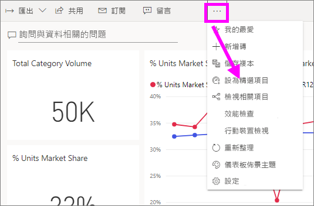
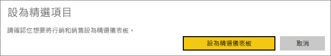

# Power BI 服務中的精選儀表板

[!INCLUDE [power-bi-service-new-look-include](../includes/power-bi-service-new-look-include.md)]

許多使用者會有一個比其他任何儀表板更常瀏覽的儀表板。 這可能是我們用來執行業務的儀表板。 或者，可能是包含來自許多不同儀表板和報告之磚彙總的儀表板。

## 建立精選儀表板
當您將儀表板選取為 [精選]  時，每次開啟 Power BI 服務時，都會開啟服務並顯示該儀表板。 

您也可以選取幾個儀表板，並將其設定為我的最愛。 請參閱[我的最愛儀表板](end-user-favorite.md)。

如果您尚未設定精選儀表板，則 Power BI 將會開啟到您上次使用的儀表板或 Power BI [首頁]  。 

### 將儀表板設定為精選

1. 開啟您想要設為精選的儀表板。 
2. 在頂端功能表列中，選取 [更多選項]  (...)，然後選取 [設為精選儀表板]  。 
   
    
3. 確認您的選擇。
   
    

## 變更精選儀表板
如果您稍後改變心意，可以將新的儀表板設為精選儀表板。

1. 遵循先前的步驟 1 和步驟 2。
   
2. 選取 [設為精選儀表板]  。 將儀表板移除精選並不會將其從 Power BI 中移除。 
   
    

## 移除精選儀表板
如果您決定不想要將任何儀表板指定為精選，以下是將儀表板取消精選的方式。

1. 開啟目前的精選儀表板。
2. 在頂端功能表列中，選取 [更多選項]  (...)，然後選取 [停用精選儀表板]  。

    ![已選取 [停用精選儀表板]](./media/end-user-featured/power-bi-unfeature.png)
   
## 後續步驟
- [將儀表板設為最愛](end-user-favorite.md)    
- 有其他問題嗎？ 試試 [Power BI 社群](https://community.powerbi.com/)。

