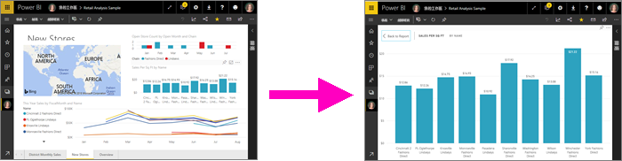
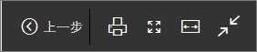
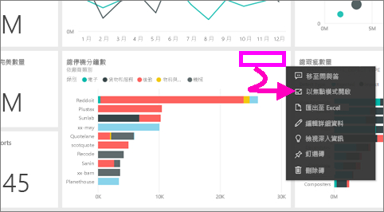
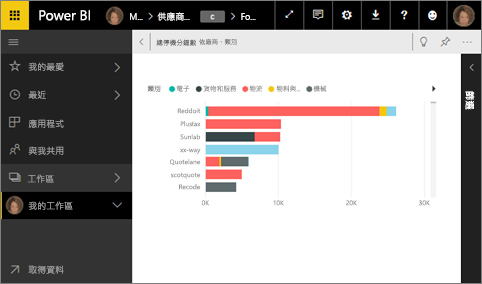
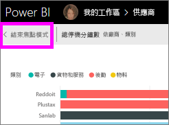
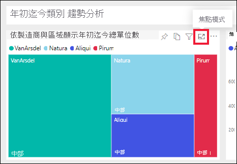
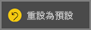
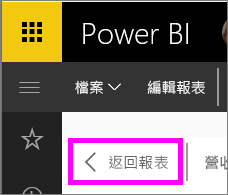

# 顯示更詳細的內容：焦點模式與全螢幕模式

<iframe width="560" height="315" src="https://www.youtube.com/embed/dtdLul6otYE" frameborder="0" allowfullscreen></iframe>

焦點模式與全螢幕模式是可在您的視覺效果、報表和儀表板中查看更多詳細資料的兩種不同方式。  主要差異在於，全螢幕會移除內容周圍的所有窗格，而焦點模式讓您仍能與視覺效果互動。 讓我們仔細查看相似性與差異性。  

|內容    | 焦點模式  |全螢幕模式  |
|---------|---------|----------------------|
|儀表板     |   不可能     | 可以 |
|報表頁面   | 不可能  | 可以|
|報表視覺效果 | 可以    | 可以 |
|儀表板磚 | 可以    | 可以 |
|Windows 10 Mobile | 不可能 | 是 |

## 什麼是全螢幕模式？

顯示您的 Power BI 服務內容 (儀表板、報表頁面、磚和視覺效果) 而不受功能表和導覽列所干擾。  您可隨時取得內容的完整檢視，而不含其他無關項目。 這有時稱為電視模式。   

若要開啟全螢幕模式，在焦點模式的儀表板、報表、磚上方，或焦點模式的視覺效果上方，從 Power BI 服務功能表列選取 [全螢幕] 圖示 。  您選取的內容隨即會填滿整個螢幕。
如果您使用 Power BI 行動版，[Windows 10 行動裝置應用程式可使用全螢幕](./mobile/mobile-windows-10-app-presentation-mode.md)。 

全螢幕模式的部分用法如下：

* 在會議或研討會中呈現您的儀表板、磚、視覺效果或報表
* 在辦公室的專用大螢幕或投影機上顯示
* 在小螢幕上檢視
* 以鎖定模式檢閱 -- 您可以透過觸控螢幕或用滑鼠點選磚，而不需要開啟基礎報表或儀表板

## 什麼是焦點模式？
「焦點」模式可讓您展開 (彈出) 視覺效果或磚，以查看更多詳細資料。  您的儀表板或報表可能有點擁擠，而您只想放大其中一個視覺效果。  此時非常適合使用焦點模式。  

使用焦點模式時，Power BI「取用者」可以與建立此視覺效果時所套用的任何篩選進行互動。  在 Power BI 服務中，您可以在儀表板磚或報表視覺效果上使用焦點模式。

## 以全螢幕模式運作
若要以全螢幕模式開啟儀表板或報表頁面，請在上方導覽列中選取全螢幕圖示  。 一旦您處於全螢幕模式之後，移動滑鼠或游標就能顯示操作功能表。 由於全螢幕可供各式各樣的內容使用，因此，操作功能表中的每個選項都稍有不同，但相當容易理解。  只需將滑鼠指標停留在定義的圖示上。

儀表板的功能表    
    

報表頁面的功能表    
    

  *     
  使用 [上一頁] 按鈕可導覽至瀏覽器中的上一頁。 如果上一頁是 Power BI 頁面，則也會以全螢幕模式顯示。  全螢幕模式會持續到您關閉全螢幕為止。

  *     
  使用此按鈕可列印全螢幕模式的儀表板或報表頁面。

  *     
    使用 [全螢幕] 按鈕可用最大的大小顯示儀表板，而無須使用捲軸。  

    

  *        
    有時候您會不在意捲軸，但希望儀表板能填滿整個可用空間的寬度。 選取 [符合寬度] 按鈕。    

    

  *        
    在全螢幕報表中，可使用這些箭頭在報表的頁面間移動。    
  * 若要結束全螢幕模式，請選取**結束全螢幕**圖示。

      

## 以焦點模式運作
開啟焦點模式的方式有兩種：一種方式適用於儀表板磚，另一種方式則適用於報表視覺效果。

### 儀表板中的焦點模式
1. 在 Power BI 服務中開啟儀表板。

2. 將滑鼠指標停留在儀表板磚或報表視覺效果上方、選取省略符號 (...)，然後選擇 [以焦點模式開啟]。

    .

2. 這會開啟磚，並填滿整個報表畫布。

   

3. 展開 [篩選] 窗格，以查看套用到這個視覺效果的所有篩選。

   ![具有 [篩選] 窗格的焦點模式](media/end-user-focus/power-bi-focus-filters.png)

4. [修改篩選](end-user-report-filter.md)，然後在資料中尋找有趣的發現，以便進一步瀏覽。  

5. 選取 [結束焦點模式] (位於視覺效果左上角)，離開焦點模式並返回儀表板。

        

## 報表視覺效果的焦點模式
1. 在 Power BI 服務中開啟報表。  在此範例中，我們將示範如何使用零售分析範例。

1. 當報表開啟之後，選取 [行政區每月銷售額] 索引標籤。

2. 將滑鼠指標停留在左下角的區域圖表上，然後選取 [焦點模式] 圖示 。  

   
2. 此視覺效果會開啟並填滿整個畫布。

   
3. 選擇性地展開 [篩選] 窗格，以便與套用到這個視覺效果的所有篩選進行互動。 深入了解資料，以尋找新的深入解析及問題的解答。 作為「取用者」，您無法新增篩選、變更視覺效果中所使用的欄位，或建立新的視覺效果。  不過，當您離開 Power BI 時，即會儲存您對現有篩選所做的任何修改。 如果您不想要讓 Power BI 記住您的修改，請選取 [重設為預設值]。   

   ![具有 [篩選] 畫面的焦點模式](media/end-user-focus/power-bi-display-focus-filters3.png)

5. 離開焦點模式，然後選取 [返回報表] (位於視覺效果的左上角) 返回報表。

      

## 考量與疑難排解
* 在報表中搭配視覺效果使用焦點模式時，您將能夠檢視所有篩選並與它們互動：視覺效果層級、頁面層級、鑽研和報表層級。    
* 使用焦點模式時若儀表板上有視覺效果，則只能檢視視覺效果層級的篩選並與之互動。

## 後續步驟
[檢視報表的設定](end-user-report-view.md)