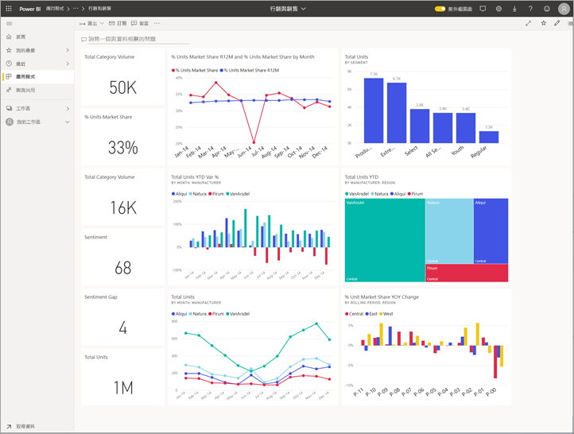
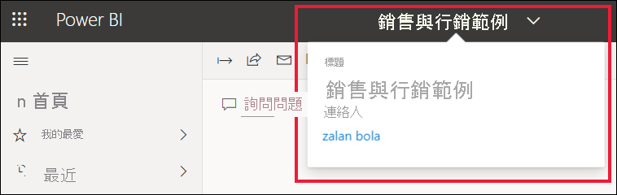
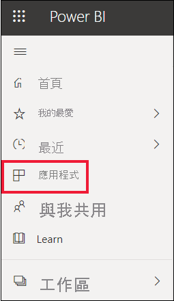
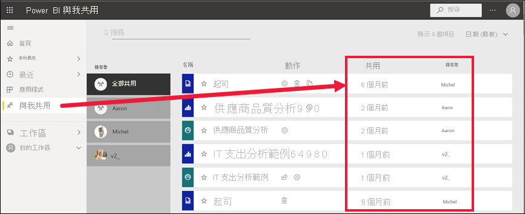
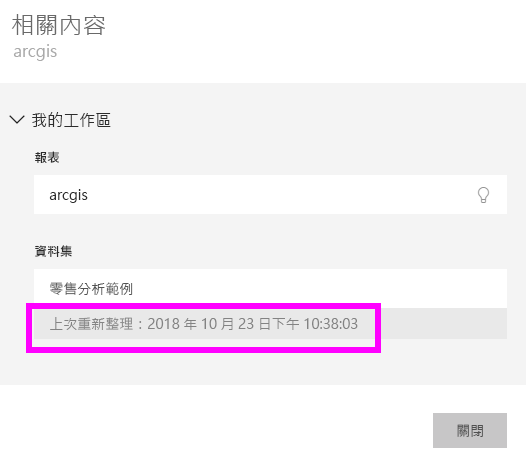
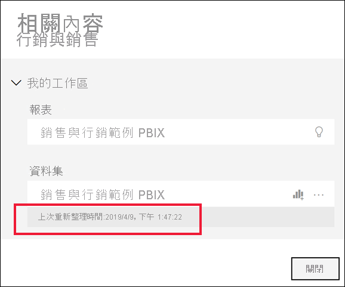

# 您的內容是最新狀態

[!INCLUDE[consumer-appliesto-ynny](../includes/consumer-appliesto-ynny.md)]

[!INCLUDE [power-bi-service-new-look-include](../includes/power-bi-service-new-look-include.md)]

作為「商務使用者」，您可以與「設計師」建立並與您共用的內容互動。 您可能會希望知道該內容是否為最新，或只想要知道該內容上次重新整理的時間。 了解您正在使用最新的內容，可讓您保持信心。  
 

若要做出正確決策，確保您正在使用最新資料就相當重要。 如何確保您正在使用最新的內容？ 在大多數情況下，您完全不需要執行任何動作。 已與您共用的應用程式會自動重新整理，並依應用程式設計師所設定的排程更新。 與您共用的儀表板和報表也一樣，設計師會手動或使用自動重新整理排程來確保內容為最新。  

如果您對資料的新舊有疑問，請連絡設計師。

## 如何找出設計師或擁有者的名稱

### 儀表板或報表

擁有者名稱可從儀表板和報表的標題列中取得。 選取報表或儀表板名稱，以顯示其他詳細資料，包括**擁有者**。

### 應用程式

應用程式畫面會顯示設計師名稱，以及上次更新應用程式的日期。  

1. 從導覽窗格中選取 [應用程式]  。

    

2. 將滑鼠停留在應用程式上方，以顯示設計師的標題、有效日期和名稱。 

    

### 與我共用
[與我共用]  畫面會顯示內容擁有者名稱，以及上次與您共用內容的日期。

 

## 如何查詢上次重新整理日期
如有興趣，您可以查閱大部分內容上次的重新整理日期。 

### 儀表板圖格
針對儀表板圖格，在 [焦點] 模式中檢視圖格以查看上次重新整理的時間戳記。

1. 在儀表板磚上，選取 [更多選項]  (...)，然後選擇 [以焦點模式開啟]  。

    

2. 上次重新整理日期會顯示在右上角。 如果您沒有看到該日期，請展開您的瀏覽器使其更寬。 

    

### 儀表板和報表
查詢上次重新整理日期的另一個方法是使用 [查看相關內容]。  從 Power BI 上方功能表列選取 [更多動作] (...)，即可取得 [查看相關內容]。

![從功能表選取 [查看相關]](media/end-user-fresh/power-bi-see-related.png)

[相關內容]  窗格會顯示儀表板或報表基礎資料集的上次重新整理資訊。

## 如果設計師刪除應用程式會發生什麼狀況

如果設計師刪除應用程式，則與該應用程式建立關聯的儀表板與報表，也會自動從您的 Power BI 工作區移除。 您無法再次取得這些儀表板和報表，且該應用程式不會出現於導覽窗格中的 [應用程式] 容器或其他位置。

## 訂閱以查看變更
保持最新狀態的另一種方式是訂閱報表或儀表板。 不需要登入並開啟報表或儀表板，您可以要求 Power BI 依照您設定的排程來傳送快照給您。  如需詳細資訊，請參閱[訂閱儀表板和報表](end-user-subscribe.md)。

## 設定資料警示
如果資料變更超出或大於您設定的限制，您是否希望收到通知？ [建立資料警示](end-user-alerts.md)。  使用資料警示可讓您輕鬆保持在最新狀態。 使用資料警示時，您可以要求 Power BI 在報表中的值超出特定閾值時傳送電子郵件給您。  例如，如果庫存低於 25 個單位，或銷售超出目標。  

## 後續步驟
[建立資料警示](end-user-alerts.md)    
[訂閱儀表板與報表](end-user-subscribe.md)    
[檢視相關內容](end-user-related.md)    
