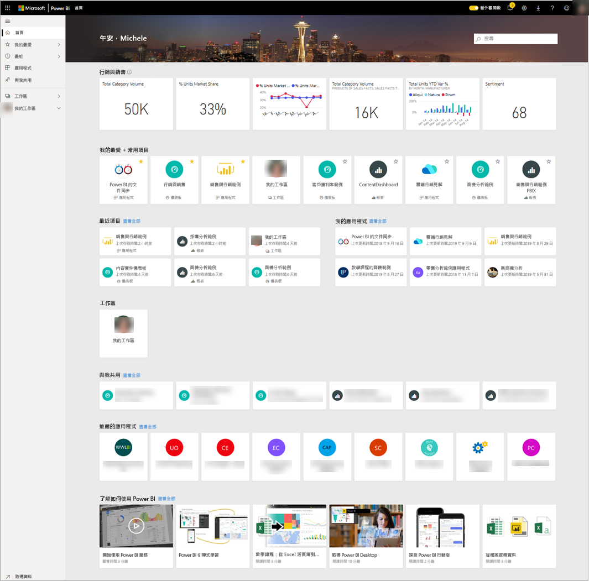
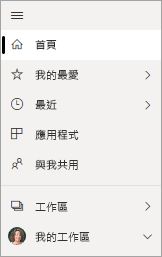

# 尋找您的儀表板、報表和應用程式
在 Power BI 中，「內容」  一詞指的是應用程式、儀表板和報表。 內容是由 Power BI 的「設計師」  所建立，這些人員會與像您一樣的同事共用該內容。 您的內容可以在 Power BI 服務中存取及檢視，且首頁登陸頁面是開始使用 Power BI 的最佳位置。

## 探索 Power BI 首頁
當您登入時，Power BI 會開啟並顯示您的 [首頁] 畫布，如下圖所示。
 
![Power BI 服務 [首頁] 畫布的螢幕擷取畫面。](media/end-user-home/power-bi-home.png)

Power BI [首頁] 提供三種不同方式來尋找及檢視您的內容。 這三個方式都存取相同的內容集區，只是取得該內容的方式不同。 有時候，搜尋會是尋找某個項目的最簡單且最快速方式，而在其他時間，選取 [首頁] 畫布上的「卡片」  會是最佳選擇。

- [首頁] 畫布會顯示並組織您的最愛和最新內容，以及建議的內容和學習資源。 每個內容片段都會顯示為「卡片」  ，其中包含標題和圖示。 選取卡片即會開啟該內容。
- 左側是稱為瀏覽列的瀏覽窗格。 在此窗格中，您的相同內容會按照 [我的最愛]、[最近]、[應用程式] 及 [與我共用]，以稍微不同的方式組織。 在這裡，您可以檢視內容的清單，並選取要開啟的內容。
- 在右上角，全域搜尋方塊可讓您依標題、名稱或關鍵字搜尋內容。

下列主題將探討用來尋找和檢視內容的每個選項。

## [首頁] 畫布
在 [首頁] 畫布中，您可以檢視您有權使用的所有內容。 一開始，您在 [首頁] 畫布上可能沒有太多的內容 (請參閱上圖)，但當您開始與同事使用 Power BI 時，此情況就會改變。

您的 [首頁] 畫布也會以建議的內容和學習資源進行更新。 
 
當您在 Power BI 服務中工作時，您會收到來自同事的儀表板、報表和應用程式，最終會填滿您的 [首頁]。 經過一段時間之後，它可能會類似下列 [首頁]。

 
接下來的幾個主題將從上到下，進一步探討這個 [首頁]。

## 最重要的內容垂手可得

### 我的最愛與常用項目
這個頂端區段所包含連結會連至您最常瀏覽或已標記為 [[精選] 或 [我的最愛]](end-user-favorite.md) 的內容。 請注意，有幾張卡片具有黃色星號；這兩個應用程式和該儀表板已標記為 [我的最愛]。
 
### 最近項目與我的應用程式
下一節會顯示您最近瀏覽過的內容。 請注意每張卡片上的時間戳記。 [我的應用程式]  區段列出已與您共用或您[已從 AppSource 下載](end-user-apps.md)的應用程式；最新的應用程式則列在此處。 您可以選取 [查看全部]  ，以顯示與您共用的所有應用程式清單。

### 工作區
作為 Power BI「取用者」  ，您通常只會有一個工作區：**我的工作區**。 

### 與我共用
同事與您共用應用程式，但他們也可以共用個別的儀表板和報表。 在 [與我共用]  區段中，請注意您的同事已與您共用三個儀表板和三個報表。

### 推薦的應用程式
根據您的活動和帳戶設定，Power BI 會顯示一組建議的應用程式。 選取應用程式卡片即會開啟應用程式。
 
### 學習資源
[首頁] 畫布底部是一組學習資源。 出現的確切資源取決於您的活動和設定，以及 Power BI 系統管理員。 
 
## 探索瀏覽窗格 (瀏覽列)

使用左側瀏覽窗格 (瀏覽列) 來尋找儀表板、報表和應用程式，並在其間移動。 有時候，使用瀏覽列將是取得內容的最快方式。
當您開啟 [首頁] 登陸頁面時，會出現瀏覽列，而當您開啟 Power BI 服務的其他區域時，則保持不變。
  
瀏覽列會將內容組織成類似於您在 [首頁] 畫布上看到的容器：[我的最愛]、[最近]、[應用程式]，以及 [與我共用]。 使用飛出視窗，您可以只檢視每個容器中的最新內容，也可以巡覽至內容清單，以查看每個容器類別的所有內容。
 
- 若要開啟其中一個內容區段並顯示所有項目的清單，請選取標題。
- 若要查看每個容器中最新內容，請選取飛出視窗 ( **>** )。

    ![使用 [最近] 瀏覽列的影片](media/end-user-home/power-bi-nav-bar.gif)

 
瀏覽列是另一種可讓您快速找到所需內容的方式。 內容的組織方式與 [首頁] 畫布相似，但會顯示在清單而不是卡片中。 

## 搜尋您的所有內容
有時候，尋找內容的最快方式就是搜尋該內容。 例如，您可能已發現一段時間未曾使用的儀表板不會顯示在 [首頁] 畫布上。 或者，您可能記得您的同事 Aaron 與您共用某個項目，但您不記得他為其提供的名稱，或他所共用的內容類型，不論該項目是儀表板還是報表。
 
您可以輸入該儀表板的完整或部分名稱，並加以搜尋。 此外，您還可以輸入同事的姓名，並搜尋他與您共用的內容。 搜尋範圍限於在您擁有或可存取的所有內容中尋找相符項目。

![使用 [最近] 搜尋欄位的螢幕擷取畫面](media/end-user-home/power-bi-search.png)

## 後續步驟
[Power BI 基本概念](end-user-basic-concepts.md)的概觀
