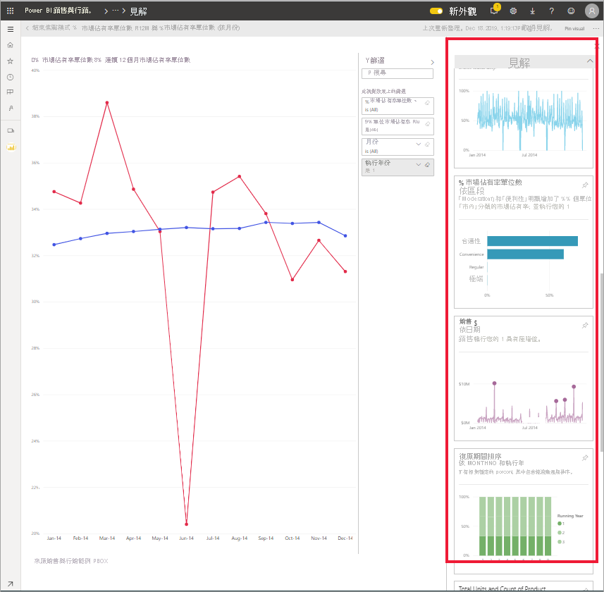
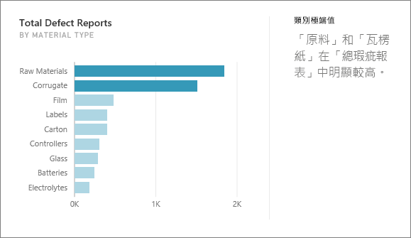
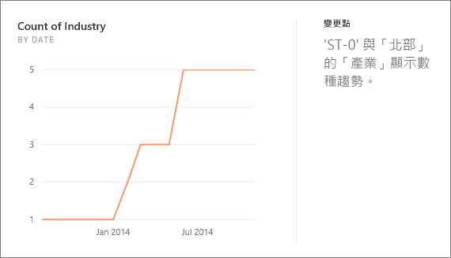
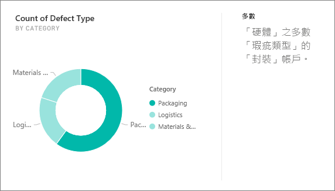
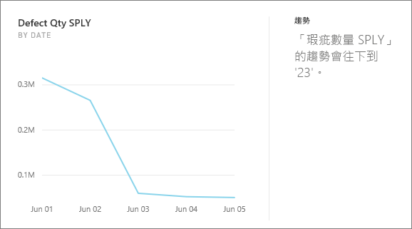
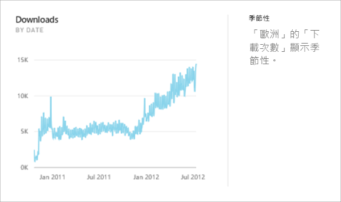
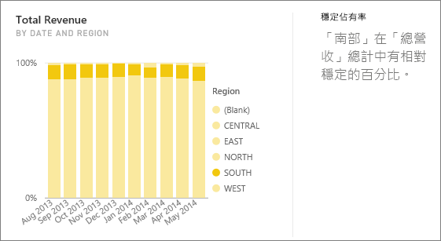
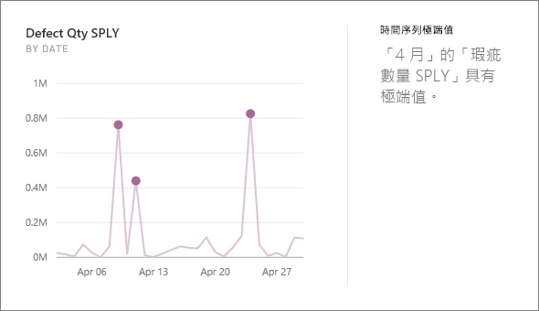

# Power BI 支援的深入解析類型

[!INCLUDE[consumer-appliesto-yyny](../includes/consumer-appliesto-yyny.md)]

您可以要求 Power BI 查看您的資料，並尋找感興趣的趨勢和模式。 這些趨勢和模式會以稱為「見解」  的視覺效果形式呈現。 

若要了解如何使用見解，請參閱 [Power BI 見解](end-user-insights.md)

## 深入解析如何運作？
Power BI 可快速搜尋資料集的不同子集， 並在搜尋時套用一組複雜的演算法來探索潛在相關見解。 Power BI「取用者」  可以在儀表板磚上執行見解。

## 一些術語
Power BI 使用統計演算法來發掘見解。 這些演算法將在本文的下一節中列出並描述。 在了解演算法之前，以下是一些可能不熟悉的詞彙定義。 

* **量值** - 量值是可用於執行計算的量化 (數值) 欄位。 常見的計算為加總、平均值和最小值。 例如，若我們的公司生產並銷售滑板，則量值可能是每年的滑板銷售數量和平均收益。  
* **維度** - 維度是類別目錄 (文字) 資料。 維度可描述人員、物件、項目、產品、地點和時間。 在資料集中，維度是將「量值」  分組成有用類別的方式。 針對我們的滑板公司，某些維度可能包括依模型、色彩、國家/地區或行銷活動來查看銷售量 (量值)。   
* **相互關聯** - 相互關聯會告訴我們項目的行為有何關聯。  如果項目的增加和減少模式很類似，則為正相關。 如果其模式相反，則為負相關。 例如，若每次執行電視行銷活動時我們的紅色滑板銷售量會增加，則紅色滑板的銷售量與電視活動為正相關。
* **時間序列** - 時間序列是將時間顯示為連續資料點的一種方式。 這些資料點可能會遞增，例如秒、小時、月或年。  
* **連續變數** - 連續變數可以是介於其下限和上限之間的任何值，否則其為離散變數。 範例包括溫度、體重、年齡和時間。 連續變數可以包含值的小數或一部分。 所銷售的藍色滑板總數是離散變數，因為我們無法銷售半個滑板。  

## 您可以找到哪些類型的見解？
這些是 Power BI 使用的演算法。 

### 類別極端值 (上/下)
醒目提示一或兩個類別其值比其他類別大很多的情況。  

### 變更時間序列中的點
醒目提示資料時間序列中的趨勢明顯變更的情況。

### Correlation
偵測在根據資料集內的類別或值繪製時，多個量值會顯示類似模式或趨勢的情況。

### 低變異數
偵測到維度資料點不在平均值的情況，因此「變異數」為低。 假設您有量值「銷售」和維度「區域」。 而跨區域查看，您會發現資料點和平均值 (資料點) 之間的差異很小。 當所有區域的銷售變異數低於閾值時，就會觸發見解。 換句話說，當所有區域的銷售額都非常相似時。

### 多數 (主要因素)
尋找當總值由另一個維度分解時，其多數可能歸因於單一因素的情況。  

### 時間序列中的整體趨勢
偵測時間序列資料中的向上或向下趨勢。

### 時間序列中的季節性
尋找時間序列資料中的週期模式，例如每週、每月或每年的季節性。

### 穩定佔有率
醒目提示子值的部分相對於跨連續變數的整體父值有父子相互關聯的情況。 穩定的共用見解會套用至量值、維度和另一個日期/時間維度的內容。 當特定維度值 (例如「東北部區域」) 在該日期/時間維度上的整體銷售中所佔百分比穩定時，就會觸發此見解。

穩定的共用見解類似於低差異的見解，因為兩者都與缺少某個時間值的變異數有關。 不過，穩定的共用見解會測量在一段時間內缺少**整體百分比**的變異數，而低差異見解則會測量在維度間缺少絕對量值的變異數。

### 時間序列極端值
針對跨時間序列的資料，偵測特定日期或時間值明顯不同於其他日期/時間值的情況。

## 後續步驟
[Power BI 深入解析](end-user-insights.md)

有其他問題嗎？ [試試 Power BI 社群](https://community.powerbi.com/)

