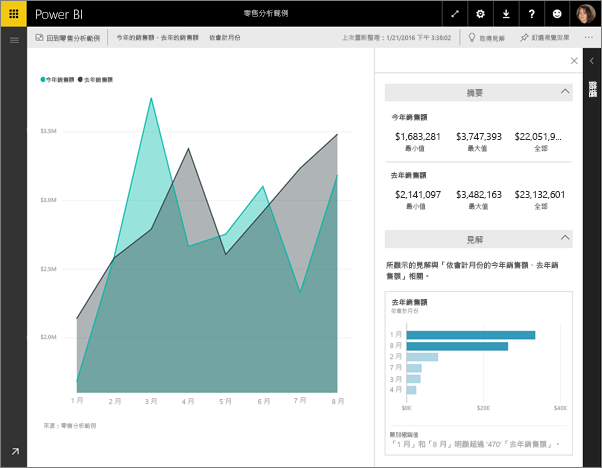
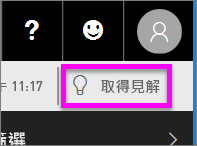
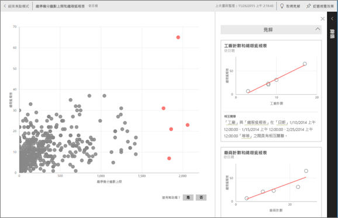

# 使用 Power BI 在儀表板圖格上檢視資料見解
儀表板上的每個視覺效果磚都是資料探索的入口。 當您選取磚時，磚會開啟報表，您可以在其中篩選和排序報表後方的資料集，並深入挖掘。 當您執行見解時，Power BI 會為您探索資料。

您可以執行快速深入剖析，根據資料產生相關的互動式視覺效果。 您可對特定的儀表板磚執行快速見解，甚至可以對見解執行見解！

深入解析功能的建置基礎是一組會持續完善的[進階分析演算法](end-user-insight-types.md)，該演算法是與 Microsoft Research 合作開發，且會持續使用，讓更多人能透過全新的直覺式方式在資料中尋找深入資訊。

## 對儀表板磚執行深入解析
當您對儀表板磚執行見解時，Power BI 只會搜尋用來建立這一個儀表板磚的資料。 

1. [開啟儀表板](end-user-dashboards.md)。
2. 將游標停留在磚上方， 選取省略符號 (...)，然後選擇 [檢視見解]。 

    

3. 隨即在[焦點模式](end-user-focus.md)中開啟磚，而深入解析卡片會沿著右側顯示。    
   
        
4. 一個深入剖析是否引起您的興趣？ 選取該資訊摘要卡片可挖掘更深入的資料。 選取的資訊摘要會顯示於左側，只以該單一資訊摘要中資料為依據的新資訊摘要卡片則沿著右側顯示。    

 ## 與深入解析卡片互動
在您開啟見解之後，請繼續探索。

   * 篩選畫布上的視覺效果。  若要顯示篩選，請選取右上角的箭號來展開 [篩選] 窗格。

     ![展開 [篩選] 功能表的見解](./media/end-user-insights/power-bi-insights-on-insights.png)
   
   * 對見解卡片本身執行見解。 這通常是指**相關的見解**。 在右上角，選取燈泡圖示  或 [取得見解]。
     
     
     
     深入解析會顯示於左側，而只以該單一深入解析資料為依據的新卡片則沿著右側顯示。
     
     

若要返回原始的見解畫布，請選取左上角的 [結束焦點模式]。

## 考量與疑難排解
- **檢視見解**不適用於 DirectQuery，而僅適用於上傳至 Power BI 的資料。
- **檢視見解**並不適用於所有類型的儀表板磚。 例如，它不適用於自訂視覺效果。<!--[custom visuals](end-user-custom-visuals.md)-->

## 後續步驟
深入了解[可用深入資訊摘要類型](end-user-insight-types.md)

