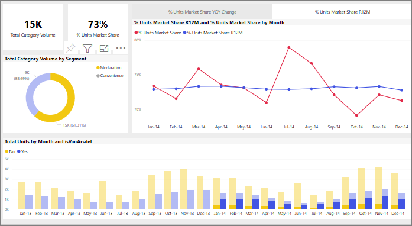

# 如何在 Power BI 報表中相互進行視覺效果交叉篩選
Power BI 的其中一項絕佳功能，是報表頁面上所有視覺效果互連的方式。 如果您選取其中一個視覺效果的資料點，頁面上包含該資料的其他視覺效果就會全部根據該選取項目而變更。 

## 視覺效果彼此互動的方式

根據預設，當您選取報表頁面上某個視覺效果中的資料點時，即會交叉篩選或交叉醒目提示頁面上的其他視覺效果。 頁面上視覺效果的確切互動方式由報表「設計者」  建立。 「設計者」  可以選擇開啟和關閉視覺效果互動，也可以選擇變更預設交叉篩選、交叉醒目提示和[切入](end-user-drill.md)行為。 

如果您尚未使用階層或切入，可以閱讀 [Power BI 中的向下切入](end-user-drill.md)，以了解相關資訊。 

交叉篩選和交叉醒目提示有助於識別資料中某個值對另一個值的貢獻度。 例如，當您選取環圈圖中的 [合適性] 區段時，即會醒目提示該區段對 [月份單位總量] 圖表中每個資料行的貢獻度，並篩選折線圖。

請參閱[關於篩選及醒目提示](end-user-report-filter.md)。 

  
> [!NOTE]
> 「交叉篩選」  與「交叉醒目提示」  這兩個字詞用來區分本文所述的兩項行為：當您使用 [篩選]  窗格來篩選視覺效果及將其醒目提示時所發生的情況。  

## 考量與疑難排解
- 如果報表所含的視覺效果支援[切入](end-user-drill.md)，則根據預設，當您切入某個視覺效果時，不會影響報表頁面上的其他視覺效果。     
- 如果您使用 visualA 與 visualB 互動，則 visualA 中的視覺效果層級篩選將會套用至 visualB。

## 後續步驟
[如何使用報表篩選](../power-bi-how-to-report-filter.md)
