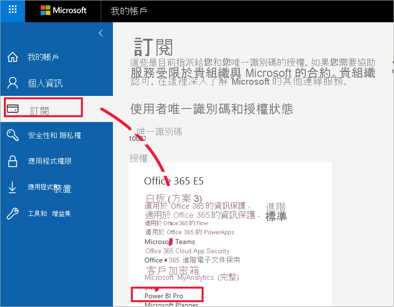

# 「商務使用者」的授權和訂閱

[!INCLUDE[consumer-appliesto-ynnn](../includes/consumer-appliesto-ynnn.md)]

身為[商務使用者](end-user-consumer.md)，您可以使用 Power BI 服務來探索報表與儀表板，從而透過參考資料來制定商務決策。 若已使用 Power BI 一段時間，或曾與「設計師」同事聊過，則可能會發現有些功能只在擁有特定類型的授權、訂閱或權限時才可運作。

您在 Power BI 服務中能執行哪些作業，取決於下列三個要件：
-    您使用的授權與訂用帳戶類型、
-    內容的儲存位置，以及
-    指派給您的角色與權限。

在此文章中，我們將描述各種授權類型的功能，以及「內容儲存位置」對於「您能執行的作業」，會造成哪些影響。 此外，您也將學習如何查詢您的授權與訂閱，以及了解內容的儲存位置。 如需角色與權限的詳細資訊，請參閱[工作區角色](end-user-workspaces.md)。

## 授權

每位 Power BI 服務的使用者若非具有「免費」授權，就是使用 *Pro* 授權。 若您是 Power BI 的「商務使用者」，可能會使用由 Power BI 系統管理員所管理的免費授權。

您可能同時擁有多個授權。  此服務一律會提供與您目前所有最寬鬆授權相等的體驗。

## Power BI Premium 容量

Premium 是組織訂用帳戶，其提供不同儲存內容的方式 (儲存在專用容量中)。 無論是組織內部或外部使用者，只要具有 Premium 權限，則無須購買個人的 Power BI Pro 授權，即可檢視存放在 Premium 容量中的內容。 

Premium 讓 Pro 使用者能廣泛散發內容，且檢視內容的收件者並不需要 Pro 授權。 內容設計師需要 Pro 授權。 設計師可以連線到資料來源、建立資料模型，然後建立封裝成工作區應用程式的報表與儀表板。 只要使用者獲指派 Power BI Premium 容量中[工作區的角色](end-user-workspaces.md)，即使沒有 Pro 授權仍然可加以存取。

在那些工作區中，設計師會指派角色，例如，**檢視者**、**參與者**、**成員**與**系統管理員**。 這些角色會決定每位同事能與內容互動的範圍。 如需詳細資訊，請參閱[工作區權限與角色。](end-user-workspaces.md) 

如需 Premium 容量的詳細資訊，請參閱[什麼是 Microsoft Power BI Premium？](../admin/service-premium-what-is.md)。

## 了解您擁有的授權

只要瀏覽您在 [Microsoft 的 [我的帳戶] 頁面](https://portal.office.com/account)，就能查看指派給您的授權。  選取 [訂閱] 索引標籤。

第一位使用者 Pradtanna 具有 Office 365 E5，其中包含 Power BI Pro 授權。

第二位使用者 Zalan 具有 Power BI 免費授權。 

![Office 入口網站 [訂用帳戶] 索引標籤](media/end-user-license/power-bi-license-free.png)

## 了解您是否有權存取 Premium 容量

接下來，確認您是否為擁有 Premium 容量之組織的一員。 上述使用者無論使用 Pro 或免費授權，都可能屬於擁有 Premium 容量的組織。  讓我們看看第二位使用者 Zalan。  

我們可以藉由查詢可用的儲存區數量，判斷 Zalan 的組織是否擁有 Premium 容量。 

- 在 Power BI 服務中，選取 [我的工作區]，然後選取右上角的齒輪圖示。 選擇 [管理個人儲存體]。

    ![隨即顯示 [齒輪設定] 功能表](media/end-user-license/power-bi-license-personal.png)

    若顯示的容量超過 10 GB，便表示您是擁有 Premium 訂用帳戶之組織的成員。 下圖顯示 Zalan 所屬組織擁有的儲存體高達 100 GB。  

    

請注意，Pro 使用者已與 Zalan 共用工作區。 鑽石圖示顯示此工作區儲存在 Premium 容量中。 

## 找出裝載在 Premium 容量中的內容

另一種確認您組織是否擁有 Premium 容量的方式，就是尋找標示有鑽石圖示的應用程式與應用程式工作區。 鑽石圖示表示此內容儲存在 Premium 容量中。 

在下圖的應用程式中，有三個儲存在 Premium 容量中。

![[應用程式] 畫面](media/end-user-license/power-bi-premium.png)

如果您是具有免費授權的使用者，只要「設計師」將工作區置於 Premium 的專用容量中，您就能**在該工作區內**檢視共用的內容、與同事共同作業、使用應用程式儀表板與報表等。 您的權限範圍由您的 Power BI 系統管理員與內容設計師設定。

## 總整理

當組織購買 Premium 訂閱時，系統管理員通常會將 Pro 授權指派給會在 Premium 容量中建立及共用內容的員工。 Pro 使用者會建立[工作區](end-user-workspaces.md)，並將內容 (儀表板、報表、應用程式) 新增至那些工作區。 為讓免費使用者也能在這些工作區中共同作業，系統管理員或 Pro 使用者可以將工作區指派至「專用容量」。  

|授權類型  |共用容量 |專用的 Premium 容量  |
|---------|---------|---------|
|**免費**     |  作為個人沙箱來使用，在其中建立您自己的內容並與該內容互動。 免費授權是試用 Power BI 服務的絕佳方式。 您無法取用他人的內容，也無法與他人共用您的內容 1     |   與指派至專用容量的內容互動，並提供給您共用。 免費使用者無須擁有 Pro 帳戶，就能與 Pro 使用者共同作業。      |
|**Pro**     |  藉由建立及共用內容來和其他 Pro 使用者共同作業。        |  藉由建立及共用內容來和免費使用者與其他 Pro 使用者共同作業。       |

1 請參閱[考量與疑難排解](#considerations-and-troubleshooting)。

在下列圖表中，左側代表在應用程式工作區中建立及共用內容的 Pro 使用者。

- **工作區 A** 是建立在不具 Premium 容量的組織中。

- **工作區 B** 是在擁有 Premium 訂用帳戶的組織中建立的。 該工作區儲存在專用容量中。 此工作區標示有鑽石圖示。  

    

Power BI Pro 的「設計師」可在這些工作區中的任一個工作區內，與其他 Pro 使用者共用及共同作業。 但 Power BI Pro 的使用者若要與免費使用者共用及共同作業，只能使用位於 Premium 專用容量中的「工作區 B」。  在該工作區內，設計師會為共同作業者指派角色。 您的角色會決定您可以在工作區內採取的動作。 Power BI「商務使用者」通常會獲指派「檢視人員」角色。 若要深入了解這些角色，請參閱 [Power BI 商務使用者的工作區](end-user-workspaces.md)。

## 考量與疑難排解

- 您可以同時擁有多個 Power BI 授權。 Power BI 服務提供給您的體驗，以您擁有的授權中，條件最佳者為準。 例如，若您同時擁有 Pro 授權與免費授權，Power BI 服務將會使用 Pro 授權。

- 如果您想要建立並共用內容 (儀表板、報表、應用程式)，或開啟其他人與您共用的內容，則需要有 Pro 使用者授權。 您可以註冊 Power BI Pro 的 60 天個人免費試用版。 當您想要使用 Pro 功能時，可以隨時選取出現在 Power BI 服務中的升級對話方塊。

    

  當 60 天試用版到期時，您的授權將會回復成免費的 Power BI 授權。 您的授權還原之後，就無法再存取需要 Power BI Pro 授權的功能。 若要繼續使用 Pro 授權，請洽詢系統管理員或 IT 技術支援人員有關購買 Power BI Pro 授權的相關事宜。 若無系統管理員或 IT 技術支援人員，請瀏覽 [Power BI 定價頁面](https://powerbi.microsoft.com/pricing/)。

- 如果選取「免費試用」類型的按鈕來自行註冊免費授權，則其永遠不會到期。 因此，若升級為 Pro 試用版，或組織提供您 Pro 授權，則當試用版結束，或組織移除 Pro 授權時，除非取消授權，否則您仍可回復成免費授權。

- 1 Power BI 服務的免費使用者授權，十分適合使用**我的工作區**執行探索，或是執行個人資料分析與視覺效果的人員使用。 免費的獨立使用者無法使用 Power BI 與同事共同作業。 使用免費授權的獨立使用者無法檢視由他人所共用內容，也無法將自己的內容與其他 Power BI 使用者共用。

    

## 後續步驟

- [我是 Power BI「商務使用者」嗎？](end-user-consumer.md)    
- [深入了解工作區](end-user-workspaces.md)    
- [依授權類型檢視 Power BI 商務使用者功能](end-user-features.md)
