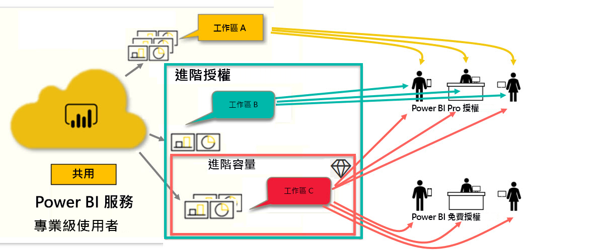

# Power BI 授權的類型
身為「取用者」  ，您可以使用 Power BI 服務來探索報表和儀表板，以制定商業決策。 如果您已經使用了 Power BI 一段時間，或與您的「設計師」  同事聊過，則可能會發現有某些功能只有在擁有特定類型的授權時才可以使用。 

此文章說明授權類型與組合之間的差異：免費、Pro、Premium，以及 Premium 容量。 您也將了解如何判斷所使用的授權組合。  

我們先從查看以下兩種類別的授權開始：每個使用者授權與組織授權。 我們的起點將是授權所提供的預設功能。 然後，我們將探討您的 Power BI 管理員和內容擁有者可以如何使用角色與權限來修改預設的授權功能。 

例如，即使您的授權允許，您的管理員仍可限制您執行匯出資料、使用 Q&A 自然語言查詢或發佈到 Web 等動作的能力。 當報表設計師  將內容指派給工作區時，他們可以將您指派給工作區角色。 角色會決定您可以在該工作區中執行和不能執行的動作。 設計師  可以使用權限設定進一步調整授權的限制。 換句話說...，這相當繁雜。 希望此文章能釐清大部分 (即使不是全部) 疑惑。

## 每個使用者授權
第一種授權類型是**每個使用者**授權。 每個 Power BI 服務使用者都有免費授權或 Pro 授權。 某些功能會保留給具有 Pro 授權的使用者使用。  

- **Power BI Pro 授權**可讓使用者透過建立並共用內容來與其他 Pro 使用者共同作業。 只有具備 Pro 授權的使用者可以發佈報表、訂閱儀表板和報表，並在工作區中與同事共同作業。 

    

    Power BI Pro 是一種個別使用者授權，可讓使用者讀取其他使用者在 Power BI 服務中發佈的報表與儀表板，以及與它們互動。 擁有此授權類型的使用者可以與其他 Power BI Pro 使用者共用內容和共同作業。 只有 Power BI Pro 使用者才能發佈或和其他使用者共用內容，或取用由其他使用者建立的內容。 例外是裝載於 [Power BI Premium 容量](#understanding-premium-and-premium-capacity)中的內容。 Pro 授權通常是由報表設計師  與開發人員所使用。 如需詳細資訊，請參閱 [Power BI Premium 容量](#understanding-premium-and-premium-capacity)。

- **獨立 Power BI 免費授權** (也很強大) 適用於 Power BI 新手，或自行建立內容的使用者。 [以個人身分註冊 Power BI 服務](../service-self-service-signup-for-power-bi.md)。 免費的獨立授權不會與組織授權相關聯。 

    免費的獨立使用者授權十分適合透過 Microsoft 範例來學習 Power BI 的人員。 使用免費獨立授權的使用者無法檢視由他人所共用的內容，也無法將自己的內容與其他 Power BI 使用者共用。 

    

目前為止都清楚嗎？  確定。 讓我們新增另一個層面：**Premium 容量**。

## 了解 Premium 與 Premium 容量
Premium 是**組織**授權。 您可以將其想成是在組織中的所有 Power BI **每個使用者**授權之上加上一層特性與功能。 

當組織購買 Premium 授權時，管理員通常會將 Pro 授權指派給將會建立及共用內容的員工。 並且，系統管理員會將免費授權指派給將會使用該內容的每個人。 Pro 使用者會建立[工作區](end-user-workspaces.md)，並將內容 (儀表板、報表、應用程式) 新增至那些工作區。 為了讓其他人可以在那些工作區中共同作業，Pro 使用者會使用容量  、權限與角色的組合。 

當組織購買 Premium 授權時，其會在專門配置給組織的 Power BI 服務中收到容量。 這個容量不會共用。 此容量支援 Microsoft 完全受控的的專用硬體。 組織可以選擇廣泛地套用其專用容量，或將其配置給特定工作區。 Premium 容量中的工作區是一種空間，其中 Pro 使用者可以與免費使用者共用及共同作業，而不需要免費的使用者擁有 Pro 帳戶。  

在 Premium 容量中，內容設計師仍然需要 Pro 授權。 設計師可以連線到資料來源、建立資料模型，然後建立封裝成工作區應用程式的報表與儀表板。 沒有 Pro 授權的使用者仍然可以存取 Power BI Premium 中的工作區，只要該內容是在 Premium 容量  中，而且只要工作區擁有者授與他們權限。

在下列圖表中，左側代表在工作區中建立及共用內容的 Pro 使用者。  
- **工作區 A** 是在沒有 Premium 的組織中建立的。 

- **工作區 B** 是在擁有 Premium 授權的組織中建立的，但此特定工作區並未儲存在 Premium 容量中。 工作區沒有鑽石圖示。

- **工作區 C** 是在具有 Premium 授權的組織中建立的，而且儲存在 Premium 容量中。 此工作區具有鑽石圖示。  

Power BI Pro 設計師  可以使用三個工作區中的任何一個來與其他 Pro 使用者共用及共同作業。 只要設計師與整個組織共用工作區，或將工作區角色指派給 Pro 使用者即可。 

Power BI Pro 設計師  只能與使用工作區 C 的免費使用者共用及共同作業。該工作區必須指派給 Premium 容量，免費使用者才能夠存取該工作區。 在工作區內，設計師會將角色指派給共同作業者：「管理員」  、「成員」  、「參與者」  或「檢視人員」  。 您的角色會決定您可以在工作區內採取的動作。 Power BI「取用者」  通常會獲指派「檢視人員」  角色。 若要深入了解，請參閱 [Power BI 取用者的工作區](end-user-workspaces.md)。

## 找出您擁有的授權
有幾種方式可以查閱您的 Power BI 授權資訊。 

首先，判斷您擁有的**使用者**授權。

- 特定版本的 Microsoft Office 會包含 Power BI Pro 授權。  若要查看您的 Office 版本是否包含 Power BI，請瀏覽 [Office 入口網站](https://portal.office.com/account)並選取 [訂用帳戶]  。

    第一位使用者 Pradtanna 具有 Office 365 E5，其中包含 Power BI Pro 授權。

    ![Office 入口網站 [訂用帳戶] 索引標籤](media/end-user-license/power-bi-license-office.png)

    第二位使用者 Zalan 具有 Power BI 免費授權。 

    ![Office 入口網站 [訂用帳戶] 索引標籤](media/end-user-license/power-bi-license-free.png)

接下來，檢查您的帳戶是否也具有 Premium 授權。 上述使用者 (Pro 或免費) 可能屬於具有 Premium 授權的組織。  讓我們看看第二位使用者 Zalan。  

- 在 Power BI 服務中，選取 [我的工作區]  ，然後選取右上角的齒輪圖示。 選擇 [管理個人儲存體]  。

    ![隨即顯示 [齒輪設定] 功能表](media/end-user-license/power-bi-license-personal.png)

    **每個使用者**授權 (Pro 或免費) 提供 10 GB 的雲端儲存空間，可用於裝載 Power BI 報表或 Excel 活頁簿。 如果您看到超過 10 GB，則您是具有 Premium 授權的組織帳戶成員。

    

    請記住，在 Office 入口網站頁面上，Zalan 的使用者訂用帳戶是 Power BI (免費)。 但是由於其組織購買了 Premium 授權，因此在 Power BI 服務中，Zalan 不僅限於 10 GB 的儲存空間，而是擁有 100 GB 可用。 身為擁有 Premium 授權之組織中的取用者  ，只要設計師  將工作區置於 Premium 容量中，Zalan 就能檢視共用內容、與同事共同作業、使用應用程式等。 其權限範圍，是由其 Power BI 管理員與內容設計師所設定。 請注意，Pro 使用者已與 Zalan 共用工作區。 鑽石圖示可讓他知道此工作區是儲存在 Premium 容量中。 

   
## 了解工作區角色
到目前為止，我們已檢閱過每個使用者授權、Premium 授權與 Premium 容量。 現在，讓我們看看工作區角色  。

因為這是適用於 Power BI 取用者  的文章，所以有下列案例：

-  您是具有 Power BI Premium 授權之組織內的免費  使用者。 
- Power BI Pro 使用者已建立儀表板與報表的集合，並將此集合作為應用程式  發佈至整個組織。  
- 應用程式存在於工作區  內，且工作區在 Premium 容量中。    
- 此應用程式工作區有一個儀表板與兩個報表。
- Pro 使用者已為我們指派了**檢視人員**角色。

### 檢視人員角色
角色可讓 Power BI 設計師  管理誰可以在工作區中做什麼，因此小組可以共同作業。 其中一個角色是**檢視人員**。 

當工作區在 Power BI Premium 容量中時，具有檢視者角色的使用者可以存取工作區，即使他們沒有 Power BI Pro 授權也一樣。 但因為「檢視人員」角色無法存取或匯出底層資料，所以其是與儀表板、報表和應用程式互動的安全方式。

> [!TIP]
> 若要深入了解其他角色 (管理員、成員與參與者)，請參閱[建立新的工作區](../service-new-workspaces.md)。

