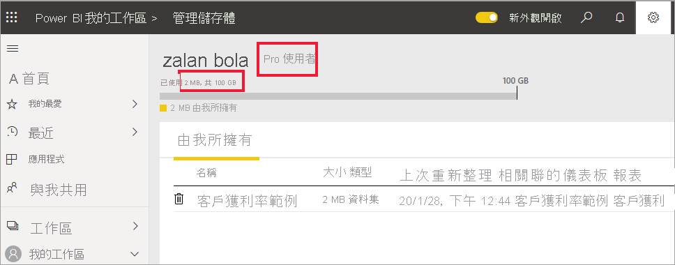

# Power BI 授權的類型
身為「取用者」  ，您可以使用 Power BI 服務來探索報表和儀表板，以制定商業決策。 如果您已經使用了 Power BI 一段時間，或與您的「設計師」  同事聊過，則可能會發現有某些功能只有在擁有特定類型的授權時才可以使用。 

本文說明授權類型之間的差異：免費、Pro、具有 Premium 容量的免費授權，以及具有 Premium 容量的 Pro 授權。 您也將了解如何判斷所使用的授權。  

我們先從查看以下兩種類別的授權開始：使用者授權和組織授權。 

## 使用者授權
第一種授權類型是**使用者**授權。 每一位 Power BI 使用者都有免費授權或 Pro 授權。 某些功能僅限於具備 Pro 授權的使用者。  

- Power BI Pro 授權可讓使用者建立並共用內容，以與其他 Pro 使用者共同作業。 只有具備 Pro 授權的使用者可以發佈報表、訂閱儀表板和報表，並在工作區中與同事共同作業。 Pro 授權通常是由報表「設計師」  、開發人員、分析師和系統管理員所使用。

- Power BI 免費授權 (也很強大) 適用於 Power BI 新手，或自行建立內容的使用者。 免費使用者授權十分適合透過 Microsoft 範例來學習 Power BI 的人員。 具備免費授權的使用者無法查看由他人所共用內容，也無法將自己的內容與其他 Power BI 使用者共用。  

目前為止都清楚嗎？  確定。 讓我們新增另一個層面：**Premium 容量**。

## Power BI Premium 的功能為何？ 運作方式
Premium 容量是**組織**授權。 您可以想成是在組織中的所有 Power BI **使用者**授權之上新增一層特性和功能。 「取用者」  的其中一項優勢，就是組織成員的體驗 (具備「免費」  使用者授權) 會變得更加完善。 如果您的公司有 Premium 容量授權，則 Pro 使用者可以與組織的所有成員共用內容，而不要求檢視內容的使用者具備 Power BI Pro 授權。   

當組織購買 Premium 容量授權時，系統管理員通常會將 Pro 授權指派給將會建立及共用內容的員工。 並且，系統管理員會將免費授權指派給將會使用該內容的每個人。  

想要 Premium 的更多詳細資料嗎？ 請繼續閱讀。 否則，請跳至下方的[找出您擁有的授權](#find-out-which-license-you-have)。

當組織購買 Premium 容量授權時，其會在專門配置給組織的 Power BI 服務中收到容量。 這個容量不會共用。 此容量支援 Microsoft 完全受控的的專用硬體。 組織可以選擇廣泛地套用其專用容量，或根據使用者數目、工作負載需求或其他因素，將其配置給指派的工作區，然後隨需求變更相應增加或減少。

Power BI Premium 提供專用容量，以傳遞更一致的效能，並在 Power BI 中支援更大的資料量。 

## 找出您擁有的授權
有幾種方式可以查閱您的 Power BI 授權資訊。 

首先，判斷您擁有的**使用者**授權。

- 特定版本的 Microsoft Office 會包含 Power BI Pro 授權。  若要查看您的 Office 版本是否包含 Power BI，請瀏覽 [Office 入口網站](https://portal.office.com/account)並選取 [訂用帳戶]  。

    第一位使用者 Pradtanna 具有 Office 365 E5，其中包含 Power BI Pro 授權。

    ![Office 入口網站 [訂用帳戶] 索引標籤](media/end-user-license/power-bi-license-office.png)

    第二位使用者 Zalan 具有 Power BI 免費授權。 

    ![Office 入口網站 [訂用帳戶] 索引標籤](media/end-user-license/power-bi-license-free.png)

接下來，檢查您的帳戶是否也具有 Premium 容量授權。 上述使用者 (Pro 或免費) 可能屬於具有 Premium 容量授權的組織。  讓我們看看第二位使用者 Zalan。  

- 在 Power BI 服務中，選取 [我的工作區]  ，然後選取右上角的齒輪圖示。 選擇 [管理個人儲存體]  。

    ![隨即顯示 [齒輪設定] 功能表](media/end-user-license/power-bi-license-personal.png)

    **使用者**授權 (Pro 或免費) 提供 10 GB 的雲端儲存空間，可用於裝載 Power BI 報表或 Excel 活頁簿。 如果您看到超過 10 GB，則您是具有 Premium 容量授權的組織帳戶成員。

    請記住，在 Office 入口網站頁面上，Zalan 的使用者訂用帳戶是 Power BI (免費)。 但是因為他的組織購買了 Premium 容量授權，所以在 Power BI 服務中，Zalan 是 **Pro 使用者**。 身為具有 Premium 容量授權組織中的「取用者」  ，他可以檢視共用內容、與同事共同作業、使用應用程式等。 他的權限範圍，是由其 Power BI 系統管理員所設定。 大部分「取用者」  都具有執行以下動作的權限：使用問與答、匯出內容、重新共用應用程式，以及建立訂用帳戶。  不過，建立和發佈新內容的功能，僅限於身為「設計師」  、分析師、開發人員和系統管理員的同事。   <!-- how can he be Pro if I assigned him a Free account in the O365 portal?  Is he a Pro user with consumer permissions? -->

    
