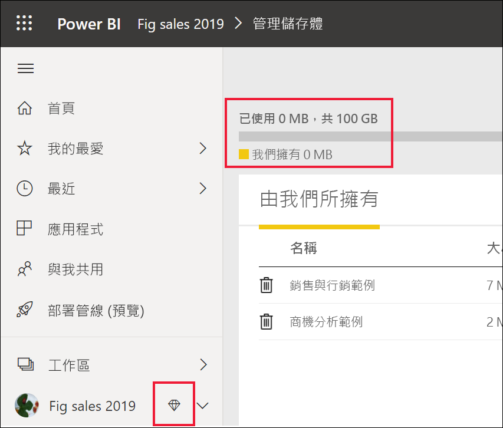
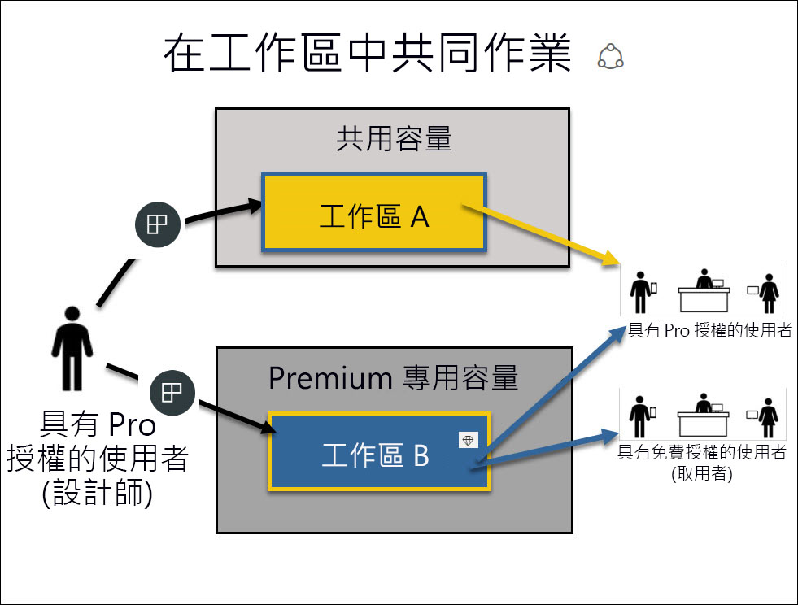

# 以「取用者」  身分使用 Power BI 服務

[!INCLUDE[consumer-appliesto-ynnn](../includes/consumer-appliesto-ynnn.md)]

「取用者」[*consumer*](end-user-consumer.md)可以使用 Power BI 服務探索報表與儀表板，以藉由參考資料來制定商務決策。 若您已使用 Power BI 一段時間，或曾與您的「設計師」  同事聊過，可能會發現有些功能只在擁有特定類型的授權、訂閱或權限時才可運作。 

您在 Power BI 服務中能執行哪些作業，取決於下列三個要件：
-    您使用的授權與訂閱類型
-    內容的儲存位置
-    指派給您的角色與權限

本文將說明各種授權類型的功能，以及「內容儲存位置」  對於您能執行的作業，會造成哪些影響  。 此外，您也將學習如何查詢您的授權與訂閱，以及了解內容的儲存位置。 如需角色與權限的詳細資訊，請參閱[工作區角色](end-user-workspaces.md)。

## 授權

每位 Power BI 服務使用者若非使用「免費」  授權，就是使用 *Pro* 授權。 若您是 Power BI 的「取用者」  ，可能會使用由您系統管理員管理的免費授權。 

您可能同時擁有多份授權。  此服務提供給您的體驗，將會以您擁有的授權中，條件最佳者為準。 

## Power BI Premium 容量

Premium 是組織訂閱，與免費授權不同，會將內容儲存在專用容量中。 無論是組織內部或外部的使用者，只要持有 Premium 授權，都無須再購買個人的 Power BI Pro 授權，就能檢視您的 Power BI 內容。 

Premium 讓 Pro 使用者能廣泛散發內容，且檢視內容的收件者並不需要 Pro 授權。 內容設計師需要 Pro 授權。 設計師可以連線到資料來源、建立資料模型，然後建立封裝成工作區應用程式的報表與儀表板。 只要 Power BI Premium 容量中的工作區有檢視者角色，沒有 Pro 授權的使用者就仍然可以加以存取。

在這些工作區中，設計師會指派角色 (例如**檢視者**、**參與者**、**成員**與**系統管理員**)，以決定每位同事能與內容互動的範圍。 如需詳細資訊，請參閱[工作區權限與角色。](end-user-workspaces.md) 

如需 Premium 容量的詳細資訊，請參閱[什麼是 Microsoft Power BI Premium？](../service-premium-what-is.md)。

## 了解您擁有的授權

只要瀏覽您在 [Microsoft 的 [我的帳戶]  頁面](https://portal.office.com/account)，就能查看指派給您的授權。  選取 [訂閱]  索引標籤。

第一位使用者 Pradtanna 具有 Office 365 E5，其中包含 Power BI Pro 授權。

![Office 入口網站 [訂用帳戶] 索引標籤](media/end-user-license/power-bi-license-office.png)

第二位使用者 Zalan 具有 Power BI 免費授權。 

![Office 入口網站 [訂用帳戶] 索引標籤](media/end-user-license/power-bi-license-free.png)

## 了解您是否有權存取 Premium 容量

接下來確認您是否為擁有 Premium 容量組織的一員。 上述使用者無論使用 Pro 或免費授權，都可能屬於擁有 Premium 容量的組織。  讓我們看看第二位使用者 Zalan。  

我們可以藉由查詢可用的儲存區數量，判斷 Zalan 的組織是否擁有 Premium 容量。 

- 在 Power BI 服務中，選取 [我的工作區]  ，然後選取右上角的齒輪圖示。 選擇 [管理個人儲存體]  。

    ![隨即顯示 [齒輪設定] 功能表](media/end-user-license/power-bi-license-personal.png)

    若顯示的容量超過 10 GB，便表示您是擁有 Premium 訂閱之組織的成員。 下圖顯示 Zalan 所屬組織擁有的儲存體高達 100 GB。  

    

請注意，Pro 使用者已與 Zalan 共用工作區。 鑽石圖示指出此工作區儲存在 Premium 容量中 

## 找出裝載在 Premium 容量中的內容

另一種確認您組織是否擁有 Premium 容量的方式，就是尋找標示有鑽石圖示的應用程式與應用程式工作區。 鑽石圖示表示此內容儲存在 Premium 容量中。 

在下圖的應用程式中，有三個儲存在 Premium 容量中。

![[應用程式] 畫面](media/end-user-license/power-bi-premium.png)

    
對於「取用者」  ，只要「設計師」  將工作區置於 Premium 的專用容量中，就能**在該工作區內**檢視共用的內容、與同事共同作業、使用應用程式儀表板及報表等等。 您的權限範圍由您的 Power BI 系統管理員與內容設計師設定。 

   

## 總整理

當組織購買 Premium 容量訂閱時，系統管理員通常會將 Pro 授權，指派給會在 Premium 容量中建立與共用內容的員工。 並且，系統管理員會將免費授權指派給將會使用該內容的每個人。 Pro 使用者會建立[工作區](end-user-workspaces.md)，並將內容 (儀表板、報表、應用程式) 新增至那些工作區。 為讓免費使用者也能在這些工作區中共同作業，系統管理員或 Pro 使用者可以將工作區指派至「專用容量」  。    
 

|授權類型  |共用容量  |專用容量  |
|---------|---------|---------|
|**免費**     |  可用為個人沙箱，以建立您自己的內容，以及與該內容互動。 這是試用 Power BI 服務的好方法。 您無法取用他人的內容，也無法將您的內容提供給他人共用 1     |   與指派至專用容量的內容互動，並提供給您共用。 免費使用者無須擁有 Pro 帳戶，就能與 Pro 使用者共同作業。      |
|**Pro**     |  藉由建立及共用內容來和其他 Pro 使用者共同作業。        |  藉由建立及共用內容來和免費使用者與其他 Pro 使用者共同作業。       |

1 請參閱[考量與疑難排解](#considerations-and-troubleshooting)。 

在下列圖表中，左側代表在應用程式工作區中建立及共用內容的 Pro 使用者。 

- **工作區 A** 是建立在不具 Premium 容量的組織中。 

- **工作區 B** 是建立在擁有 Premium 訂閱，且工作區儲存在專用容量內的組織中。 此工作區標示有鑽石圖示。  

    

Power BI Pro 的「設計師」  可以在這三個工作區中的任一個工作區內，與其他 Pro 使用者共用及共同作業。 但 Power BI Pro 的使用者若要與免費使用者共用及共同作業，只能使用位於 Premium 專用容量中的「工作區 B」。  在該工作區內，設計師會為共同作業者指派角色。 您的角色會決定您可以在工作區內採取的動作。 Power BI「取用者」  通常會獲指派「檢視人員」  角色。 若要深入了解這些角色，請參閱 [Power BI 取用者的工作區](end-user-workspaces.md)。

## 考量與疑難排解
- 您可以同時擁有多份 Power BI 授權。 Power BI 服務提供給您的體驗，以您擁有的授權中，條件最佳者為準。 例如，若您同時擁有 Pro 授權與免費授權，Power BI 服務將會使用 Pro 授權。

- 若您想要共用及建立內容 (儀表板、報表、應用程式)，您不得是 Power BI 的「取用者」  ，而必須是「設計師」  。 請考慮變更為 Pro 使用者授權。 當您想要試用 Pro 功能時，可以隨時選取出現在 Power BI 服務中的升級對話方塊，註冊 Power BI Pro 個人試用版，免費使用 60 天。

    

  當 60 天試用版到期時，您的授權將會回復成免費的 Power BI 授權。 出現這種情況後，您即無法再存取需要 Power BI Pro 授權的功能。 若您想要繼續使用 Pro 授權，請洽詢您的系統管理員有關於購買 Power BI Pro 授權的相關事宜。 若無系統管理員，請前往 [Power BI 定價頁面](https://powerbi.microsoft.com/pricing/)。     

- 當您註冊免費授權之後，該授權將永遠不會過期。 因此，若您升級為 Pro 試用版，或您組織提供您 Pro 授權，則當試用版結束，或您的組織移除了您的 Pro 授權時，除非您自己或系統管理員取消授權，否則您仍可回復成免費授權。 

- 1 Power BI 服務的免費使用者授權，十分適合使用**我的工作區**執行探索，或是執行個人資料分析與視覺效果的人員使用。 免費使用者無法使用 Power BI 與同事共同作業。 免費授權使用者無法查看他人共用的內容，也無法將自己的內容提供給其他 Power BI 使用者共用。 

    

## 後續步驟
- [我是 Power BI 的「取用者」  嗎？](end-user-consumer.md)    
- [深入了解工作區](end-user-workspaces.md)    
- [依授權類型檢視 Power BI 取用者功能](end-user-features.md)
