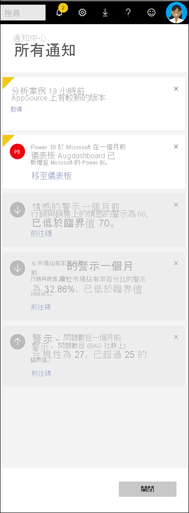

# 檢視 Power BI 通知

[!INCLUDE[consumer-appliesto-yynn](../includes/consumer-appliesto-yynn.md)]

[!INCLUDE [power-bi-service-new-look-include](../includes/power-bi-service-new-look-include.md)]

通知中心是按時間排列的 Power BI 體驗相關資訊摘要。 加以開啟即可看到下列訊息：已與您共用的新儀表板、Power BI 事件和會議的相關資訊、您已設定的警示等。 您可以[在 Power BI 服務中設定警示](end-user-alerts.md)，也可以在 Power BI 行動裝置應用程式中設定警示。

觀看 Amanda 如何檢閱、管理及回應通知。 然後遵循影片下方的指示親自試試看。    

> [!NOTE]
> 這部影片會示範較舊版本的 Power BI 服務。 

<iframe width="560" height="315" src="https://www.youtube.com/embed/bZMSv5KAlcE" frameborder="0" allowfullscreen></iframe>

## 檢視您的通知
1. 當您登入 Power BI 時，所有在您離線時傳來的通知都會加入摘要中。 如果您有新通知，Power BI 會顯示有新項目數目的黃色泡泡。
   
   
2. 在 Power BI 功能表列選取**通知**圖示。
   
   
3. 最新通知會列在頂端，而且未讀取的訊息會有醒目提示。 通知會保留 90 天，除非您將其刪除，或是達到 100 則上限。
   
   
4. 若要關閉通知，請選取 X 圖示。

## 後續步驟
* [Power BI 服務中的資料警示](end-user-alerts.md)
* [在 iPhone App (Power BI for iOS) 中設定資料警示](mobile/mobile-set-data-alerts-in-the-mobile-apps.md)
* [在 Power BI for Windows 10 行動裝置 App 中設定資料警示](mobile/mobile-set-data-alerts-in-the-mobile-apps.md)
* 有其他問題嗎？ [試試 Power BI 社群](https://community.powerbi.com/)

