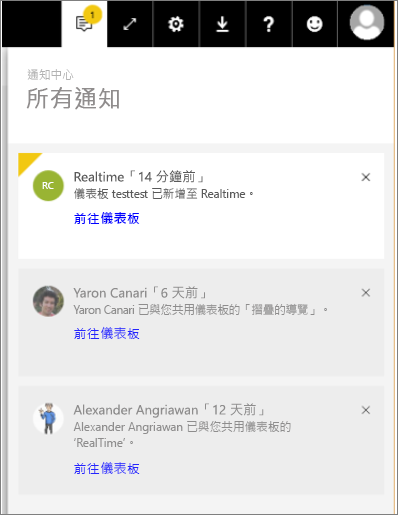

# 檢視 Power BI 通知
通知中心是按時間排列的 Power BI 體驗相關資訊摘要。 加以開啟即可看到下列訊息的循序摘要：已與您共用的新儀表板、您的群組空間變更、Power BI 事件和會議的資訊、您已設定的警示等等。 您可以[在 Power BI 服務中設定警示](../service-set-data-alerts.md)，也可以在 Power BI 行動裝置應用程式中設定警示。

觀看 Amanda 檢閱收到的通知、管理通知及加以回應。 然後遵循影片下方的指示親自試試看。

<iframe width="560" height="315" src="https://www.youtube.com/embed/bZMSv5KAlcE" frameborder="0" allowfullscreen></iframe>

1. 當您登入 Power BI 時，所有在您離線時傳來的通知都會加入摘要中。 如果您有新通知，Power BI 會顯示有新項目數目的黃色泡泡。
   
   
2. 在 Power BI 功能表列選取通知圖示。
   
   
3. 最新通知會列在頂端，而且未讀取的訊息會有醒目提示。 通知會保留 90 天，除非您將其刪除，或是達到 100 則上限。
   
   
4. 若要關閉通知，請選取 X 圖示。

### 後續步驟
* [Power BI 服務中的資料警示](../service-set-data-alerts.md)
* [建立由 Power BI 資料警示觸發的 Microsoft Flow](../service-flow-integration.md)
* [在 iPhone App (Power BI for iOS) 中設定資料警示](mobile/mobile-set-data-alerts-in-the-mobile-apps.md)
* [在 Power BI for Windows 10 行動裝置 App 中設定資料警示](mobile/mobile-set-data-alerts-in-the-mobile-apps.md)
* 有其他問題嗎？ [試試 Power BI 社群](http://community.powerbi.com/)

