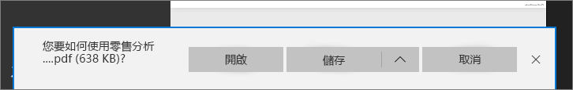

# 從 Power BI 將報表匯出至 PDF
有了 Power BI，您就可以將報表發佈至 PDF 格式，並根據 Power BI 報表輕鬆地建立文件。 當您**匯出至 PDF** 時，Power BI 報表中的每個頁面都會變成 PDF 文件中的個別頁面。

## 如何將 Power BI 報表匯出至 PDF
在 Power BI 服務中，選取要顯示在畫布上的報表。 也可以從您的首頁、應用程式，或左側瀏覽窗格上的其他區段選取報表。

1. 從功能表列中選取 [檔案]   > [匯出至 PDF]  。

    ![從功能表列選取 [檔案]，將箭頭指向 [匯出至 PDF]](media/end-user-pdf/power-bi-export-pdf.png)

    會出現快顯，其中有選項可供您選取 [目前檢視]  或 [預設檢視]  。  [目前檢視]  會以目前狀態匯出報表，其中包括您對交叉分析篩選器和篩選值進行的有效變更。  大多數使用者會選取此選項。  選取 [預設檢視]  則會以原始狀態 (如同作者共用當下的狀態) 匯出報表，而不會反映您對該原始狀態進行的任何變更。
    
    另外還會出現核取方塊供您選取是否要匯出報表的隱藏索引標籤。  如果您只要可在瀏覽器中看見的報表索引標籤，只要選取此方塊即可。  如果您希望取得屬於報表的所有隱藏索引標籤，可以不要選取此方塊。  如果選取方塊呈現灰色，即代表報表中沒有任何隱藏索引標籤。  在您選取完成後，請按一下 [匯出] 按鈕繼續。
    
    進度列會顯示在右上角。 匯出可能需要幾分鐘的時間，而您可以在報表匯出時繼續使用 Power BI 工作。

    

    完成後，通知橫幅隨即變更，讓您知道 Power BI 服務已完成匯出程序。

2. 您可以在瀏覽器顯示下載檔案的位置取得檔案。 在下圖中，是以瀏覽器視窗底部的下載橫幅方式顯示。

    

就是這麼簡單。 您可以下載檔案，並以任何 PDF 檢視器開啟它，例如 Microsoft Edge 中提供的 PDF 檢視器。

## 限制與考量
使用 [匯出至 PDF]  功能時，需牢記幾項考量與限制。

* 目前不支援 **R 視覺效果**。 在 PDF 中，這些視覺效果會是空白，並顯示錯誤訊息。  

* 目前已支援**經認證**的**自訂視覺效果**。 如需認證自訂視覺效果，包括如何使自訂視覺效果獲得認證的詳細資訊，請參閱[認證自訂視覺效果](../power-bi-custom-visuals-certified.md)。 不支援未經認證的自訂視覺效果。 在 PDF 中，將會顯示它們並出現錯誤訊息。   

* 目前無法匯出超過 30 頁的報表。

* 將報表匯出至 PDF 的程序需時數分鐘，請耐心等候。 影響所需時間的因素，包括報表結構及 Power BI 服務目前的負載。

* 如果 Power BI 服務中沒有 [匯出至 PDF]  功能表項目，可能是因為租用戶系統管理員停用了此功能。 如需詳細資訊，請連絡您的租用戶系統管理員。

* 背景影像會按圖表的周框區域剪裁。 強烈建議您先移除背景影像，再匯出至 PDF。

* Power BI 租用戶網域外部使用者擁有的報表 (例如，組織外部某人所擁有並與您共用的報表) 無法發佈至 PDF。

* 如果您與組織外部的某人 (也就是不在您 Power BI 租用戶中的使用者) 共用儀表板，該使用者會無法將與共用儀表板的相關報表匯出至 PDF。 舉例來說，如果您是 aaron@contoso.com，您可以和 cassie@cohowinery.com 共用。 但是 cassie@cohowinery.com 無法將相關報表匯出至 PDF。

* 將包含背景影像的報表匯出成 PDF 時，如果使用 [頁面背景] 中的 [標準] 或 [填滿] 選項，您可能會在匯出中看到扭曲的影像。  為得到最佳結果，建議您使用 [最適大小] 選項以免匯出的文件發生問題。

* Power BI 服務會使用您的 Power BI 語言設定作為 PDF 的輸出語言。 若要查看或設定語言喜好設定，請選取齒輪圖示 > [設定]   > [一般]   > [語言]  。

* 針對匯出選擇 [目前的值] 時，目前不適用 URL 篩選。

## 後續步驟
[列印報表](end-user-print.md)
