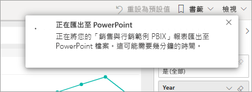
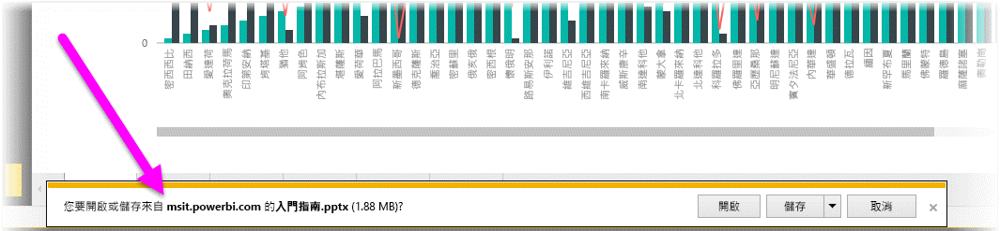
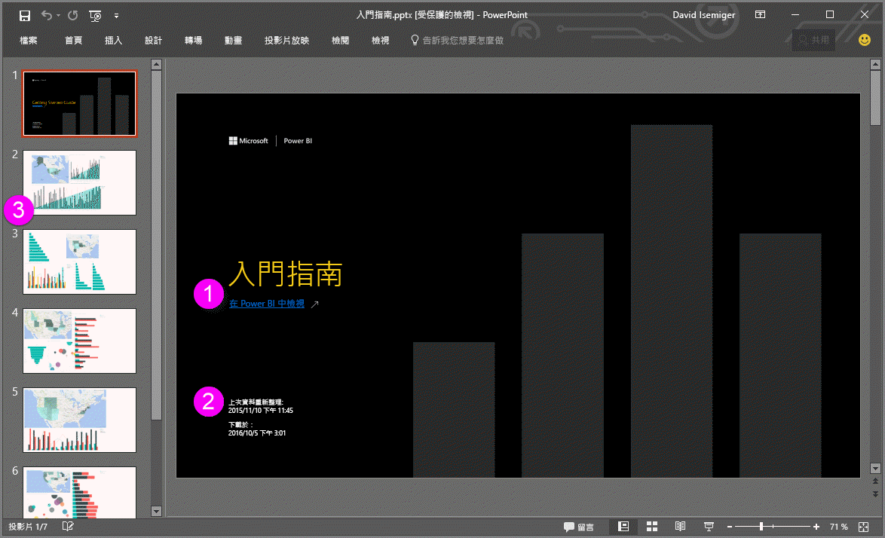
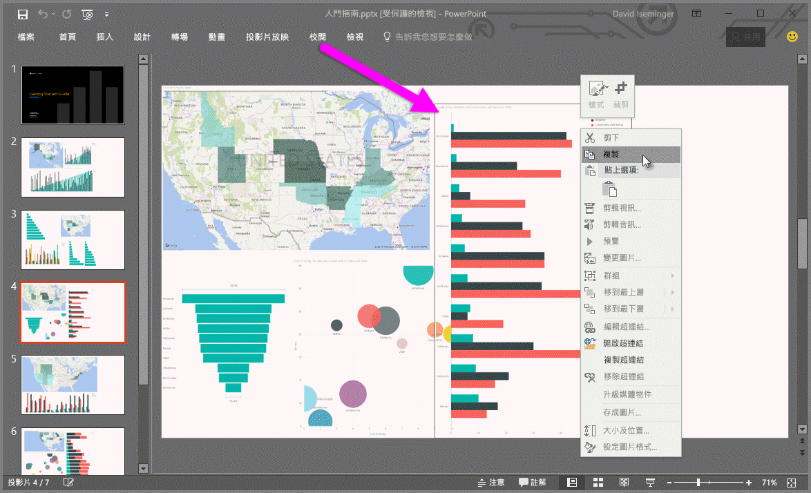

# 從 Power BI 將報表匯出至 PowerPoint
有了 Power BI，您就可以將報表發佈至 Microsoft PowerPoint，並根據 Power BI 報表輕鬆地建立投影片組。 當您匯出至 PowerPoint 時，會發生下列狀況：

* Power BI 報表中每個頁面都會變成 PowerPoint 的個別投影片。
* Power BI 報表中每個頁面都會匯出成 PowerPoint 中的單一高解析度影像。
* 會保留您新增至報表的篩選和交叉分析篩選器設定。
* PowerPoint 中會建立連結至 Power BI 報表的連結。

將 **Power BI 報表**匯出到 **PowerPoint** 的程序非常簡單快速。 請遵循下一節中概述的步驟。

## 將 Power BI 報表匯出至 PowerPoint
在 Power BI 服務中，選取要顯示在畫布上的報表。 您也可以從左側瀏覽窗格上的 [首頁]  、[應用程式]  或其他任何容器中選取報表。

當畫布上顯示您要匯出至 PowerPoint 的報表時，請從功能表列選取 [匯出]   > [PowerPoint]  。

![從功能表列選取 [匯出]](media/end-user-powerpoint/power-bi-export.png)

隨即出現快顯視窗，其中有選項可供您選取 [目前的值]  或 [預設值]  。 [目前的值]  會以目前狀態匯出報表，其中包括您對交叉分析篩選器和篩選值進行的有效變更。 大多數使用者會選取此選項。 選取 [預設值]  則會以原始狀態 (如同「作者」  共用當下的狀態) 匯出報表，而不會反映您對該原始狀態進行的任何變更。

 
另外，還會出現核取方塊供您選取是否要匯出報表的隱藏索引標籤。 如果您只要在瀏覽器中匯出可看見的報表索引標籤，請選取此核取方塊。 如果您希望在匯出過程中取得所有隱藏索引標籤，請不要選取此核取方塊。 如果核取方塊呈現灰色，即代表報表中沒有任何隱藏索引標籤。 在您選取完成後，請選取 [匯出]  繼續。

您會在 Power BI 服務瀏覽器視窗的右上角，看到報表正在匯出至 PowerPoint 的通知橫幅。 匯出可能需要幾分鐘的時間。 您可以在正在匯出報表時繼續使用 Power BI 工作。

在 Power BI 服務完成匯出程序後，通知橫幅會隨即變更以讓您知道。 您可以在瀏覽器顯示下載檔案的位置取得檔案。 在下圖中，是以瀏覽器視窗底部的下載橫幅方式顯示。

就是這麼簡單。 您可以下載檔案、使用 PowerPoint 開啟檔案，然後像您處理任何其他 PowerPoint 簡報一樣修改或加強檔案。

## 查看已匯出的 PowerPoint 檔案
當您開啟 Power BI 匯出的 PowerPoint 檔案時，您會發現一些很棒又實用的元素。 請看下圖，然後查看描述其中幾項酷炫功能的編號項目。

1. 投影片組的第一頁包含報表名稱及連結，讓您能夠**在 Power BI 中檢視**作為投影片組基礎的報表。
2. 您也可以取得有關報表的一些實用資訊。 [上次資料重新整理]  會顯示匯出報表所依據的日期和時間。 [下載於]  則顯示將 Power BI 報表匯出至 PowerPoint 檔案時的日期和時間。
3. 每張報表頁面都是一張個別的投影片，如左導覽窗格中所示。 
4. 已發行的報表會根據您 Power BI 設定中的語言來進行轉譯，否則會根據您的瀏覽器地區設定來進行轉譯。 若要查看或設定語言喜好設定，請選取齒輪圖示  > [設定]   > [一般]   > [語言]  。 如需地區設定的資訊，請參閱 [Power BI 支援的語言與國家或地區](../supported-languages-countries-regions.md)。
5. PowerPoint 簡報包含了一張封面投影片，其中有正確時區的匯出時間。

當您瀏覽個別的投影片時，您會發現每個報表頁面都是獨立的影像。

>[!NOTE]
> 每個報表頁面擁有一個視覺效果是新的行為。 先前的行為 (針對每個視覺效果提供獨立的影像) 已不再實作。 
 

您可在此隨意處理 PowerPoint 簡報或任何高解析度影像。

## 限制
當您使用 [匯出至 PowerPoint]  功能時，需牢記幾項考量與限制。

* 目前不支援 R 視覺效果。 任何這類的視覺效果都會作為空白影像匯出至 PowerPoint，並顯示一個錯誤訊息，指出目前並不支援該視覺效果。
* 目前支援經認證的自訂視覺效果。 如需認證自訂視覺效果 (包括如何使自訂視覺效果獲得認證) 的詳細資訊，請參閱[讓自訂視覺效果獲得認證](../power-bi-custom-visuals-certified.md)。 不支援未經認證的自訂視覺效果。 它們會作為空白影像匯出至 PowerPoint，並顯示一個錯誤訊息，指出目前並不支援該視覺效果。
* 目前無法匯出超過 30 頁的報表。
* 將報表匯出至 PowerPoint 的程序可能需時數分鐘，請耐心等候。 影響所需時間的因素，包括報表結構及 Power BI 服務目前的負載。
* 如果 Power BI 服務中沒有 [匯出至 PowerPoint]  功能表項目，可能是因為租用戶系統管理員停用了此功能。 如需詳細資訊，請連絡您的租用戶系統管理員。
* 背景影像會按圖表的周框區域剪裁。 我們建議您先移除背景影像，再匯出至 PowerPoint。
* PowerPoint 中的頁面一律會以標準的 9:16 大小建立，而不論 Power BI 報表中的原始頁面大小或維度為何。
* Power BI 租用戶網域外部使用者擁有的報表 (例如，組織外部某人所擁有並與您共用的報表) 無法發佈至 PowerPoint。
* 如果您與組織外部的某人 (也就是不在您 Power BI 租用戶中的使用者) 共用儀表板，則該使用者無法將共用儀表板的相關聯報表匯出至 PowerPoint。 例如，如果您是 aaron@contoso.com，您可以與 david@cohowinery.com 共用。 但是 david@cohowinery.com 無法將相關聯報表匯出至 PowerPoint。
* 較舊版本的 PowerPoint 可能無法進行匯出。
* 如先前所述，每個報表頁面會匯出為 PowerPoint 檔中的單一影像。
* Power BI 服務會使用您的 Power BI 語言設定作為 PowerPoint 的輸出語言。 若要查看或設定語言喜好設定，請選取齒輪圖示  > [設定]   > [一般]   > [語言]  。
* 匯出的 PowerPoint 檔案，其封面投影片上的**下載於**時間，會設定為匯出當時您電腦的時區。
* 針對匯出選擇 [目前的值]  時，目前不適用 URL 篩選。

## 後續步驟
[列印報表](end-user-print.md)
