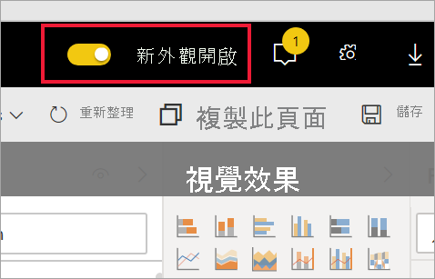

# 選擇加入 Power BI 服務預覽功能

[!INCLUDE[consumer-appliesto-yynn](../includes/consumer-appliesto-yynn.md)]

## 什麼是「預覽功能」  ？
當我們改善 Power BI 服務時，會以「預覽功能」  的形式發行一些新功能。 您可以開啟或關閉預覽功能，以獲得試用機會。

某些預覽功能可從 Power BI 儀表板、首頁或報表本身開啟和關閉。

   

其他預覽功能則可從 [設定]  功能表取得。 本文說明如何透過 [設定] 功能表存取預覽功能。

## 尋找預覽並將其開啟 (及關閉)
1. 選取 Power BI 螢幕右上角的齒輪圖示以開啟 [設定] 功能表，然後選擇 [設定]  。
   
   ![[設定] 功能表](./media/end-user-preview-features/power-bi-settings.png).
2. 選取 [一般]  索引標籤。如果預覽存在，您將會看到**預覽功能**的選項，或者會看到列在左側的預覽功能。  在此範例中，有針對 ArcGIS Maps 列出的預覽。 
   
   ![[一般] 索引標籤](./media/end-user-preview-features/power-bi-preview-esri.png)
3. 選取 [開啟]  選項按鈕，或標記核取方塊，以試用全新的體驗。 然後選取 [套用]  。
4. 若要關閉預覽功能，請遵循上述步驟 1-3，並在步驟 3 中選擇 [關閉]  ，或移除核取方塊，然後選取 [套用]  。

有疑問或意見反應嗎？ [請瀏覽 Power BI 社群論壇](https://community.powerbi.com/t5/Navigation-Preview-Forum/bd-p/NavigationPreview)。

