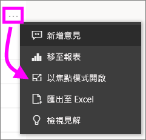

# 從 Power BI 服務列印

[!INCLUDE[consumer-appliesto-yynn](../includes/consumer-appliesto-yynn.md)]
## 可列印的內容
[!INCLUDE [power-bi-service-new-look-include](../includes/power-bi-service-new-look-include.md)]

從 Power BI 服務列印整個儀表板、儀表板磚、報表頁面或報表視覺效果。 如果報表有多張頁面，則您需要分別列印每一頁。 

## 列印考量

大部分的 Power BI 儀表板和報表都是由報表「設計工具」  所建立，以供線上使用並在顯示於各種裝置上時令人驚豔。 當您列印報表時，內容在紙張上的顯示方式是由瀏覽器所控制。 

有些瀏覽器設定可用於調整列印，但即使如此，您可能仍無法獲得想要的結果。 請考慮先[匯出為 PDF](end-user-pdf.md)，並改為列印 PDF。 

## 調整瀏覽器列印設定
當從 Power BI 列印時，您的瀏覽器即會開啟 [列印] 視窗。 每個瀏覽器的 [列印] 視窗各不相同。 但是，您會發現這些視窗都有類似的選項可供使用，以控制列印成品的外觀。 

以下是您可用來格式化列印成品的一些快速提示。

   > 
1. 如果儀表板、報表或視覺效果的寬度大於高度，請考慮使用 [橫向]  版面配置。 

   ![顯示 [版面配置] 為 [橫向] 的 [列印] 對話方塊](./media/end-user-print/power-bi-landscape-layout.png)

2. 若要更貼合列印的頁面，請調整邊界和比例等項目。 

    ![顯示 [更多] 設定的 [列印] 對話方塊](./media/end-user-print/power-bi-margins.png)

試驗您特有瀏覽器的設定，直到得到想要的外觀為止。 有些瀏覽器甚至有列印背景圖形的選項。 

## 列印儀表板
1. 開啟您想要列印的儀表板。
2. 在左上角選取 [匯出]，然後選擇 [列印此頁面]  。
   
    ![[列印儀表板] 選項](./media/end-user-print/power-bi-dashboard-print.png)

3. 您瀏覽器的 [列印] 視窗會隨即開啟。 選擇這些設定。 例如，如果儀表板的寬度大於長度，您可能想要將版面配置變更為 [橫向]  。 選取 [列印]  。
   
    ![[列印] 對話方塊](./media/end-user-print/power-bi-print-dash.png)

## 列印儀表板磚
1. 從上方功能表列中選取全螢幕圖示 ，以[全螢幕模式](end-user-focus.md)開啟儀表板。

3. 藉由暫留以顯示 [更多選項]  (...) 並選擇 [以焦點模式開啟]  或焦點圖示 ，[在焦點模式中開啟磚](end-user-focus.md)。
   
    

4. 將滑鼠停留在磚上方以顯示 [選項] 功能表。
   
    

4. 選取列印圖示 .     

5. 您瀏覽器的 [列印] 視窗會隨即開啟。 選擇這些設定。 例如，如果磚不符合頁面，您可能會想要將比例變更為 75%。 選取 [列印]  。

    ![[列印] 視窗](./media/end-user-print/power-bi-scale.png) 

> [!TIP]
> 如已遵循上述所有步驟，但磚仍未依您想要的方式顯示，請嘗試下列方法。
> 1. 開啟 [列印] 視窗，變更您認為會得到最佳列印成品的列印設定。 例如，變更版面配置、邊界和比例。 
> 2. 但不要選取 [列印]，而是選取 [取消]  。 
> 3. 再次執行步驟 1-5。 您的磚會調整為新 [列印] 視窗設定，並可供列印。

## 列印報表頁面
一次只能列印一頁報表。

1. 開啟報表，然後選取 [匯出]   > [列印]  以列印目前的報表頁面。
   
    ![Power BI [檔案] 功能表](./media/end-user-print/power-bi-report-print.png)
2. 您瀏覽器的 [列印] 視窗會隨即開啟。

3. 遵循上述**列印儀表板**的列印步驟執行作業。
   

## 列印報表視覺效果
1. [以焦點模式開啟視覺效果](end-user-focus.md)，方法是將滑鼠游標移至磚上方，並選取右上角的焦點圖示。

2. 從左上角，選取 [匯出]   > [列印]  以列印視覺效果。

    ![Power BI [檔案] 功能表](./media/end-user-print/power-bi-report-print.png)

3. 遵循上述**列印儀表板**的列印步驟執行作業。

## 考量與疑難排解

* 問：我無法一次列印所有報表頁面。    
* 答：是的。 一次只能列印一頁報表。
* 問：我無法列印到 PDF。    
* 答：如果您已在瀏覽器中設定 PDF 驅動程式，則只會看到此選項。    
* 問：當我選取 [列印]  時，看到的畫面與您在此所示的不同。    
* 答：[列印] 畫面會因瀏覽器與軟體版本而異。
* 問：我的列印成品未正確地縮放。  我的儀表板無法容納在此頁面上。 其他縮放和方向問題。    
* 答：我們無法保證列印的複本會與出現在 Power BI 服務中正本完全相同。 縮放、邊界、視覺效果詳細資料、方向和大小等項目不是由 Power BI 所控制。 嘗試調整瀏覽器列印設定。 上述建議中有部分是頁面方向 (直向或橫向)、邊界大小和比例。 如果這些內容沒有幫助，請參閱特定瀏覽器的相關文件。      
* 問：在全螢幕模式列印時，滑鼠停留在視覺效果上，卻看不到 [列印] 選項。   
* 答：請回到預設檢視的儀表板或報表，先以焦點模式重新開啟視覺效果，再以全螢幕模式開啟。 

## 後續步驟
[與同事和其他人共用儀表板與報表](../service-share-dashboards.md)

有其他問題嗎？ [試試 Power BI 社群](https://community.powerbi.com/)

