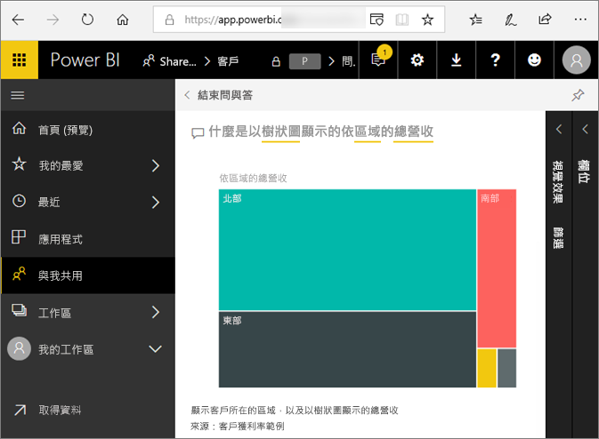
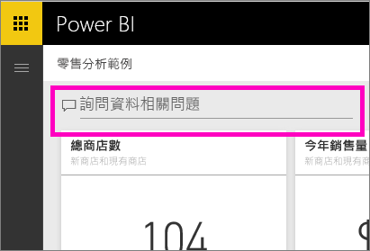
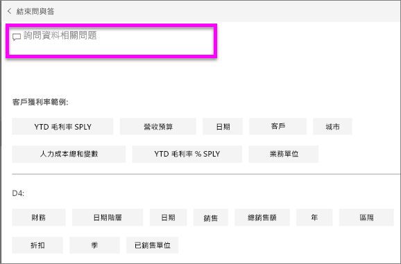
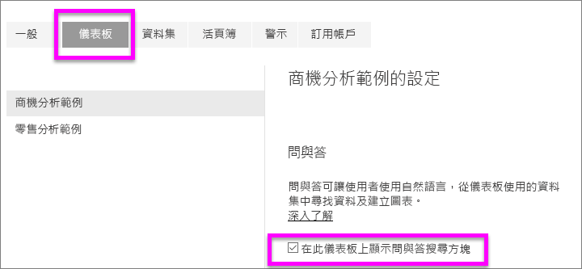
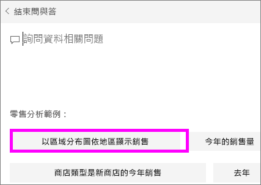

# Power BI **取用者**問與答
## 問與答是什麼？
有時若要從您的資料獲得解答，最快的方法是使用自然語言詢問問題。 例如，「去年總銷售額是多少」。  
使用問與答來探索資料，可使用直覺式的自然語言功能，並以圖表和圖形形式接收回應。 問與答不同於搜尋引擎 -- 問與答只會提供有關 Power BI 中資料的結果。

**Power BI 問與答**只可回答以英文詢問之自然語言查詢。 您可以透過 Power BI 系統管理員啟用西班牙文預覽。

**Power BI 問與答**可透過專業或進階授權提供。 
>

提問只是第一步。  縮小或擴充您的問題，讓查閱資料更加有趣，探索值得信賴的新資訊、聚焦於詳細資料，並且放寬條件以求得更廣泛的檢視。 您獲得的深入資訊和發現，讓人雀躍不已。

這種體驗真正充滿互動...而且快速！ 採用記憶體內部儲存體的回應幾乎可瞬間完成。

## 我可以在哪裡使用問與答？
您可以在 Power BI 服務中的儀表板上找到問與答，位於 Power BI 行動版儀表板底部，以及 Power BI Embedded 視覺效果的上方。 除非設計工具已授與您編輯權限，否則您將能夠使用問與答來探索資料，但無法儲存以問與答建立的任何視覺效果。

## 問與答如何知道要怎麼回答問題？
問與答會在所有與儀表板建立關聯的資料集中尋找解答。 如果資料集在儀表板中具有圖格，則問與答會在該資料集中尋找解答。 

## 我該如何開始？
首先，熟悉內容。 請在儀表板和報表中查看視覺效果。 了解可供您使用的資料類型和範圍。 然後，返回儀表板並將游標放在問題方塊中。 即會開啟問與答畫面。

 

* 如果視覺效果的軸標籤和值包含「銷售」、「帳戶」、「月份」與「商機」，您就可以安心地提出問題，例如：「哪一個『帳戶』有最高的『商機』，或以橫條圖根據月份顯示『銷售』。」

* 如果您在 Google Analytics 網站中擁有效能資料，您可以詢問問與答有關花在網頁的時間、特定網頁瀏覽次數和使用者參與率。 或者，如果您要查詢人口統計資料，您可能會想詢問各地區年齡和家庭收入的相關問題。

在畫面底部，您會看到其他有幫助的項目。 針對每個資料集，問與答都會顯示關鍵字，有時甚至會顯示一些範例或建議的問題。 選取其中任何一個以將其新增至問題方塊。 

問與答可協助您詢問問題的另一種方式為提示、自動完成和視覺提示。 

 

### 問與答會使用哪一種視覺效果？
問與答會根據要顯示的資料挑選最佳視覺效果。 有時在基礎資料集中資料的定義是特定類型或類別目錄，這就有助於問與答知道要如何加以顯示。 例如，如果將資料定義為日期類型，則較有可能顯示為折線圖。 分類為城市的資料比較有可能顯示為地圖。

您也可以告知問與答要使用哪一種視覺效果，方法是將視覺效果類型加入您的問題中。 但是請記住，以您要求的視覺效果類型讓問與答顯示資料，並不一定可行。 問與答將提示您可用的視覺效果類型清單。

## 考量與疑難排解
**問題**：我在儀表板上找不到問與答。    
**解答 1**：如果您找不到問題方塊，請先檢查您的設定。 請選取 Power BI 工具列右上角的齒輪圖示。   

然後選擇 [設定] > [儀表板]。 請確定已勾選 [在此儀表板上顯示問與答搜尋方塊]。
  

**解答 2**：有時儀表板「設計者」或您的系統管理員會關閉問與答。 請與他們確認是否可以將其重新開啟。   

**問題**：當我輸入問題時無法取得我想看到的結果。    
**解答**：請諮詢儀表板「設計者」。 為了改善問與答的結果，設計工具可能會進行很多作業。 比方說，設計工具可能會重新命名資料集中的資料行，來使用較容易了解的詞彙 (例如以 `CustomerFirstName` 取代 `CustFN`)。 由於設計工具十分了解資料集，因此設計工具也可以提出有幫助的問題，並將其新增至問與答畫布中。

## 後續步驟

