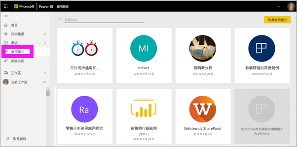
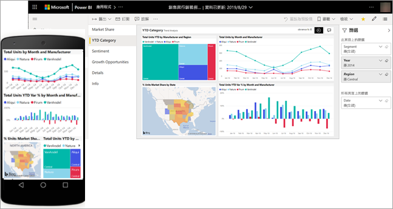
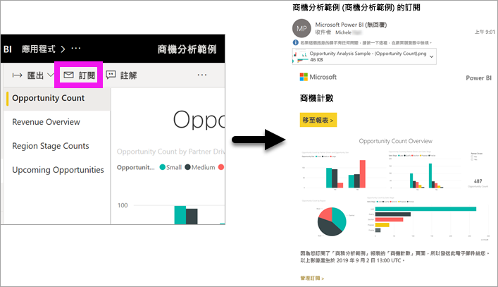
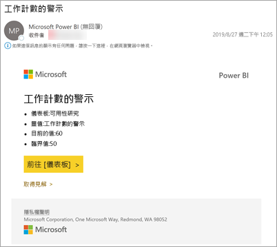
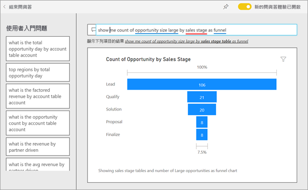
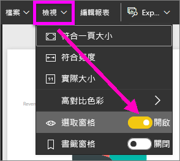
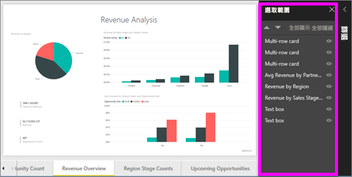
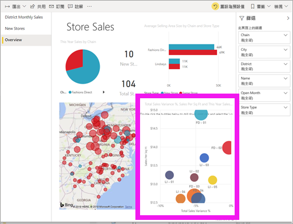
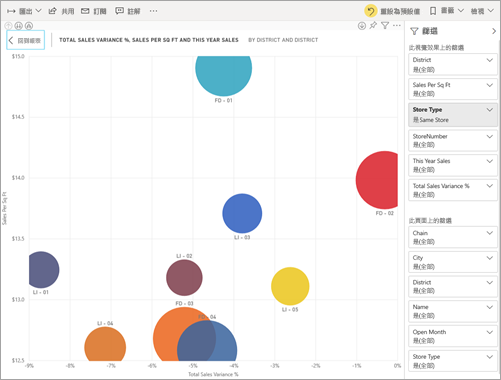

# 快速入門：了解適用於*取用者*的 Power BI 功能

[!INCLUDE[consumer-appliesto-ynny](../includes/consumer-appliesto-ynny.md)]

在此快速入門中，您會了解如何與 Power BI 互動，探索資料驅動商務見解。 本文不適合用於深入了解，而是快速探索 Power BI **取用者**可用的許多動作。

如果您尚未註冊 Power BI，請先進行[免費註冊](https://app.powerbi.com/signupredirect?pbi_source=web)再開始。

## Power BI 是什麼？ 
Power BI 是軟體服務、應用程式和連接器的集合，它們會搭配使用來將不相關的資料來源轉換成相關、視覺融入且具互動性的見解。 不論您的資料是簡單的 Excel 試算表，還是來自不同資料來源的資料集合，Power BI 都可讓您輕鬆地連線到資料來源、以視覺方式檢視 (或探索) 重要資料，並與任何人或所有人共用該資料。 

## 閱讀檢視
Power BI 服務中的 [閱讀] 檢視可供報表「取用者」  使用。 當同事與您共用報表、儀表板或應用程式時，[閱讀] 檢視是您探索報表並與之互動的方式。 

只要在瀏覽器或行動裝置中開啟 Power BI 服務即可。 您和同事可以從相同的受信任應用程式、儀表板與報表執行作業；其會自動更新及重新整理，因此您一律會使用最新的內容。   

由於內容不是靜態的，因此您可以深入探索以尋找趨勢、見解與其他商業智慧。 對內容進行分析，甚至用您自己的話來詢問問題。 或者，放心讓資料為您探索有趣的見解、在資料變更時傳送警示給您，並依照您設定的排程以電子郵件傳送報表給您。 這包括您來自任何裝置、不分時間的所有資料，無論它是位於雲端或內部部署中。 

繼續閱讀以深入了解更多。

## Power BI 內容
當我們在 Power BI 中使用「內容」一詞時，我們指的是報表、儀表板和應用程式。 這些是您將用來探索資料並做出商務決策的建置組塊。 

> [!NOTE]
> 儀表板、報表及應用程式也可以在行動裝置上檢視及共用。

###  應用程式

「應用程式」  是將相關儀表板和報表全都結合到同一處的 Power BI 內容類型。 應用程式可以有一或多個儀表板和一或多個報表，所有儀表板和報表都會組合在一起。 應用程式是由 Power BI「設計師」  所建立，這些設計師會散發應用程式並與像您一樣的「取用者」  共用。 

檢視應用程式的其中一種方法是從導覽窗格選取 [應用程式]  ，然後選取要開啟的應用程式。

若要深入了解檢視應用程式，請參閱 [Power BI 應用程式](end-user-apps.md)

### 報表

Power BI 報表是一種資料集的多角度檢視，可透過視覺效果表示該資料集不同的尋找結果和見解。 報表可以具備單一視覺效果，或是充滿視覺效果的頁面。 報表是由 Power BI「設計師」  所建立，這些設計師會散發報表，並與像您一樣的「取用者」  共用。

若要了解如何檢視報表，請參閱 [Power BI 報表](end-user-reports.md)

### 儀表板

Power BI 儀表板是使用視覺效果來訴說故事的單一頁面，通常稱為畫布。 因為受限於一張頁面，所以設計良好的儀表板只包含故事最重要的項目。

您在儀表板上看到的視覺效果稱為磚，由報表「設計師」  釘選在儀表板上。 在大部分的情況下，選取磚會帶您前往建立視覺效果的報表頁面。 

若要了解如何檢視儀表板，請參閱 [Power BI 儀表板](end-user-dashboards.md)
 
## 在 Power BI 服務中互動

### 與同事共同作業
略過電子郵件。 直接在儀表板上新增個人註解，或是和同事開始進行與該儀表板相關的交談。 註解功能只是您可與其他人共同作業的其中一種方法。 

深入了解[註解](end-user-comment.md)

### 放鬆並讓 Power BI 為您工作
Power BI 服務能為您工作的兩種方法，是處理訂用帳戶和警示。 

#### 訂閱儀表板 (或報表)
您無須開啟 Power BI 也能監視儀表板。  您可以改為訂閱，使 Power BI 根據您設定的排程透過電子郵件寄送該儀表板的快照集給您。 

.

 深入了解 [Power BI 訂用帳戶](end-user-subscribe.md)

#### 在資料達到閾值時取得警示
您的資料是即時的，且您的視覺效果會自動更新來反映這種情況。 如果您想要在資料變更超過或低於所設定閾值時收到通知，請使用資料警示。 只有量測計、KPI 與卡片可以設定這些警示。    

Power BI 會在值的增加或減少程度超過所設定的限制時，傳送電子郵件給您。  

深入了解 [Power BI 警示](end-user-alerts.md)

### 利用問與答，使用自然語言詢問問題
有時若要從您的資料獲得解答，最快的方法是使用自然語言詢問問題。 問與答問題方塊位於儀表板頂端。 例如：「依照銷售階段，將大型商機計數以漏斗圖顯示。」 

深入了解 [Power BI 問與答](end-user-q-and-a.md)

### 在視覺效果上顯示詳細資料
視覺效果是由資料點所組成，而透過將游標暫留在資料點上，便可以檢視詳細資料。

### 將儀表板設為我的最愛
當您將內容設為「我的最愛」  時，便可從導覽窗格加以存取。 Power BI 中幾乎每一個區域都能看到導覽窗格。 我的最愛通常是儀表板、報表頁面，以及您最常前往的應用程式。

從 Power BI 服務的右上角，選取 [我的最愛]  ；如果看不到，請選取 [更多選項]  (...)，並從下拉式清單選取 [我的最愛]  。 
   
![[我的最愛] 圖示](./media/end-user-reading-view/power-bi-favorites.png)

查看下拉式清單中可供使用的其他動作。  我們不會在此文章中涵蓋所有這些動作，但會在其他文章中加以討論。  使用 Power BI 目錄或 [搜尋]  欄位來深入了解。 

深入了解[我的最愛和精選](end-user-favorite.md)

### 調整顯示尺寸
報表可在許多不同的裝置上檢視，這些裝置的螢幕大小和外觀比例有所不同。  預設呈現方式可能不是您要在裝置上查看的方式。  

若要調整，請從右上角的功能表列中選取 [檢視]  ，然後選擇其中一個顯示選項。 

### 您會看到頁面上所有視覺效果互連的方式
交叉醒目提示和交叉篩選報表頁面上的相關視覺效果。 單一報表頁面上的視覺效果皆彼此「連接」。  意思就是說，如果您在一種視覺效果中選取一個或多個值，將會根據您的選取項目，變更使用相同值的其它視覺效果。

> 

深入了解[視覺效果互動](end-user-interactions.md)

<!-- ###  Open the **Selection** pane
Easily navigate between the visualizations on the report page. 

1. Select **View > Selection pane** to open the Selection pane. Toggle **Selection pane** to On.

    

2. The Selection pane opens on your report canvas. Select a visual from the list to make it active.

     -->

### 放大個別視覺效果
將滑鼠暫留在視覺效果上，並選取**焦點模式**圖示 。 當您以焦點模式檢視視覺效果時，其會展開並填滿整個報表畫布，如下所示。

<!-- To display that same visualization without the distraction of menubars, filter pane, and other chrome -- select the **Full Screen** icon from the top menubar    .

 -->

深入了解[焦點模式和全螢幕模式](end-user-focus.md)

### 排序視覺效果
報表頁面上的視覺效果可進行排序，並儲存您套用的變更。 

將游標暫留在視覺效果上來予以啟用，並選取 [更多選項]  (...) 來開啟排序選項。

 

深入了解[對視覺效果進行排序](end-user-search-sort.md)

### 顯示用來建立視覺效果的資料
Power BI 視覺效果是使用基礎資料集中的資料所建構。 如果您對背景資料有興趣，Power BI 可讓您「顯示」  用來建立視覺效果的資料。 當您選取 [顯示資料]  時，Power BI 會在視覺效果下方 (或旁邊) 顯示資料。

在視覺效果啟用的情況下，選取 [更多選項]  (...) 並選擇 [顯示資料]  。
   
   ![選取 [顯示資料]](./media/end-user-show-data/power-bi-explore-show-data.png)

### 將資料匯出至 Excel
除了顯示用來建立視覺效果的資料之外，您也可以匯出該資料並在 Microsoft Excel 中檢視它。 當您匯出至 Excel 時，您會建立個別的文件，也就是不屬於 Power BI 的試算表。 您在該 Excel 檔案中所做的任何變更都不會影響 Power BI 中的資料。 無論您是想要仔細查看資料，或是想要在另一個應用程式中或針對其他用途使用該資料，Power BI 都能為您提供該彈性。

<!-- Exporting isn't limited to individual visuals; you can export entire reports to PowerPoint or PDF to share with your colleagues.

 -->

這是針對「取用者」  可搭配 Power BI 服務執行之一部分工作的快速概觀。  

## 清除資源
- 若您連線到應用程式，請從導覽窗格選取 [應用程式]  以開啟應用程式內容清單。 在要刪除的應用程式上暫留，然後選取垃圾桶圖示。

- 若您匯入或連線至 Power BI 範例報表，請從導覽窗格開啟 [我的工作區]  。 使用頂端的索引標籤，找到儀表板、報表和資料集，然後為每個項目選取垃圾桶圖示。

## 後續步驟
[取用者適用的 Power BI](end-user-consumer.md)

