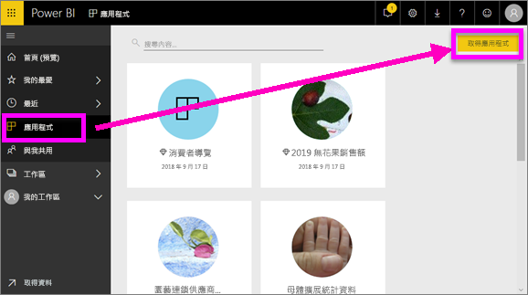
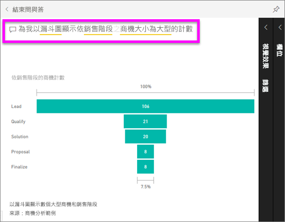
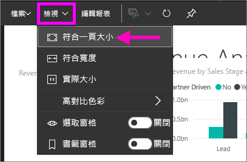
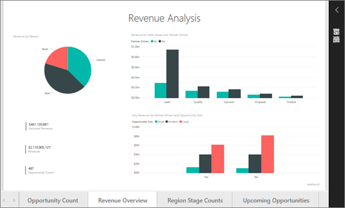
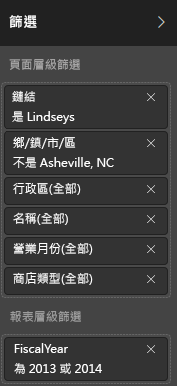
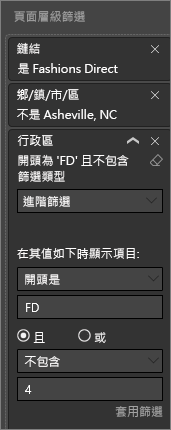
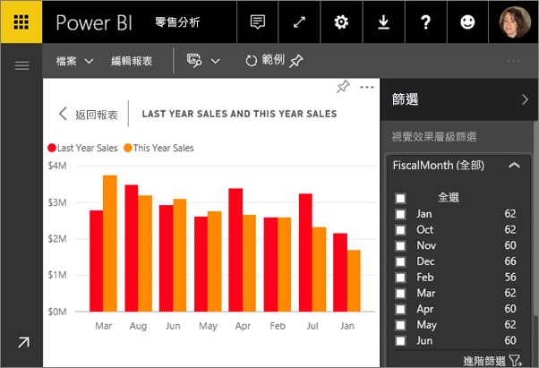
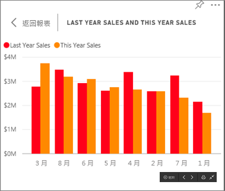

<!-- once the sample apps are live, change this so consumers can follow along -->
# 快速入門：了解適用於***取用者***的 Power BI 功能
在此快速入門中，您會了解如何與 Power BI 互動，探索資料驅動商務見解。 本文不適合用於深入了解，而是快速探索 Power BI **取用者**可用的許多動作。

如果您尚未註冊 Power BI，請先進行[免費註冊](https://app.powerbi.com/signupredirect?pbi_source=web)再開始。

## 先決條件
- Power BI 服務 (app.powerbi.com)
<!-- app from AppSource -->

## 閱讀檢視
閱讀檢視可讓報表取用者在 Power BI 服務中使用。 當同事與您共用報表時，閱讀檢視是您探索和與報表互動的方式。 

另一項 Power BI 服務報表模式為[編輯檢視](../service-interact-with-a-report-in-editing-view.md)，可供報表設計師使用。  

探索儀表板與報表最有效及最安全的方法，就是閱讀檢視。 當您切割與您共用的儀表板和報表時，基礎資料集仍會保留完整而不會受到任何變更。 

在閱讀檢視中，您可以在頁面上執行像是交叉醒目提示和交叉篩選視覺效果等動作。  只要反白顯示或選取一個視覺效果中的值，就能立即看到其對其他視覺效果的影響。 使用 [篩選] 窗格可在報表頁面上加入及修改篩選，並變更在視覺效果中排序值的方式。 這些僅是 Power BI 中取用者功能的一小部分。  繼續閱讀以深入了解更多。

 
### 檢視應用程式
Power BI 的應用程式會將相關的儀表板和報表全都帶到同一處。

1. 選取 [應用程式]  > [取得應用程式]。 
   
     
2. 在 AppSource 的 [我的組織] 下方搜尋以縮小結果範圍，並找到您在尋找的應用程式。
   
     ![在 AppSource 的 [我的組織] 下](./media/end-user-reading-view/power-bi-appsource.png)
3. 選取 [立即取得]，將它新增至 [應用程式] 容器。 

### 檢視儀表板
此應用程式會開啟儀表板。 Power BI 「儀表板」是使用視覺效果說故事的單一頁面，通常稱為畫布。 因為受限於一張頁面，所以設計良好的儀表板只包含故事最重要的項目。

您在儀表板上看到的視覺效果稱為「磚」，從報表「釘選」在儀表板上。

### 訂閱儀表板 (或報表)
您無須開啟 Power BI 也能監視儀表板。  您可以改為訂閱，使 Power BI 根據您設定的排程透過電子郵件寄送該儀表板的快照集給您。 

.

1. 從頂端功能表列，選取 [訂閱] 或選取信封圖示。
   
   

3. 使用黃色的滑桿開啟和關閉訂閱。  您可以選擇新增電子郵件訊息的詳細資料。 

    在下方的螢幕擷取畫面中，您可以注意到當您在訂閱報表時，實際上是在訂閱報表「頁面」。  若要訂閱報表中的多個頁面，請選取 [新增另一個訂閱] 再選取其他頁面。 
      
   
   
    重新整理報表頁面不會重新整理資料集。 只有資料集擁有者可以手動重新整理資料集。 若要查看基礎資料集的名稱，請從頂端功能表列選取 [檢視相關項目]。

### 檢視相關內容
[相關內容] 窗格會顯示您的 Power BI 服務內容 (儀表板、報表及資料集) 如何互連。 該窗格不僅顯示相關內容，還能讓您對內容採取動作，並在相關內容之間輕鬆瀏覽。

從儀表板或報表中，從頂端功能表列選取 [檢視相關項目]。

### 利用問與答，使用自然語言詢問問題
有時若要從您的資料獲得解答，最快的方法是使用自然語言詢問問題。 問與答問題方塊位於儀表板頂端。 例如：「依照銷售階段，將大型商機計數以漏斗圖顯示。」 

### 將儀表板設為我的最愛
當您將內容設為我的最愛時，將可從左側瀏覽列存取。 Power BI 中幾乎每一個區域都能看到左側瀏覽列。 我的最愛通常是儀表板、報表頁面，以及您最常前往的應用程式。

1. 結束問與答以返回儀表板。    
2. 從 Power BI 服務的右上角，選取 [我的最愛] 或星號圖示 。
   
   ![[我的最愛] 圖示](./media/end-user-favorite/powerbi-dashboard-favorite.png)

### 開啟和檢視報表及報表頁面
報表是一或多個頁面的視覺效果。 Power BI 的報表設計工具會建立報表並[直接與取用者共用](end-user-shared-with-me.md)，或作為[應用程式](end-user-apps.md)的一部分。 

您可以從儀表板開啟報表。 大部分的儀表板磚從報表「釘選」。 選取磚會開啟用來建立磚的報表。 

1. 從儀表板選取磚。 在此範例中，我們已選取 [收入] 直條圖磚。

    

2.  相關的報表隨即開啟。 請注意，我們在 [收入概觀] 頁面上。 此報表頁面包含我們從儀表板選取的直條圖。

    ![在 [閱讀檢視] 中開啟報表](./media/end-user-reading-view/power-bi-report-opens.png)

### 調整顯示尺寸
報表可在許多不同的裝置上檢視，這些裝置的螢幕大小和外觀比例有所不同。  預設呈現方式可能不是您要在裝置上查看的方式。  

1. 若要調整，請從頂端功能表列選取 [檢視]。

    

2.  選擇其中一個顯示選項。 在此範例中，我們已選擇 [符合一頁大小]。

        

### 使用報表 [篩選條件] 窗格
若報表作者將篩選條件新增至報表中的頁面，您便可以與它們互動，並儲存您對報表進行的變更。

1. 選取右上角的**篩選條件**圖示。
   
     

2. 選取要啟用的視覺效果。 您會看到所有已套用至您該視覺效果 (視覺層級篩選)、跨整個報表頁面 (頁面層級篩選)，以及跨整份報表 (報表層級篩選) 的所有篩選條件。
   
   

3. 將滑鼠停留在篩選，並選取向下箭號將其展開。
   
   

4. 對篩選進行變更，並查看視覺效果如何受到影響。  
   
     
     

### 您會看到頁面上所有視覺效果互連的方式
交叉醒目提示和交叉篩選頁面上的相關視覺效果。 單一報表頁面上的視覺效果皆彼此「連接」。  意思就是說，如果您在一種視覺效果中選取一個或多個值，將會根據您的選取項目，變更使用相同值的其它視覺效果。

> 
### 在視覺效果上顯示詳細資料
將滑鼠停留在視覺項目以便查看詳細資料

### 排序視覺效果
報表頁面上的視覺效果可進行排序，並儲存您套用的變更。 

1. 暫留在視覺效果上，使其進入使用中狀態。    
2. 選取省略符號 (...) 來開啟排序選項。

     

###  開取 [選取] 窗格
在報告頁面上的視覺效果之間輕鬆地瀏覽。 

1. 選取 [檢視] > [選取] 窗格，來開啟 [選取] 窗格。 將 [選取] 窗格 設為 [開啟]。

    ![開啟報表 [選取] 窗格](media/end-user-reading-view/power-bi-selection-pane2.png)

2. 隨即會在您的報表畫布上開啟 [選取] 窗格。 從清單選取視覺效果，使其進入使用中狀態。

    

### 放大個別視覺效果
將滑鼠暫留在視覺效果上，並選取**焦點模式**圖示 。 當您以焦點模式檢視視覺效果時，其會展開並填滿整個報表畫布，如下所示。

若要顯示該相同視覺效果，而不受功能表列、篩選窗格和其他組件區塊的干擾，請從頂端功能表列，選取**全螢幕**圖示 。

### 顯示用來建立視覺效果的資料
Power BI 視覺效果是使用基礎資料集中的資料所建構。 如果您對背景資料有興趣，Power BI 可讓您「顯示」用來建立視覺效果的資料。 當您選取 [顯示資料] 時，Power BI 會在視覺效果下方 (或旁邊) 顯示資料。

1. 在 Power BI 服務中，開啟報表並選取視覺效果。  
2. 若要顯示視覺效果背後的資料，請選取省略符號 (...) 並選擇 [顯示資料]。
   
   ![選取 [顯示資料]](./media/end-user-show-data/power-bi-explore-show-data.png)

這向來只是**取用者**可使用 Power BI 服務來執行一些動作的快速概觀。  

## 清除資源
- 若您連線到應用程式，請從左側瀏覽列，選取 [應用程式] 來開啟應用程式內容清單。 在要刪除的應用程式上暫留，然後選取垃圾桶圖示。

- 若您匯入或連線至 Power BI 範例報表，請從左側瀏覽列開啟 [我的工作區]。 使用頂端的索引標籤，找到儀表板、報表和資料集，然後為每個項目選取垃圾桶圖示。

## 後續步驟

