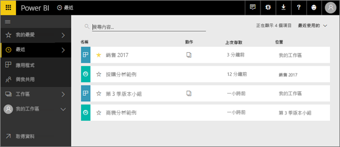
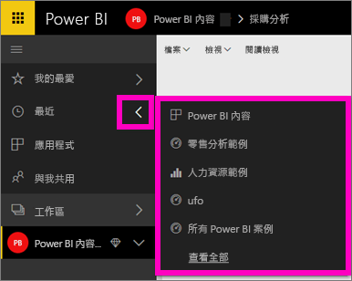
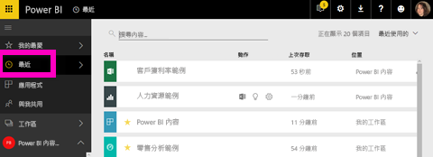

# Power BI 服務中的 [最近]  內容
最近內容指的是您在 Power BI 服務中最後瀏覽的項目，最多 20 個。  這些包含：所有工作區中的儀表板、報表、應用程式和活頁簿。

觀看 Amanda 示範如何填入 Power BI 服務 [最近]  內容清單，接著遵循影片下的逐步指示，自己試試看。

<iframe width="560" height="315" src="https://www.youtube.com/embed/G26dr2PsEpk" frameborder="0" allowfullscreen></iframe>

## 顯示最近內容
若要查看您最近瀏覽過的五個項目，請從左側導覽中選取 [最近]  右側的箭號。  您可以從這裡選取最近內容，加以開啟。 只會列出五個最新的項目。

如果您最近瀏覽過項目超過五個，請選取 [See all]\(查看全部)  以開啟 [最近] 畫面 (請參閱下面)。 您也可以從左側導覽中選取 [最近]  或最近 圖示。

您可以在這裡與內容互動，就像在個別[儀表板  ](end-user-dashboards.md)、[報表  ](end-user-reports.md)和 [活頁簿]  索引標籤，以及在應用程式畫面上互動一樣 <!--[**Apps**](end-user-apps.md)--> 。

## 後續步驟
<!--[Power BI service Apps](end-user-apps.md)-->

有其他問題嗎？ [試試 Power BI 社群](http://community.powerbi.com/)

