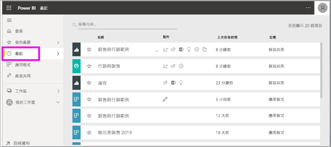
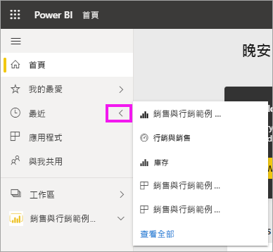
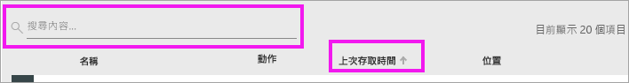

# Power BI 服務中的 [最近]  內容
[最近] 內容是您在 Power BI 服務中最後瀏覽的項目，最多 20 個。  這些包括︰儀表板、報表、應用程式和活頁簿。

觀看 Amanda 示範如何填入 Power BI 服務 [最近]  內容清單，接著遵循影片下的逐步指示，自己試試看。

<iframe width="560" height="315" src="https://www.youtube.com/embed/G26dr2PsEpk" frameborder="0" allowfullscreen></iframe>

> [!NOTE]
> 這部影片使用較舊版本的 Power BI 服務。

## 顯示最近內容
若要查看您最近瀏覽過的五個項目，請從瀏覽窗格中選取 [最近]  右側的箭號。  您可以從這裡選取最近內容，加以開啟。 只會列出五個最新的項目。

如果您最近瀏覽過的項目超過五個，請選取 [查看全部]  以開啟 [最近] 畫面。 您也可以從瀏覽窗格中選取 [最近]  或最近  圖示。

## 可從 [最近]  內容清單中取得的動作
可供您使用的動作將取決於內容「設計師」  所指派設定。 您的某些選項可能包括：
* 選取星星圖示，以[將儀表板、報表或應用程式設為我的最愛](end-user-favorite.md) 。
* 有些儀表板和報表可以重複共用  .
* [以 Excel 開啟報表](end-user-export.md)  
* [檢視 Power BI 在資料中找到的見解](end-user-insights.md)。
* 此外，如果您的清單太長，請[使用搜尋欄位和排序找出您需要的內容](end-user-search-sort.md)。 若要了解是否可以排序資料行，請將游標停留其上以查看是否出現箭號。 在此範例中，將游標停留在 [上次存取]  上方會顯示箭號 -- 您最近的內容可以依存取日期排序。 

    

## 後續步驟
[Power BI 服務應用程式](end-user-apps.md)

有其他問題嗎？ [試試 Power BI 社群](https://community.powerbi.com/)

