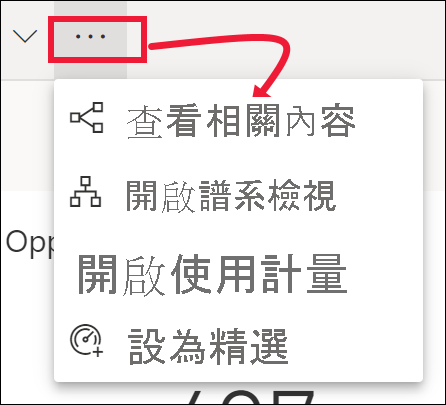
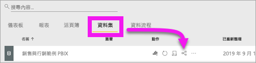
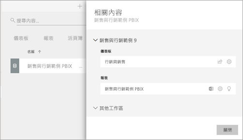

# 查看 Power BI 服務中的相關內容

[!INCLUDE[consumer-appliesto-yyny](../includes/consumer-appliesto-yyny.md)]

[!INCLUDE [power-bi-service-new-look-include](../includes/power-bi-service-new-look-include.md)]

[相關內容] 窗格會顯示您的 Power BI 服務內容 (儀表板、報表及資料集) 如何互連。 [相關內容] 窗格也是用來採取動作的啟動台。 您可以從這裡執行一些動作，例如開啟儀表板、開啟報表、產生見解、在 Excel 中分析資料等。  

在 Power BI 服務中，報表會建置於資料集之上、報表視覺效果會釘選到儀表板，而儀表板視覺效果會連結回報表。 但您要如何知道，哪些儀表板裝載了來自「行銷」報表的視覺效果？ 要怎麼找到那些儀表板？ 您的「採購」儀表板是否使用來自多個資料集的視覺效果？ 如果有，儀表板名稱為何、如何加以開啟和編輯？ 您的 HR 資料集是否已用於任何報表或儀表板？ 或者，是否可以移動它而不會造成任何中斷的連結？ 在 [相關內容] 窗格，這類問題都能獲得解答。  該窗格不僅顯示相關內容，還能讓您對內容採取動作，並在相關內容之間輕鬆瀏覽。

> [!NOTE]
> [相關內容] 功能不適用於串流資料集。
> 
> 

## 查看儀表板或報表的相關內容
觀看 Will 檢視儀表板相關內容。 接著請遵循影片下方的逐步指示，使用「採購分析」範例親自試試看。

> [!NOTE]
> 這部影片是以較舊版本的 Power BI 服務為基礎。 

<iframe width="560" height="315" src="https://www.youtube.com/embed/B2vd4MQrz4M#t=3m05s" frameborder="0" allowfullscreen></iframe>

在儀表板或報表開啟的情況下，於功能表列中選取 [更多選項] (...)，然後從下拉式清單中選擇 [查看相關內容]。

[相關內容] 窗格隨即開啟。 如果是儀表板，其中會顯示有視覺效果釘選到儀表板的所有報表，以及其相關聯的資料集。 在此儀表板中，只會從一個報表釘選視覺效果，且該報表僅以一個資料集為基礎。 如果您查看此文章一開始的影像，您將會看到儀表板的相關內容，其中包含從四份報表及兩個資料集所釘選的視覺效果。

![[相關內容] 窗格](./media/end-user-related/power-bi-view-related-dashboard.png)

根據您的權限而定，您可以從這裡直接對相關內容採取動作。  例如，選取報表或儀表板名稱加以開啟。  針對列出的報表，請選取圖示以開啟和編輯報表的設定、[取得見解](end-user-insights.md)等。 針對資料集，您可以檢閱上次重新整理的日期和時間、[使用 Excecl 分析](../collaborate-share/service-analyze-in-excel.md)、[取得見解](end-user-insights.md)、重新整理等。  

<!-- ## See related content for a dataset
You'll need at least *view* permissions to a dataset to open the **Related content** pane. In this example, we're using the [Procurement Analysis sample](../create-reports/sample-procurement.md).

From the nav pane, locate the **Workspaces** heading and select a workspace from the list. If you have content in a workspace, it will display in the canvas to the right. 

In a workspace, select the **Datasets** tab and locate the **See related** icon .

Select the icon to open the **Related content** pane.

From here, you can take direct action on the related content. For example, select a dashboard or report name to open it.  For any dashboard in the list, select an icon to [share the dashboard with others](../collaborate-share/service-share-dashboards.md) or to open the **Settings** window for the dashboard. For a report, select an icon to [analyze in Excel](../collaborate-share/service-analyze-in-excel.md), [rename](../create-reports/service-rename.md), or [get insights](end-user-insights.md).  -->

## 限制與疑難排解
* 如果您未看到 [查看相關項目]，請改為尋找圖示 ![[查看相關項目] 圖示](./media/end-user-related/power-bi-view-related-icon-new.png)。 選取圖示以開啟 [相關內容] 窗格。
* 若要開啟報表的相關內容，您必須使用[閱讀檢視](end-user-reading-view.md)。
* 相關內容功能不適用於串流資料集。

## 後續步驟
* [開始使用 Power BI 服務](../fundamentals/service-get-started.md)
* 有其他問題嗎？ [試試 Power BI 社群](https://community.powerbi.com/)
