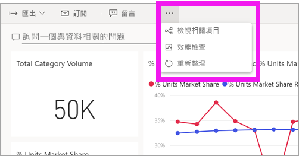
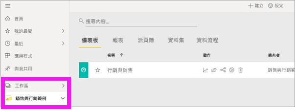

# 檢視 Power BI 服務中的相關內容

[!INCLUDE[consumer-appliesto-ynny](../includes/consumer-appliesto-ynny.md)]

[!INCLUDE [power-bi-service-new-look-include](../includes/power-bi-service-new-look-include.md)]

[相關內容] 窗格會顯示您的 Power BI 服務內容 (儀表板、報表及資料集) 如何互連。 [相關內容] 窗格也是用來採取動作的啟動台。 您可以從這裡執行一些動作，例如開啟儀表板、開啟報表、產生見解、在 Excel 中分析資料等。  

在 Power BI 中，報表是建立在資料集之上，報表視覺效果會釘選到儀表板，且儀表板視覺效果會連結回報表。 但您要如何知道，哪些儀表板裝載了來自「行銷」報表的視覺效果？ 要怎麼找到那些儀表板？ 您的「採購」儀表板是否使用來自多個資料集的視覺效果？ 如果有，儀表板名稱為何、如何加以開啟和編輯？ 您的 HR 資料集是否已用於任何報表或儀表板？ 或者，是否可以移動它而不會造成任何中斷的連結？ 在 [相關內容] 窗格，這類問題都能獲得解答。  該窗格不僅顯示相關內容，還能讓您對內容採取動作，並在相關內容之間輕鬆瀏覽。

> [!NOTE]
> [相關內容] 功能不適用於串流資料集。
> 
> 

## 檢視儀表板或報表的相關內容
觀看 Will 檢視儀表板相關內容。 然後遵循影片下方的逐步指示，使用「採購分析」範例資料集親自試試看。

<iframe width="560" height="315" src="https://www.youtube.com/embed/B2vd4MQrz4M#t=3m05s" frameborder="0" allowfullscreen></iframe>

在儀表板或報表開啟的情況下，選取功能表列中的 [更多選項] (...)，然後從下拉式清單中選擇 [檢視相關項目]。

[相關內容] 窗格隨即開啟。 如果是儀表板，其中會顯示有視覺效果釘選到儀表板的所有報表，以及其相關聯的資料集。 在此儀表板中，只會從一個報表釘選視覺效果，且該報表僅以一個資料集為基礎。 

![[相關內容] 窗格](./media/end-user-related/power-bi-view-related-dashboard.png)

您可以從這裡直接對相關內容採取動作。  例如，選取報表或儀表板名稱加以開啟。  針對列出的報表，選取圖示即可[使用 Excecl 分析](../collaborate-share/service-analyze-in-excel.md)或[取得見解](end-user-insights.md)。 針對資料集，您可以查看上次重新整理的日期和時間、[使用 Excecl 分析](../collaborate-share/service-analyze-in-excel.md)或[取得見解](end-user-insights.md)。  

## 檢視資料集相關內容
您至少必須有資料集的「檢視」權限，才能開啟 [相關內容] 窗格。 在此範例中，我們使用的是[採購分析範例](../create-reports/sample-procurement.md)。

從導覽窗格中，找出 [工作區] 標題，並從清單中選取工作區。 如果您的工作區中有內容，則其會顯示在右側的畫布中。 

在工作區中選取 [資料集] 索引標籤，然後找出**檢視相關項目**圖示 。

![[資料集] 索引標籤](./media/end-user-related/power-bi-related-dataset.png)

選取圖示以開啟 [相關內容] 窗格。

![[相關內容] 窗格會在 Power BI 內容檢視上開啟](media/end-user-related/power-bi-dataset.png)

您可以從這裡直接對相關內容採取動作。 例如選取儀表板或報表名稱加以開啟。  針對清單中的儀表板，選取圖示即可[與他人共用儀表板](../collaborate-share/service-share-dashboards.md)，或開啟儀表板的 [設定] 視窗。 若是報表，選取圖示即可[使用 Excecl 分析](../collaborate-share/service-analyze-in-excel.md)、[重新命名](../create-reports/service-rename.md)或[取得深入資訊](end-user-insights.md)。  

## 限制與疑難排解
* 如果您沒有看到 [檢視相關項目]，請改為尋找圖示 。 選取圖示以開啟 [相關內容] 窗格。
* 若要開啟報表的 [相關內容]，必須使用[閱讀檢視](end-user-reading-view.md)。
* 「相關內容」功能不適用於串流資料集。

## 後續步驟
* [開始使用 Power BI 服務](../fundamentals/service-get-started.md)
* 有其他問題嗎？ [試試 Power BI 社群](https://community.powerbi.com/)
