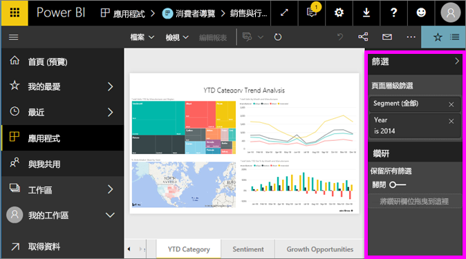
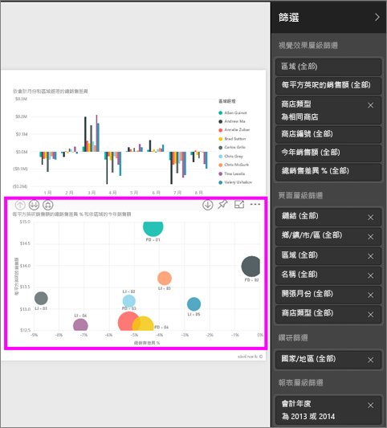
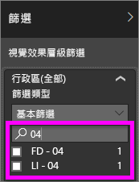
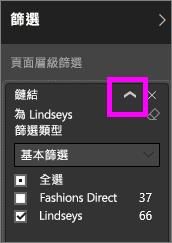
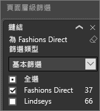
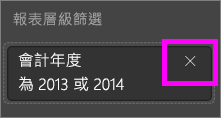

# 報表 [篩選] 窗格概觀
本文深入探討 Power BI 服務中的報表 [篩選] 窗格。

有許多不同的方式可在 Power BI 中篩選資料，建議您先閱讀[關於篩選和反白顯示](../power-bi-reports-filters-and-highlighting.md)。

## 使用報表篩選窗格
當同事與您共用報表時，請務必尋找 [篩選] 窗格。 有時候它會沿著報表的右側邊緣摺疊。 選取它來展開。   

[篩選] 窗格包含已由報表「設計師」新增到報表的篩選。 與您相同的「取用者」可以和篩選互動並儲存變更，但無法將新的篩選新增至報表。 例如，在上面的螢幕擷取畫面中，設計者新增了兩個頁面層級篩選：「區段」與「年」。 您可以互動和變更這些篩選條件，但您無法新增第三個頁面層級篩選。

在 Power BI 服務中，報表會保留您在 [篩選] 窗格中所做的任何變更，而這些變更會傳送至行動版的報表。 若要將 [篩選] 窗格重設為設計師預設值，請從頂端功能表列選取 [重設為預設值]。     

## 開啟 [篩選] 窗格
開啟報表時，[篩選] 窗格會顯示於報表畫布右方。 若未看見窗格，請選取右上角的箭號展開窗格。  

在此範例中，我們已選取具有 6 個篩選的視覺效果。 報表頁面也有篩選，列在 [頁面層級篩選] 標題下。 有一個[鑽研篩選](../power-bi-report-add-filter.md)，整份報表也有一個篩選︰**FiscalYear** 是 2013 或 2014。

有些篩選旁邊有 **All** 字組，這表示所有值作為一個篩選。  例如，上方螢幕擷取畫面中的 [Chain(All)] 表示此報表頁面包含所有連鎖店的相關資料。  相反地，[FiscalYear is 2013 or 2014] 的報表層級篩選表示報表只包含會計年度 2013 年及 2014 年的資料。

檢視此報表的任何人都可以使用這些篩選器互動。

- 在頁面、視覺效果、報表和鑽研篩選條件中搜尋，尋找和選取您想要的值。 

    

- 暫留然後選取篩選旁邊的箭號，即可檢視篩選的詳細資料。
  
   
* 變更篩選，例如將 [Lindseys] 變更為 [Fashions Direct]。
  
     

* 從頂端功能表列選取 [重設為預設值]，將篩選重設為其原始狀態。    
    
    
* 選取篩選名稱旁邊的 **x** 即可刪除篩選。
  
    

  刪除篩選會將其從清單移除，但不會從報表刪除資料。  例如，如果您刪除 [FiscalYear is 2013 or 2014] 篩選，會計年度資料仍會留在報表中，但不會再篩選為僅顯示 2013 年及 2014 年；將顯示資料包含的所有會計年度。  不過，刪除篩選後即無法再加以修改，因為其已從清單移除。 清除篩選是較佳的選項，其方法是選取橡皮擦圖示 。
  
  

## 清除篩選
 在進階或基本篩選模式中，選取橡皮擦圖示   來清除篩選。 

## 篩選類型：文字欄位篩選
### 清單模式
勾選核取方塊可以選取或取消選取值。 [所有]  核取方塊可以用來開啟或關閉所有核取方塊的切換狀態。 核取方塊代表該欄位所有可用的值。  當您調整篩選之後，會更新重新計算陳述式以反映您的選擇。 

請注意，現在的重新計算陳述式寫著 "is Mar, Apr or May"。

### 進階模式
選取 [進階篩選]  以切換到進階模式。 使用下拉式清單控制項和文字方塊，來識別要包含哪些欄位。 您可以選擇 [And] 和 [Or]，建立複雜的篩選運算式。 當您已設定想要的值之後，請選取 [套用篩選]  按鈕。  

## 篩選類型：數值欄位篩選
### 清單模式
如果這些值為有限時，選取欄位名稱之後就會顯示清單。  如需使用核取方塊的說明，請參閱上述 [文字欄位篩選] &gt; [清單模式]。   

### 進階模式
如果值為無限或代表某種範圍，則選取欄位名稱之後會開啟進階篩選模式。 使用下拉式清單和文字方塊來指定您想要查看值的範圍。 

您可以選擇 [And] 和 [Or]，建立複雜的篩選運算式。 當您已設定想要的值之後，請選取 [套用篩選]  按鈕。

## 篩選類型：日期和時間
### 清單模式
如果這些值為有限時，選取欄位名稱之後就會顯示清單。  如需使用核取方塊的說明，請參閱上述 [文字欄位篩選] &gt; [清單模式]。   

### 進階模式
如果欄位值代表日期或時間，則可以在使用日期/時間篩選時指定開始/結束時間。  

## 後續步驟
[了解如何及為什麼視覺效果要在報表頁面上相互交叉篩選及交叉醒目提示](end-user-interactions.md)