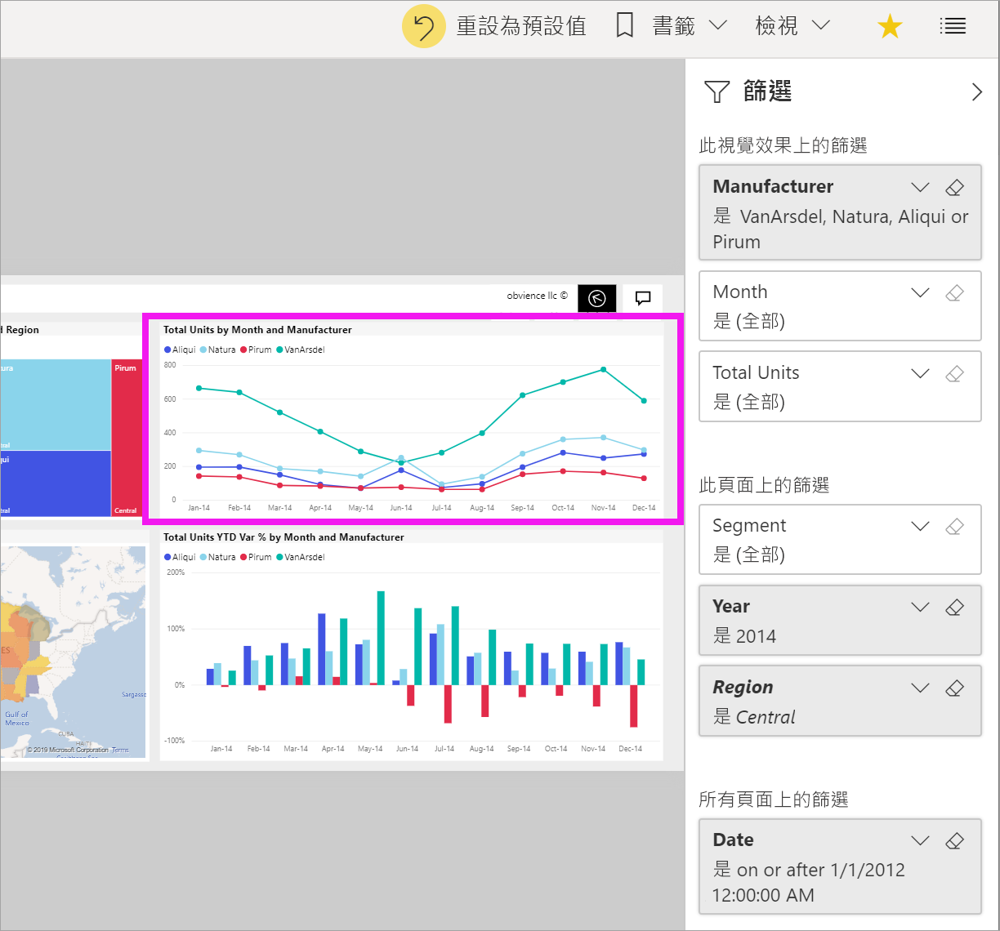

# 報表 [篩選] 窗格概觀

[!INCLUDE[consumer-appliesto-yyny](../includes/consumer-appliesto-yyny.md)]

[!INCLUDE [power-bi-service-new-look-include](../includes/power-bi-service-new-look-include.md)]

本文深入探討 Power BI 服務中的報表 [篩選條件]  窗格。 使用篩選條件來探索資料中新見解。

Power BI 中有許多不同的方式可篩選資料。 如需篩選條件的詳細資訊，請參閱 [Power BI 報表中的篩選條件和醒目提示](../create-reports/power-bi-reports-filters-and-highlighting.md)。

![瀏覽器中箭號指向 [篩選條件] 選項的報表螢幕擷取畫面。](media/end-user-report-filter/power-bi-report.png)

## 使用報表篩選窗格

當同事與您共用報表時，請務必尋找 [篩選]  窗格。 有時候它會沿著報表的右側邊緣摺疊。 選取它來展開。

![展開 [篩選條件] 窗格的報表螢幕擷取畫面。](media/end-user-report-filter/power-bi-expand-filter-pane.png)

[篩選條件]  窗格包含由報表「設計師」  新增到報表的篩選條件。 您這樣的「取用者」  可以和現有篩選條件互動並儲存變更，但無法將新的篩選條件新增至報表。 例如，在上面的螢幕擷取畫面中，設計者新增了三個頁面層級篩選：[區段是全部]  、[年份是 2014]  ，以及 [區域是中部]  。 您可以與這些篩選條件互動並變更它們，但您無法新增第四個頁面層級篩選。

在 Power BI 服務中，報表會保留您在 [篩選條件]  窗格中的所有變更。 服務會將這些變更保留到報表的行動裝置版本。 

若要將 [篩選]  窗格重設為設計師預設值，請從上方功能表列選取 [重設為預設值]  。

![[重設為預設值] 圖示的螢幕擷取畫面。](media/end-user-report-filter/power-bi-reset-icon.png) 

> [!NOTE]
> 如果您沒有看到 [重設為預設值]  選項，則表示報表「設計師」  可能已停用該選項。 「設計師」  也可以鎖定特定篩選條件，讓您無法進行變更。

## 檢視報表頁面的所有篩選條件

[篩選條件]  窗格會顯示設計師新增至報表的所有篩選條件。 [篩選條件]  窗格也是您可以檢視篩選條件資訊並與之互動的區域。 儲存您建立的變更，或使用 [重設為預設值]  還原為原始的篩選條件設定。

如有想要儲存的變更，您也可以建立個人書籤。 如需詳細資訊，請參閱[什麼是書籤？](end-user-bookmarks.md)

[篩選條件]  窗格會顯示並管理數種類型的報表篩選：報表、報表頁面和視覺效果。

在此範例中，我們已選取具有三個篩選條件的視覺效果。 報表頁面也有篩選條件，列在 [此頁面上的篩選]  標題下。 此外，整份報表有 [日期]  篩選條件。

有些篩選條件的旁邊有 [(全部)]  。 [(全部)]  表示所有值都包含在篩選條件中。 在上述的螢幕擷取畫面中，[Segment(All)] \(區段(全部)\)  告訴我們此報表頁面包含所有產品區段的資料。 

檢視此報表的任何人都可以使用這些篩選器互動。

### 只檢視套用至視覺效果的篩選條件

若要更仔細查看套用至特定視覺效果的篩選條件，請將滑鼠停留在視覺效果上，以顯示篩選條件圖示  選取該篩選條件圖示，查看具有會影響該視覺效果之所有篩選條件、交叉分析篩選器等的快顯視窗。 快顯上的篩選包含 [篩選]  窗格所顯示的相同篩選，再加上影響所選視覺效果的其他篩選。

![篩選條件清單的螢幕擷取畫面，其有箭號指向這些篩選條件在 [篩選條件] 窗格中的位置。](media/end-user-report-filter/power-bi-hover-filters.png)

以下是此檢視可顯示的篩選條件類型：

- 基本篩選條件
- 交叉分析篩選器
- 交叉醒目提示
- 交叉篩選
- 進階篩選條件
- 前 N 個篩選條件
- 相對日期篩選條件
- 同步交叉分析篩選器
- 包含/排除篩選條件
- 透過 URL 傳遞的篩選條件

在此範例中：
1. [內含]  告訴我們視覺效果已進行交叉篩選。 這表示此報表頁面上的其他視覺效果，已從各州中選取猶他州、科羅拉多州和德克薩斯州。 在此案例中是地圖。 因為已選取這三個州，所以所有其他州的資料不會顯示在所選的橫條圖上。  

1. [日期]  是套用到此報表中所有頁面的篩選，而

1. [區域是中部]  和 [年份是 2014]  是套用到此報表頁面的篩選，而

4. [製造商是 VanArsdel、Natura、Aliqui 或 Pirum]  是套用到此視覺效果的篩選。

### 在篩選條件中搜尋

有時候篩選條件會有一長串的值。 使用搜尋方塊尋找並選取您想要的值。

### 顯示篩選條件詳細資料

若要了解篩選條件，請查看可用的值和計數。  暫留然後選取篩選條件名稱旁邊的箭號，即可檢視篩選條件的詳細資料。
  

### 變更篩選條件選取項目

搜尋資料見解的一個方法是與篩選條件互動。 您可以使用欄位名稱旁的下拉式箭號來變更篩選條件選取項目。  根據 Power BI 篩選的篩選條件和資料類型，選項範圍為從簡單清單選取範圍到找出日期或數字的範圍。 在以下的進階篩選條件中，我們已將矩形式樹狀結構圖上的 [年初迄今單位總量]  篩選條件變更為 2000 到 3000 之間。 請注意，這項變更會將 Pirum 從樹狀圖中移除。
  

> [!TIP]
> 按住 CTRL 鍵，一次選取多個篩選條件值。 大部分的篩選條件都支援多重選取。

### 將篩選條件重設為預設值

如果您想要取消曾對篩選條件建立的所有變更，請從頂端功能表列中選取 [重設為預設值]  。  此選取項目會將篩選條件還原為報表設計師所設定的原始狀態。

![[重設為預設值] 選項的螢幕擷取畫面。](media/end-user-report-filter/power-bi-reset-icon.png)

### 清除篩選

若要將篩選重設為 [(全部)]，請選取篩選名稱旁邊的橡皮擦圖示將它清除。

  
<!--  too much detail for consumers

## Types of filters: text field filters
### List mode
Ticking a checkbox either selects or deselects the value. The **All** checkbox can be used to toggle the state of all checkboxes on or off. The checkboxes represent all the available values for that field.  As you adjust the filter, the restatement updates to reflect your choices. 

Note how the restatement now says "is Mar, Apr or May".

### Advanced mode
Select **Advanced Filtering** to switch to advanced mode. Use the dropdown controls and text boxes to identify which fields to include. By choosing between **And** and **Or**, you can build complex filter expressions. Select the **Apply Filter** button when you've set the values you want.  

## Types of filters: numeric field filters
### List mode
If the values are finite, selecting the field name displays a list.  See **Text field filters** &gt; **List mode** above for help using checkboxes.   

### Advanced mode
If the values are infinite or represent a range, selecting the field name opens the advanced filter mode. Use the dropdown and text boxes to specify a range of values that you want to see. 

By choosing between **And** and **Or**, you can build complex filter expressions. Select the **Apply Filter** button when you've set the values you want.

## Types of filters: date and time
### List mode
If the values are finite, selecting the field name displays a list.  See **Text field filters** &gt; **List mode** above for help using checkboxes.   

### Advanced mode
If the field values represent date or time, you can specify a start/end time when using Date/Time filters.  

-->

## 後續步驟

了解如何及為何[視覺效果要在報表頁面上相互交叉篩選及交叉醒目提示](end-user-interactions.md)
