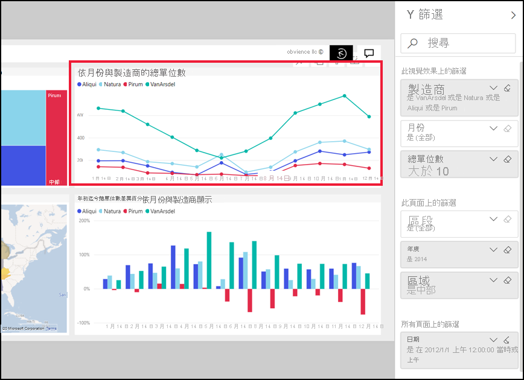
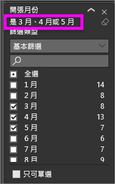
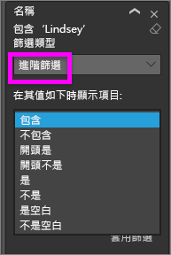
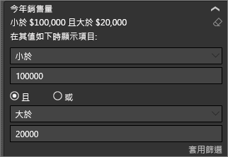
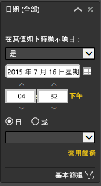

# 報表 [篩選] 窗格概觀
這篇文章探討報表篩選 窗格中的 Power BI 服務。 使用篩選來探索資料中的新深入解析。

有許多不同的方式可在 Power BI 中篩選資料，建議您先閱讀[關於篩選和反白顯示](../power-bi-reports-filters-and-highlighting.md)。

## 使用報表篩選窗格
當同事與您共用報表時，請務必尋找 [篩選]  窗格。 有時候它會沿著報表的右側邊緣摺疊。 選取它來展開。   

[篩選] 窗格包含已由報表「設計師」  新增到報表的篩選。 *取用者*像您一樣可以互動與現有的篩選條件，並儲存變更，但無法將新的篩選器加入報表。 例如，在上面的螢幕擷取畫面中，設計者新增了兩個頁面層級篩選：區隔，並執行一年。 您可以互動和變更這些篩選條件，但您無法新增第三個頁面層級篩選。

在 Power BI 服務中，報告保留您在 [篩選] 窗格中，進行任何變更，以及這些變更會傳送至行動版的報表。 若要將 [篩選] 窗格重設為設計師預設值，請從頂端功能表列選取 [重設為預設值]  。  

   

## 檢視報表頁面的所有篩選
[篩選] 窗格會顯示所有的篩選器加入至報表*設計工具*。 [篩選] 窗格也是的區域中，您可以在此檢視篩選條件的相關資訊，並與其互動。 您可以將儲存的變更，或使用**重設為預設**還原為原始的篩選器設定。

如果您想要儲存的變更，您也可以建立個人的書籤。  如需詳細資訊，請參閱 <<c0> [ 報表中加入書籤](end-user-bookmarks.md)。

有數種類型的報表篩選所顯示及管理從 [篩選] 窗格中，套用至視覺效果、 報表頁面和整個報表。

在此範例中，我們選取具有 2 個篩選器的視覺效果。 報表頁面也有篩選，列在**在此頁面上的篩選器**標題。 和整份報表有篩選的日期。

有些篩選旁邊有 **All** 字組，這表示所有值作為一個篩選。  例如， **Segment(All)** 上述螢幕擷取畫面中告訴我們此報表頁面包含所有產品區段相關資料。  相反地，在網頁層級篩選屬於**區域是西部**告訴我們，[報表] 頁面只會包含針對西部區域的資料。

檢視此報表的任何人都可以使用這些篩選器互動。

### 檢視僅套用至視覺效果的篩選
若要取得仔細看看套用特定的視覺效果的篩選，請停留在視覺效果以顯示篩選圖示。 選取的篩選圖示，以查看所有篩選器、 交叉分析篩選器，並依此類推，會影響該視覺效果與快顯視窗。 快顯視窗上的篩選器會顯示在相同的篩選**篩選器**窗格。 

 
以下是此檢視可以顯示的篩選條件類型：
- 基本篩選條件
- 交叉分析篩選器
- 交叉醒目提示
- 交叉篩選
- 進階篩選條件
- 前 N 個篩選條件
- 相對日期篩選條件
- 同步交叉分析篩選器
- 包含/排除篩選條件
- 透過 URL 傳遞的篩選條件

在範例中，如下：
1. 我們可以看到，直條圖已交叉篩選。
2. **包含**告訴我們交叉篩選，是用於**區段**，而三個是包含。 
3. 交叉分析篩選器申請**季**。
4. **區域**是篩選器套用至這個報表頁面上，以及
5. **Vanarsdel**並**年份**所套用的篩選器對這個視覺效果。

### 在篩選條件中搜尋
有時候篩選條件可以有一長串的值。 使用搜尋方塊中，尋找並選取您想要的值。 

### 顯示篩選詳細資料
若要了解篩選，看看可用的值和計數。  暫留然後選取篩選名稱旁邊的箭號，即可檢視篩選條件的詳細資料。 
  

### 變更篩選選取項目
搜尋資料深入解析的一個方法是與篩選互動。 您可以變更使用欄位名稱旁邊的下拉式箭頭的篩選選取項目。  根據篩選器和進行篩選的資料類型，您的選項將範圍從簡單的選取範圍從清單以找出的日期或數字的範圍。 在進階的篩選條件下，我們已變更篩選條件**總單位 YTD**介於 2000 和 3000 之間的矩形式樹狀結構圖上。 請注意，這會移除 Prirum 矩形式樹狀結構圖。 
  

> [!TIP]
> 若要一次選取一個以上的篩選值，請按住 CTRL 鍵。 大部分的篩選器支援多重選取。 

### 重設為預設值的篩選
如果您想要取消所有變更您對所選取的篩選**重設為預設**從頂端功能表列。  這會還原到其原始狀態，篩選所設定的報表*設計工具*。 

    
### 清除篩選
是否有您想要設定為只在一個篩選條件 **（全部）** ，方法是選取橡皮擦圖示將其清除篩選器名稱旁邊。
  
<!--  too much detail for consumers

## Types of filters: text field filters
### List mode
Ticking a checkbox either selects or deselects the value. The **All** checkbox can be used to toggle the state of all checkboxes on or off. The checkboxes represent all the available values for that field.  As you adjust the filter, the restatement updates to reflect your choices. 

Note how the restatement now says "is Mar, Apr or May".

### Advanced mode
Select **Advanced Filtering** to switch to advanced mode. Use the dropdown controls and text boxes to identify which fields to include. By choosing between **And** and **Or**, you can build complex filter expressions. Select the **Apply Filter** button when you've set the values you want.  

## Types of filters: numeric field filters
### List mode
If the values are finite, selecting the field name displays a list.  See **Text field filters** &gt; **List mode** above for help using checkboxes.   

### Advanced mode
If the values are infinite or represent a range, selecting the field name opens the advanced filter mode. Use the dropdown and text boxes to specify a range of values that you want to see. 

By choosing between **And** and **Or**, you can build complex filter expressions. Select the **Apply Filter** button when you've set the values you want.

## Types of filters: date and time
### List mode
If the values are finite, selecting the field name displays a list.  See **Text field filters** &gt; **List mode** above for help using checkboxes.   

### Advanced mode
If the field values represent date or time, you can specify a start/end time when using Date/Time filters.  

-->

## 後續步驟
[了解如何及為什麼視覺效果要在報表頁面上相互交叉篩選及交叉醒目提示](end-user-interactions.md)