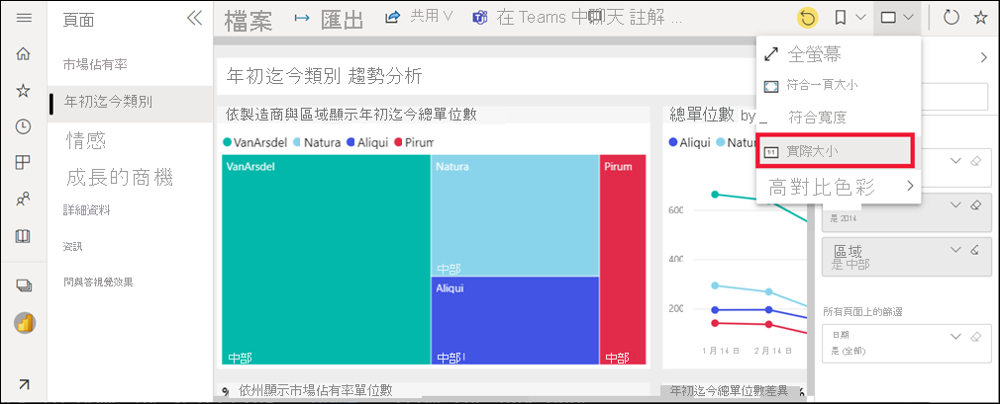
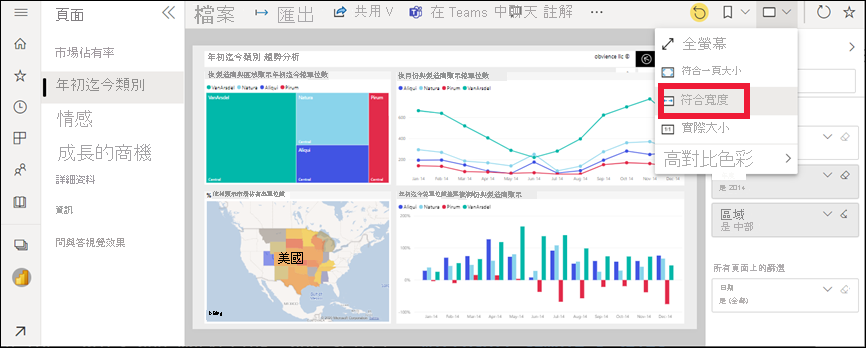

# 檢視 Power BI 服務中適用於「商務使用者」的報表

[!INCLUDE[consumer-appliesto-yyny](../includes/consumer-appliesto-yyny.md)]

[!INCLUDE [power-bi-service-new-look-include](../includes/power-bi-service-new-look-include.md)]

報表是一或多頁的視覺效果。 報表是由 Power BI「設計師」所建立，並[直接與「商務使用者」共用](end-user-shared-with-me.md)，或作為[應用程式](end-user-apps.md)的一部分共用。 若要開啟報表，則需要 Power BI Pro 授權，或該報表必須位於儲存在 Premium 專用容量的工作區中。

要開啟報表有很多種不同的方法，我們將示範其中兩種：從 [首頁] 開啟，以及從儀表板開啟。 

<!-- add art-->

## 從 Power BI 首頁開啟報表
讓我們開啟與您直接共用的報表，然後開啟在應用程式中共用的報表。

   

### 開啟已與您共用的報表
Power BI「設計師」** 可以透過電子郵件中的連結與您直接共用個別報表，或是自動將報表新增至您的 Power BI 內容。 以這種方式所共用報表會顯示在導覽窗格的 [與我共用]**** 容器中，以及 [首頁] 畫布的 [與我共用]**** 區段中。

1. 開啟 Power BI 服務 (app.powerbi.com)。

2. 從導覽窗格中，選取 [首頁]**** 以顯示您的 [首頁] 畫布。  

   ![[首頁] 畫布](./media/end-user-report-open/power-bi-open-home.png)
   
3. 向下捲動，直到您看到 [與我共用]**** 為止。 尋找報表圖示 。 在此螢幕擷取畫面中，我們有一個儀表板和一份報表。 此報表名為「銷售與行銷範例」**。 
   
   

4. 只要選取報表「卡片」** 即可開啟報表。

   

5. 請注意左側的索引標籤。  每個索引標籤各代表一個報表「頁面」**。 我們目前開啟的是 [成長的商機]** 頁面。 選取 [年初迄今類別]** 索引標籤即可改為開啟該報表頁面。 

   ![顯示 [報表頁面] 索引標籤的螢幕擷取畫面。](./media/end-user-report-open/power-bi-report-open.png)

6. 展開右側的 [篩選] 窗格。 已套用到此報表頁面或整個報表的篩選會顯示在這裡。

   

7. 將滑鼠暫留在報表視覺效果上會顯示數個圖示和 [更多選項] (...)。若要查看套用至特定視覺效果的篩選，請選取篩選圖示。 在這裡，我們已選取 [依月份和製造商的總單位數] 折線圖的篩選圖示。

   

6. 現在，我們會看到整個報表頁面。 若要變更頁面的顯示 (縮放)，請選取右上角的 [檢視] 下拉式清單，選擇 [實際大小]，然後切換至 [符合寬度]。

   

   

您有許多方法可與報表互動，以探索見解並制定商業決策。  使用左側的目錄，閱讀有關 Power BI 報表的其他文章。 

### 開啟應用程式中的報表
如果您收到了來自同事或 AppSource 的應用程式，則這些應用程式可從 [首頁] 及導覽窗格上的 [應用程式]**** 容器中開啟。 [應用程式](end-user-apps.md)是 Power BI「設計師」** 為您組合的一組儀表板和報表。

### Prerequisites
若要跟著做，請下載「銷售與行銷」應用程式。
1. 在您的瀏覽器中，瀏覽至 appsource.microsoft.com。
1. 搜尋 "Sales and Marketing"，然後選取 [Microsoft sample - Sales & Marketing]****。
1. 選取 [立即取得] > [繼續] > [安裝]，將應用程式安裝在您的應用程式容器中。 

您可以從您的 [應用程式] 容器或從 [首頁] 開啟該應用程式。
1. 若要返回 [首頁]，請從導覽窗格中選取 [首頁]****。

7. 向下捲動，直到您看到**我的應用程式**為止。

   ![顯示 Power BI 首頁 [我的應用程式] 區段的螢幕擷取畫面。](./media/end-user-report-open/power-bi-apps.png)

8. 選取新的「銷售與行銷」** 應用程式並加以開啟。 根據應用程式「設計者」** 所設定的選項，應用程式將會開啟儀表板或報表。 此應用程式會開啟儀表板。  

## 從儀表板開啟報表
您可以從儀表板開啟報表。 大部分的儀表板[磚](end-user-tiles.md)都是從報表「釘選」** 而來。 選取磚會開啟用來建立磚的報表。 

1. 從儀表板選取圖格。 在此範例中，我們已選取 [總單位 YTD...]** 直條圖磚。

    

2.  隨即開啟相關聯的報表。 請注意，我們在「YTD 類別」** 頁面上。 此報表頁面包含我們從儀表板選取的直條圖。

    ![在 [閱讀檢視] 中開啟報表](./media/end-user-report-open/power-bi-report-tab.png)

> [!NOTE]
> 並非所有的磚都會帶您前往報表。 如果您選取的磚是[使用問與答建立](end-user-q-and-a.md)，問與答畫面將會開啟。 如果您選取的磚是[使用儀表板 [新增磚]**** 小工具所建立](../create-reports/service-dashboard-add-widget.md)，則可能會發生數件不同的事：影片可能會播放、網站會開啟等。  

##  仍然有更多方法來開啟報表
當您更熟悉巡覽 Power BI 服務之後，便會找出最適合您的工作流程。 還有一些其他方法可存取報表：
- 從導覽窗格使用 [我的最愛](end-user-favorite.md) 和 [最近](end-user-recent.md)    
- 使用[檢視相關項目](end-user-related.md)    
- 在電子郵件中，當有人[與您共用](../collaborate-share/service-share-reports.md)或您[設定警示](end-user-alerts.md)時。    
- 從您的[通知中心](end-user-notification-center.md)    
- 從工作區
- 還有更多

## 後續步驟
[開啟並檢視儀表板](end-user-dashboard-open.md)    
[報表篩選](end-user-report-filter.md)

