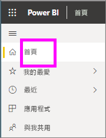
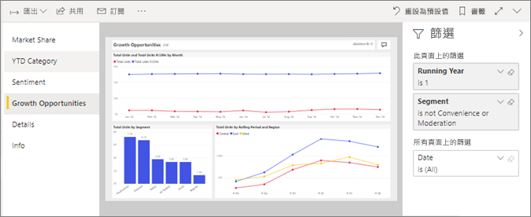
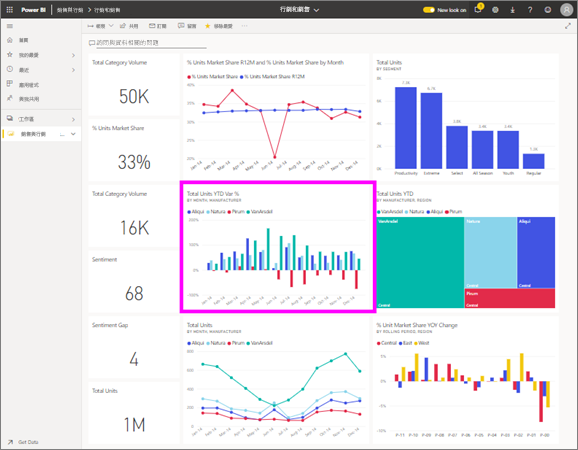

# 在適用於「取用者」  的 Power BI 服務中檢視報表
報表是一或多頁的視覺效果。 Power bi 會建立報告*設計工具*並[與共用*取用者*直接](end-user-shared-with-me.md)或做為一部分[應用程式](end-user-apps.md)。 

有許多不同的方式，來開啟報表，我們將示範其中兩個： 從首頁開啟，並從儀表板中開啟。 

<!-- add art-->

## 從 Power BI 的首頁開啟報表
讓我們開啟與您直接共用的報表，然後開啟在應用程式中共用的報表。

   

### 開啟已與您共用的報表
Power BI*設計工具*可以直接與您共用報表。 這種方式共用的內容會顯示在**與我共用**列，並在您導覽容器**與我共用**主畫布的區段。

1. 開啟 Power BI 服務 (app.powerbi.com)。

2. 從 瀏覽列中，選取 **首頁**顯示主畫布。  

   
   
3. 向下捲動，直到您看到 [與我共用]  為止。 尋找報表圖示 。 在這個螢幕擷取畫面中我們有一個儀表板報表，以及一個名為*銷售與行銷範例*。 
   
   

4. 只要選取的報表*卡*開啟報表。

   

5. 請注意左側索引標籤。  每個索引標籤各代表一個報表「頁面」  。 我們目前有*成長機會*頁面中開啟。 選取  *YTD 類別*改為開啟該報表頁面的索引標籤。 

   

6. 現在我們看到整份報表頁面，以滑鼠右鍵。 若要變更頁面的顯示 （縮放），請從右上角中選取 [檢視] 下拉式清單 ( **>** )，然後選擇**實際大小**。

   

   

### 開啟應用程式中的報表
如果您的同事，或從 AppSource 收到應用程式，這些應用程式都是從主資料夾以及從**應用程式**瀏覽列上的容器。 [應用程式](end-user-apps.md)是儀表板和報表的組合。

1. 返回至選取的首頁**首頁**從瀏覽列。

7. 向下捲動，直到您看到**我的應用程式**為止。

   

8. 選取其中一個應用程式加以開啟。 根據應用程式「設計師」  所設定的選項，應用程式將會開啟儀表板、報表或應用程式內容清單。 若選取應用程式：
    - 會開啟報表，您已萬事俱備。
    - 會開啟儀表板，請參閱下方的***從儀表板開啟報表***。
    - 開啟應用程式內容清單，在 [報表]  下，選取報表以便開啟。

## 從儀表板開啟報表
您可以從儀表板開啟報表。 大部分的儀表板磚從報表「釘選」  。 選取磚會開啟用來建立磚的報表。 

1. 從儀表板選取磚。 在此範例中，我們已選取 [總單位 YTD...] 直條圖磚。

    

2.  相關的報表隨即開啟。 請注意，我們在「YTD 類別」頁面上。 此報表頁面包含我們從儀表板選取的直條圖。

    ![在 [閱讀檢視] 中開啟報表](./media/end-user-report-open/power-bi-report-newer.png)

> [!NOTE]
> 並非所有的磚都會帶您前往報表。 如果您選取的磚是[使用問與答建立](end-user-q-and-a.md)，問與答畫面將會開啟。 如果您選取的磚是[使用儀表板 [新增磚]  小工具所建立](../service-dashboard-add-widget.md)，則可能會發生數件不同的事。  

##  仍然有更多方法來開啟報表
當您更方便瀏覽 Power BI 服務，便會找出最適合您的工作流程。 還有一些其他方法可存取報表：
- 從列使用 nav**我的最愛**和**最近**    
- 使用[檢視相關項目](end-user-related.md)    
- 在電子郵件中，當有人[與您共用](../service-share-reports.md)或您[設定警示](end-user-alerts.md)時。    
- 從您的[通知中心](end-user-notification-center.md)    
- 以及更多

## 後續步驟
有[很多方式可用來與報表互動](end-user-reading-view.md)。  開始探索選取報表畫布的側邊的每個索引標籤。

