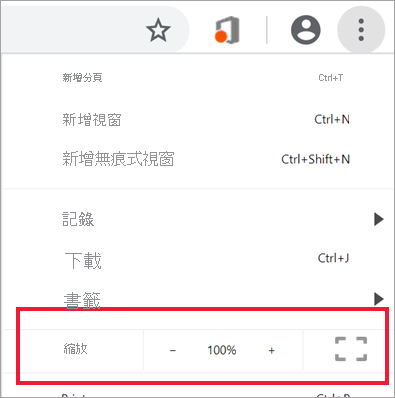
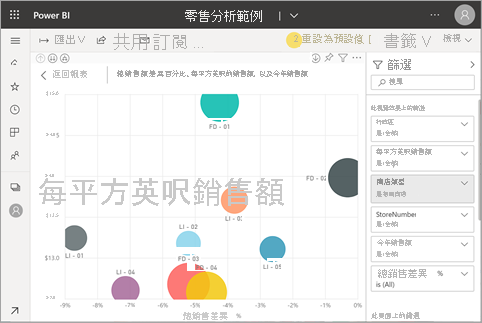

# 變更報表頁面的顯示

[!INCLUDE[consumer-appliesto-yyny](../includes/consumer-appliesto-yyny.md)]

[!INCLUDE [power-bi-service-new-look-include](../includes/power-bi-service-new-look-include.md)]

人們會在許多不同的裝置上，使用各種螢幕大小和外觀比例來檢視報表。 變更報表頁面的顯示方式以符合需求。

## 瀏覽 [檢視] 功能表

![[檢視] 下拉式選項的螢幕擷取畫面。](media/end-user-report-view/power-bi-viewmenu.png)

[檢視]  功能表中的選項提供您彈性來依所選大小和寬度顯示報表頁面：

- 假設您正在小型裝置上檢視報表，則會難以看到標題和圖例。  選取 [檢視]   > [實際大小]  來增加報表頁面的大小。 使用捲軸來移動報表。

    ![設為 [實際大小] 並叫出兩個捲軸的報表螢幕擷取畫面。](media/end-user-report-view/power-bi-view-actual.png)

- 另一個選項是選取 [符合寬度]  ，使報表符合您的螢幕寬度。 因為只變更寬度不改變高度，所以您仍然需要使用垂直捲軸。

  ![設為 [符合寬度] 並叫出垂直捲軸的報表螢幕擷取畫面。](media/end-user-report-view/power-bi-view-width.png)

- 如果不希望有任何捲軸，但要充分使用螢幕大小，請選取 [符合一頁大小]  。

   ![設為 [符合一頁大小] 的報表螢幕擷取畫面。](media/end-user-report-view/power-bi-view-fit.png)

- 您也可以從四種 [高對比色彩]  中選擇：高對比 #1、高對比 #2、黑底白字及白底黑字。 它是可讓您用來使視障人士可以更清楚地看到報表的協助工具功能。 下方範例為高對比 1。 

    ![設為 [高對比 #1] 之報表的螢幕擷取畫面。](media/end-user-report-view/power-bi-contrast1.png)

- 最後一個選項 [全螢幕]  會顯示沒有功能表列和標頭的報表頁面。 [全螢幕] 可能是難以查看細節的小螢幕理想選擇。  [全螢幕] 也是將報表頁面投影在大螢幕供大家檢視但不互動的理想選擇。  

    

結束報表時，不會儲存您的 [檢視]  設定，但會還原為預設值。 如果一定要儲存這些設定，請使用[書籤](end-user-bookmarks.md)。

## 使用瀏覽器變更頁面顯示

瀏覽器中的縮放控制項可放大或縮小可用畫布區域。 減少縮放會展開可用的畫布區域，反之亦然。 

調整整個瀏覽器大小是另一種變更報表顯示大小的方式。 

## 放大視覺效果
有時候很難看到視覺效果的細節。 您可以放大視覺效果，只顯示該視覺效果。 如需詳細資訊，請參閱[焦點模式和全螢幕模式](end-user-focus.md)

### 「焦點」  模式中的視覺效果

### 「全螢幕」  模式中的視覺效果

## 後續步驟

* [報表 [篩選] 窗格概觀](end-user-report-filter.md)