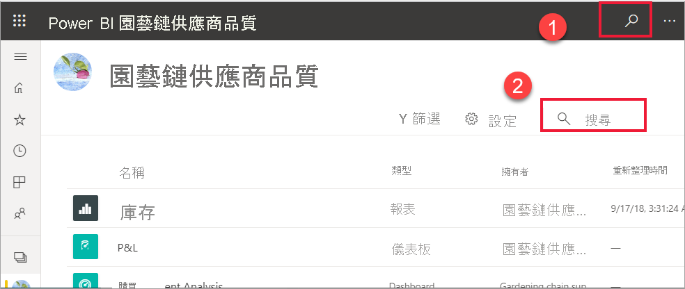
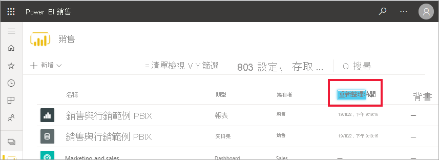

# 適用於 Power BI 取用者的導覽：全域搜尋

[!INCLUDE[consumer-appliesto-yyny](../includes/consumer-appliesto-yyny.md)]

[!INCLUDE [power-bi-service-new-look-include](../includes/power-bi-service-new-look-include.md)]

開始使用 Power BI 服務時，您只會有一些內容 (儀表板、報表、應用程式)。 但當同事開始與您共用內容，而您開始下載應用程式時，您可能就會有多內容。 這就是您發現搜尋和排序非常有幫助的時候了。

## 搜尋內容
 Power BI 服務的幾乎每個部分都可以使用搜尋。 只要尋找 [搜尋] 方塊或 [搜尋] 圖示 .

 在 [搜尋] 欄位中，鍵入儀表板、報表、活頁簿、工作區、應用程式或擁有者的全部或部分名稱。 Power BI 會搜尋您的所有內容。 

  

 在某些 Power BI 的區域 (例如工作區) 中，您會發現兩個不同的搜尋欄位。 功能表列中的 [搜尋] 欄位會搜尋您的所有內容，而工作區畫布上的 [搜尋] 欄位只會搜尋該工作區。

  

## 排序內容清單

如果您只有少量內容，則可能不需要排序。  但是，如果您有許多儀表板與報告，排序將可協助您找出所需的內容。 例如，這個 [與我共用] 內容清單有 257 個項目。 

![[與我共用] 內容清單](./media/end-user-search-sort/power-bi-all-shared.png)

目前，這個內容清單會依名稱字母順序 (從 A 到 Z) 排序。若要變更排序準則，請選取 [名稱 (A-Z)] 右邊的箭號。

![[排序] 下拉式功能表](./media/end-user-search-sort/power-bi-sort-date.png)

排序也適用於工作區。 在此範例中，內容是依 [重新整理] 日期來排序。 若要設定工作區的排序準則，請選取欄標頭，然後選取一次來選取該標題，然後再次選取以變更排序方向。 

並非所有資料行都可以進行排序。 將滑鼠游標暫留在資料行標題，以探索哪些項目可以進行排序。

## 考量與疑難排解
* 若是資料集，擁有者無法使用**排序依據**。

## 後續步驟
[在報表中將視覺效果排序](end-user-change-sort.md)

[在視覺效果中排序資料](end-user-change-sort.md)

有其他問題嗎？ [試試 Power BI 社群](https://community.powerbi.com/)
