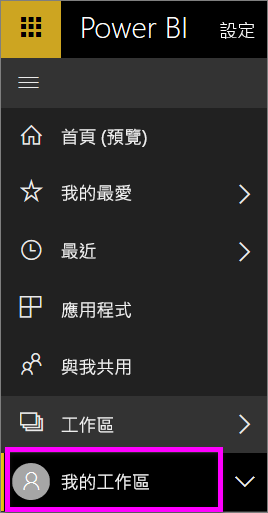

# 瀏覽：搜尋、尋找和排序 Power BI 服務中的內容
有許多方法可以瀏覽 Power BI 服務中的內容。 工作區中的內容會依類型加以組織：儀表板、報告、活頁簿和資料集。  而內容也會依使用情況加以組織：我的最愛、最近、應用程式、與我共用及精選。 為了讓導覽可在一處完成，首頁會將內容整理在同一個頁面上。 這些通往您的內容的不同路徑，可讓您在 Power BI 服務中快速找出您所需的內容。  

## 在工作區內瀏覽

Power BI「取用者」通常只會有一個工作區：**我的工作區**。 如果您已經下載 Microsoft 的範例，或已建立或下載您自己的內容，**我的工作區**就只會有這些內容。  

在 **我的工作區**中，Power BI 服務會依類型來劃分您的內容：儀表板、報表、活頁簿和資料集。 當您選取工作區時，您將會看到此組織方式。 在此範例中，**我的工作區**包含一個儀表板、兩個報表、零個活頁簿和兩個資料集。

________________________________________

## 使用左導覽列進行瀏覽
左側瀏覽列會透過一些方法將您的內容分類，讓您可以更快速、輕鬆地找到需要的內容。  

- 與您共用的內容可在**與我共用**中取得。
- 您上次檢視的內容會在**最近**中提供。 
- 您可以選取 [應用程式] 來找出您的應用程式。
- **首頁**讓您可從一處檢視最重要的內容、建議的內容及學習資源。

此外，您可以將內容標記為[我的最愛](end-user-favorite.md)和[精選](end-user-featured.md)。 挑選您預期最常檢視的一個儀表板，並將它設為 [精選] 儀表板。 每次開啟 Power BI 服務時，都會先顯示您的精選儀表板。 您有一些經常瀏覽的儀表板和應用程式嗎？ 將它們設為「我的最愛」，即一律可在左導覽列中看到它們。

![[我的最愛] 飛出視窗](./media/end-user-search-sort/power-bi-favorite-flyout.png).

## 考量與疑難排解
* 若是資料集，擁有者無法使用**排序依據**。

## 後續步驟
[Power BI - 基本概念](end-user-basic-concepts.md)

有其他問題嗎？ [試試 Power BI 社群](http://community.powerbi.com/)