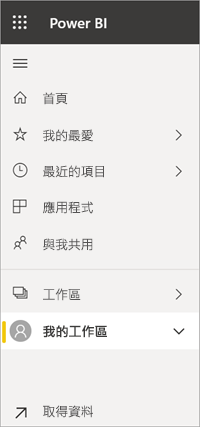

# 瀏覽：搜尋、尋找和排序 Power BI 服務中的內容

[!INCLUDE [power-bi-service-new-look-include](../includes/power-bi-service-new-look-include.md)]

有許多方法可以在 Power BI 服務中瀏覽到您的內容。 您工作區內的內容會依類型加以組織：儀表板和報表。  而內容也會依使用情況加以組織：我的最愛、最近、應用程式、與我共用及精選。 為了讓導覽可在一處完成，Power BI「首頁」  會將內容整理在同一個頁面上。 這些通往您內容的不同路徑，可讓您在 Power BI 服務中快速找出您所需的內容。  

## 在工作區內瀏覽

Power BI「取用者」  通常只會有一個工作區：**我的工作區**。 如果您已經下載 Microsoft 範例，或已建立或下載您自己的儀表板、報表或應用程式，[我的工作區]  將會包含內容。  

在 [我的工作區]  內，Power BI 服務會依類型來劃分您的內容：儀表板、報表、活頁簿和資料集。 當您選取工作區時，您將會看到此組織方式。 在此範例中，[我的工作區]  包含一個儀表板、一個報表、零個活頁簿和一個資料集。

________________________________________
## 使用 [搜尋] 欄位進行瀏覽
使用 [我的工作區]  內容檢視來搜尋、篩選及排序您的內容。 在 [搜尋] 欄位中，輸入儀表板、報表、活頁簿或擁有者的全部或部分名稱。  

因為您只有少數幾個內容，所以不需要搜尋和排序。  但當您擁有許多儀表板和報表時，就會發現搜尋和排序十分有幫助。 例如，下列的報表清單具有 83 個項目。 

您也可以依名稱或擁有者排序內容。 請注意 [名稱]  右邊的向上箭號。 我們目前正在依名稱字母順序遞增排序 83 個項目。 若要變更排序順序為遞減，請選取 [名稱]  。 向上箭號會變更為向下箭號。

並非所有資料行都可以進行排序。 將滑鼠游標暫留在資料行標題，以探索哪些項目可以進行排序。

___________________________________________________________________
## 使用瀏覽窗格進行瀏覽
瀏覽窗格會以可讓以您更快速地找到需要內容的方式來將內容分類。  

- 與您共用的內容可在**與我共用**中取得。
- 您上次檢視的內容會在**最近**中提供。 
- 您可以選取 [應用程式]  來找出您的應用程式。
- **首頁**讓您可從一處檢視最重要的內容、建議的內容及學習資源。

此外，您可以將內容標記為[我的最愛](end-user-favorite.md)和[精選](end-user-featured.md)。 挑選您預期會最常檢視的儀表板或報表，並將它設為 [精選]  內容。 每次開啟 Power BI 服務時，都會先顯示您的精選儀表板。 您有一些經常瀏覽的儀表板和應用程式嗎？ 透過將它們設為「我的最愛」，即一律可在左導覽列中看到它們。

![[我的最愛] 飛出視窗](./media/end-user-search-sort/power-bi-favorite.png).

## 考量與疑難排解
* 若是資料集，擁有者無法使用**排序依據**。

## 後續步驟
[在報表中將視覺效果排序](end-user-change-sort.md)

有其他問題嗎？ [試試 Power BI 社群](http://community.powerbi.com/)
