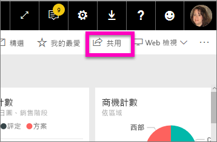
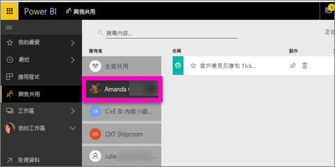

# 顯示與我共用的報表與儀表板
## 與我共用

當您的同事使用 [共用] 按鈕與您共用內容時，該內容會出現在您的 [與我共用] 容器中。 儀表板或報表只能從 [與我共用] 取得，而無法從 [應用程式] 取得。

觀看 Amanda 說明 [與我共用] 內容清單，並示範如何瀏覽和篩選清單。 然後遵循影片下方的逐步指示親自試試看。 為了讓您檢視與您共用的儀表板，您需要有 Power BI Pro 授權。 如需詳細資訊，請參閱[什麼是 Power BI Premium？](../service-premium.md)。

<iframe width="560" height="315" src="https://www.youtube.com/embed/G26dr2PsEpk" frameborder="0" allowfullscreen></iframe>

根據設計者賦予您的權限，您會有許多選項可用來與儀表板和報表互動。 這些包括可以建立儀表板的複本、以[閱讀檢視](end-user-reading-view.md)開啟報表，以及重新與其他同事共用。

![[與我共用] 容器](./media/end-user-shared-with-me/power-bi-container.png)

## 可從 [與我共用] 容器執行的動作
* 選取星狀圖示，以[將儀表板或報表設為我的最愛](end-user-favorite.md)。
* 移除儀表板或報表  
* 有些儀表板和報表可以重複共用  
* 此外，如果您的清單太長，請[使用搜尋欄位和排序找出您需要的內容](end-user-search-sort.md)。
  
  > [!NOTE]
  > 如需 EGRC 分類的資訊，請選取分類按鈕，或[瀏覽儀表板資料分類](../service-data-classification.md)。
  > 
  > 
* 選取儀表板名稱來開啟儀表板，並進行探索。 開啟共用儀表板之後，即可使用問與答來提問有關基礎資料的問題，或選取圖格，以在閱讀檢視中開啟報表並與之互動。

## 依擁有者篩選共用儀表板
可以依內容擁有者進一步篩選 [與我共用] 畫面中的內容。 例如，如果我選取 [Amanda]，則只會看到 Amanda 已與我共用的儀表板。

