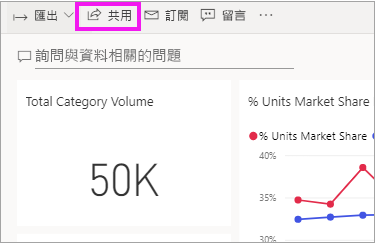
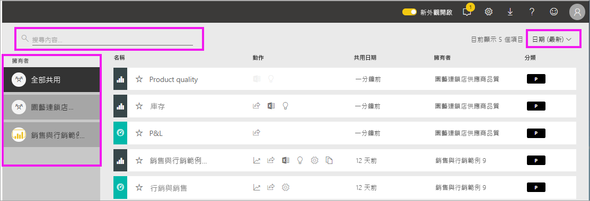

# 顯示與我共用的報表與儀表板

當您的同事使用 [共用]  按鈕與您共用內容時，該內容會出現在您的 [與我共用]  容器中。 儀表板或報表只能從 [與我共用]  取得，而無法從 [應用程式]  取得。

觀看 Amanda 說明 [與我共用]  內容清單，並示範如何瀏覽和篩選清單。 然後遵循影片下方的逐步指示親自試試看。 為了讓您檢視與您共用的儀表板，您需要有 Power BI Pro 授權。 如需詳細資訊，請參閱[什麼是 Power BI Premium？](../service-premium-what-is.md)。
    

> [!NOTE]
> 這部影片使用較舊版本的 Power BI 服務。
    

<iframe width="560" height="315" src="https://www.youtube.com/embed/G26dr2PsEpk" frameborder="0" allowfullscreen></iframe>

## 與共用內容互動

根據「設計師」  授與您的權限，您會有許多選項可用來與共用儀表板和報表互動。 這些包括可以建立儀表板的複本、以[閱讀檢視](end-user-reading-view.md)開啟報表，以及重新與其他同事共用。

![[與我共用] 容器](./media/end-user-shared-with-me/power-bi-shared.png)

### 可從 [與我共用]  容器執行的動作
可供您使用的動作將取決於內容「設計師」  所指派設定。 您的某些選項可能包括：
* 選取星號圖示，以[將儀表板或報表設為我的最愛](end-user-favorite.md) 。
* 移除儀表板或報表  .
* 有些儀表板和報表可以重複共用  .
* [以 Excel 開啟報表](end-user-export.md)  
* [檢視 Power BI 在資料中找到的見解](end-user-insights.md) 。
  
  > [!NOTE]
  > 如需 EGRC 分類的資訊，請選取 [分類]  按鈕，或[瀏覽儀表板資料分類](../service-data-classification.md)。
  > 

## 搜尋和排序共用儀表板
如果內容清單很長，您可以使用數個選項來尋找所需的內容。 您可以使用搜尋欄位、依日期排序，也可以從 [擁有者]  資料行中選取。    

