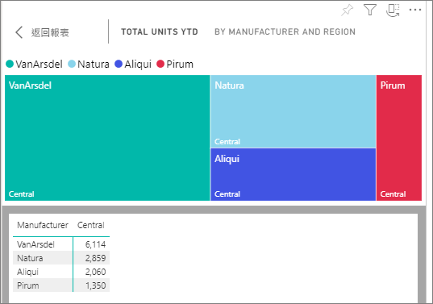
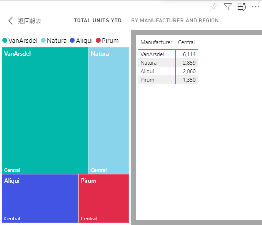

# 顯示用於建立視覺效果的資料

Power BI 視覺效果是使用基礎資料集中的資料所建構。 如果您對背景資料有興趣，Power BI 可讓您「顯示」  用來建立視覺效果的資料。 當您選取 [顯示資料]  時，Power BI 會在視覺效果下方 (或旁邊) 顯示資料。

1. 在 Power BI 服務中，[開啟報表](end-user-report-open.md)並選取視覺效果。  
2. 若要顯示視覺效果背後的資料，請選取省略符號 (...) 並選擇 [顯示資料]  。
   
   ![選取 [顯示資料]](./media/end-user-show-data/power-bi-explore-show-data-newer.png)
3. 根據預設，資料會顯示在視覺效果下方。
   
   

4. 若要變更方向，請從視覺效果的右上角，選取垂直版面配置  。
   
   

## 後續步驟
[Power BI 報表中的視覺效果](../visuals/power-bi-report-visualizations.md)    
[Power BI 報表](end-user-reports.md)    
