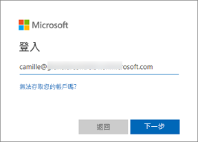

# 登入 Power BI 服務

## Power BI 帳戶
在您登入 Power BI 之前，您需要一個帳戶。 有兩種方式可取得 Power BI 帳戶。 第一種是當您的公司為其員工購買 Power BI 授權時。 而第二種是當個人註冊免費試用版或個人授權時。 本文涵蓋第一種狀況。

## 第一次登入

### 步驟一：開啟瀏覽器
Power BI 服務在瀏覽器中執行。  因此第一個步驟是開啟您慣用的瀏覽器，並鍵入 **app.powerbi.com**。

### 步驟二：鍵入您的電子郵件地址
第一次登入時，系統會要求您輸入電子郵件地址。  這是用來註冊 Power BI 的公司或學校電子郵件地址。  

請在您收件匣中尋找來自 Power BI 系統管理員的電子郵件。 大部分系統管理員會傳送包含暫時密碼的歡迎電子郵件給您。 請使用此電子郵件帳戶進行登入。 

 
### 步驟三：建立新的密碼
如果 Power BI 系統管理員已傳送暫時密碼給您，請在 [目前密碼]  欄位中輸入該密碼。 如果您還沒有在電子郵件中收到此密碼，請連絡您的 Power BI 系統管理員。

![鍵入 [登入] 欄位的電子郵件地址](media/end-user-sign-in/power-bi-login2.png)

Power BI 將會記住您的認證，下一次登入時，您就不需要輸入使用者名稱 (電子郵件地址)。 

### 步驟四：檢閱 [首頁]
在您第一次瀏覽時，Power BI 會開啟 [首頁]  。 如果您的 [首頁]  未開啟，從請左側瀏覽窗格中加以選取。 

![鍵入 [登入] 欄位的電子郵件地址](media/end-user-sign-in/power-bi-home-select.png)

在 [首頁] 中，您會看到您有權使用的所有內容。 一開始，[首頁] 上可能沒有太多的內容，不過別擔心，當您開始與同事使用 Power BI 時，此情況就會改變。 

![鍵入 [登入] 欄位的電子郵件地址](media/end-user-sign-in/power-bi-home2.png)

如果您不想要 Power BI 開啟到 [首頁]，可以改為[設定**精選**儀表板或報表](end-user-featured.md)加以開啟。 

## 安全地與內容互動
身為「取用者」，其他人將會與您共用內容，而您會與該內容互動，以瀏覽資料並制定商務決策。  在您篩選、配量、訂閱、匯出和調整大小時，請別擔心，您的工作不會影響基礎資料集或原始共用的內容 (儀表板和報表)。 Power BI 是可讓您進行探索和實驗的安全位置。 這並不表示您無法儲存變更；您可以儲存變更。 但這些變更只會影響**您**對內容的檢視。 而且還原成原始預設檢視非常簡單，只需按一下按鈕即可。

## 登出 Power BI 服務
當您關閉或登出 Power BI 時，會儲存您的變更，讓您能夠從先前離開的地方接續。

若要關閉 Power BI，只需關閉所使用的瀏覽器索引標籤。 

 

如果您共用電腦，建議您在每次關閉 Power BI 時進行登出。  若要登出，請從右上角選取您的 [個人資料] 圖片，然後選擇 [登出]  。否則，當您完成時，只需關閉瀏覽器索引標籤即可。

 

## 疑難排解與考量
- 如果您以個人身分註冊 Power BI，請使用您用來註冊的電子郵件地址進行登入。

- 如果您使用 Power BI 搭配多個帳戶，系統將會提示您從清單中選取帳戶，並在登入時輸入密碼。 

## 後續步驟
[檢視 Power BI 應用程式](end-user-app-view.md)
