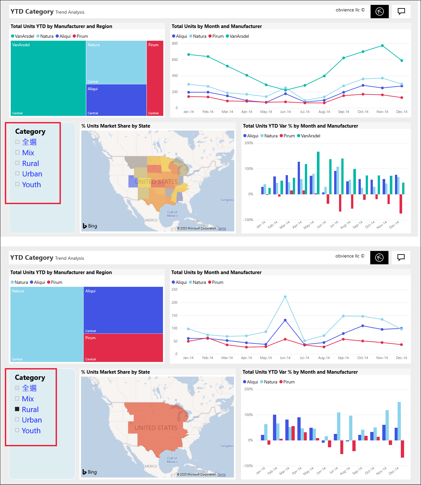
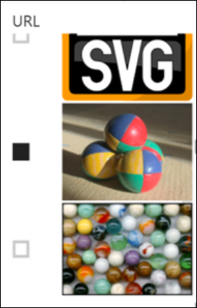
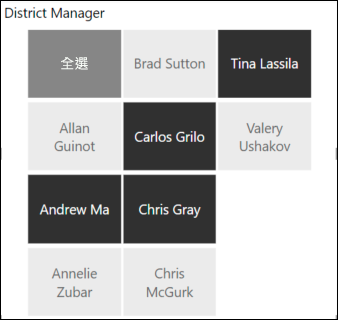
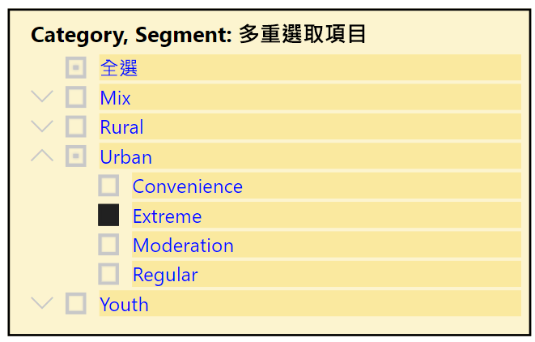
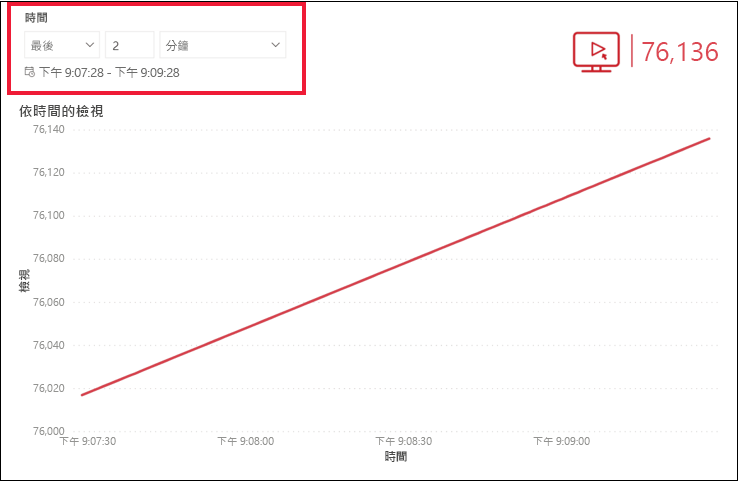
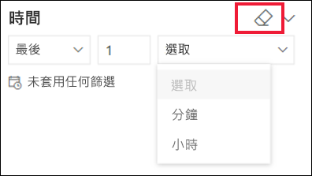

# Power BI 服務的交叉分析篩選器

[!INCLUDE[consumer-appliesto-ynnn](../includes/consumer-appliesto-yynn.md)]

交叉分析篩選器是一種視覺效果，可篩選報表頁面上的其他視覺效果。 使用 Power BI 報表時，您會發現許多類型的交叉分析篩選器。 上圖顯示相同的交叉分析篩選器，但有不同的選取項目。 請注意每個選取項目如何篩選頁面上的其他視覺效果。  

## 如何使用交叉分析篩選器
建立報表時，「設計工具」  會新增交叉分析篩選器以協助說明內容，並提供可探索資料的工具。

### 數值範圍交叉分析篩選器
 上圖的數值範圍交叉分析篩選器可有助依下列項目來探索總銷售額：地理位置、庫存單位和訂單日期。 使用控點選取範圍。 

### 基本垂直核取方塊交叉分析篩選器

在基本的核取方塊交叉分析篩選器中，選取一或多個核取方塊，以查看對頁面上其他視覺效果的影響。 若要選取多個項目，請使用 CTRL 鍵。 有時候，報表「設計工具」  會將交叉分析篩選器設定為只允許一次選取一個值。 

### 影像和圖形交叉分析篩選器
當交叉分析篩選器選項為影像或圖形時，會讓選取項目類似使用核取方塊。 您可選擇一或多個影像或圖形來將交叉分析篩選器套用至頁面上的其他視覺效果。 

    

    

### 階層交叉分析篩選器

在具有階層的交叉分析篩選器中，使用＞形箭號來展開和摺疊階層。 標頭會更新以顯示選取項目。

### 相對時間交叉分析篩選器
隨著快速重新整理案例的出現，以較小時間範圍篩選的能力非常有用。
您可使用相對時間交叉分析篩選器，將時間型篩選套用至報表的任何日期或時間資料。 例如，您可使用相對時間交叉分析篩選器，只顯示過去2天、數小時或甚至幾分鐘內的影片檢視。 

## 停用交叉分析篩選器
若要停用交叉分析篩選器，請選取橡皮擦圖示。

## 後續步驟
如需詳細資訊，請參閱下列文章：

[Power BI 中的視覺效果類型](end-user-visualizations.md)

