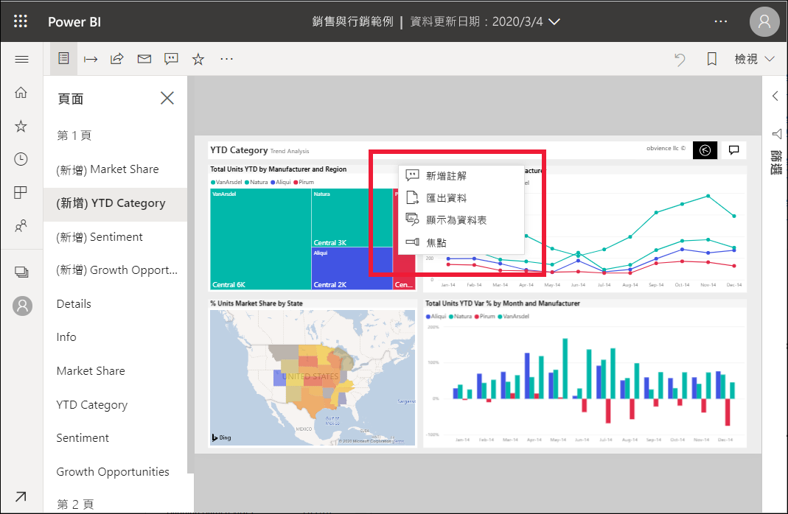
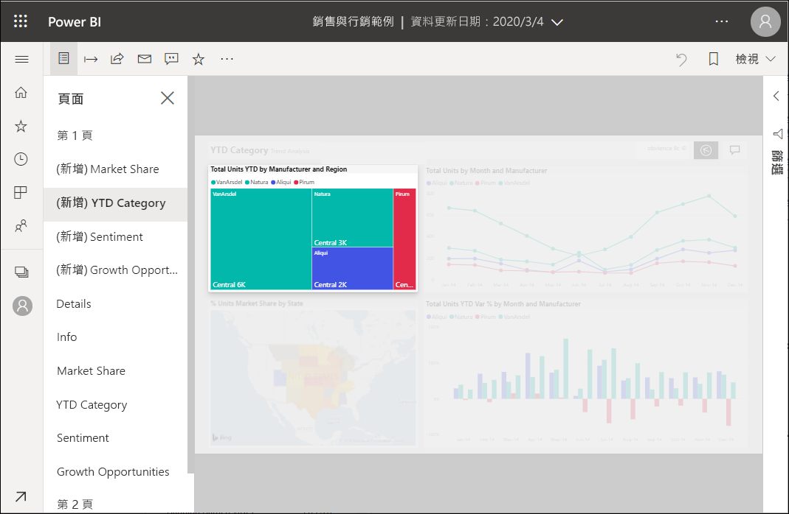

# 將焦點新增至 Power BI 報表

[!INCLUDE[consumer-appliesto-yyny](../includes/consumer-appliesto-yyny.md)]

使用焦點時，您可以將注意力吸引到報表頁面上的特定視覺效果上。  如果在新增書籤時選取焦點模式，則書籤中會保留該模式。

## 新增焦點

1. 在 Power BI 服務中[開啟報表](end-user-report-open.md)。

2. 決定您要在報表頁面上醒目提示的視覺效果。 選取 [其他動作 (...)]  下拉式清單。  

    

3. 選擇 [焦點]  的選項。 選取的視覺效果會醒目提示，這會使頁面上的所有其他視覺效果淡至接近透明。 

    

## 後續步驟

* [以焦點模式顯示儀表板磚或報表視覺效果](end-user-focus.md)

