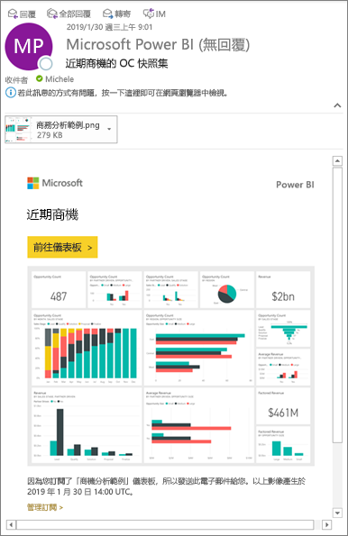

# 訂閱 Power BI 服務中的報表或儀表板 
讓您最重要的儀表板和報表維持最新的狀態從沒這麼容易過。 訂閱對您來說最重要的報表頁面和儀表板，Power BI 就會以電子郵件寄送快照集到您的收件匣。 您要告訴 Power BI 需要收到電子郵件的頻率︰每天、每週，或在資料重新整理後。 您甚至可以設定特定的時間，讓 Power BI 傳送電子郵件或立即執行。  

電子郵件和快照集將使用 Power BI 設定中設定的語言 (請參閱 [Power BI 支援的語言與國家/地區](../supported-languages-countries-regions.md))。 如果未定義任何語言，Power BI 會使用您目前瀏覽器中地區設定的語言。 若要查看或設定語言喜好設定，請選取齒輪圖示  > [設定] > [一般] > [語言]  。 

![[語言] 下拉式清單](./media/end-user-subscribe/power-bi-language.png)

當您收到電子郵件時，其中會包含「前往報表或儀表板」的連結。 在安裝 Power BI 應用程式的行動裝置上，選取此連結會啟動應用程式 (而不是在 Power BI 網站上開啟報表或儀表板的預設動作)。

## 需求
**建立**訂閱是 Power BI Pro 的功能。   

## 訂閱儀表板或報表頁面
不論您是要訂閱儀表板或報表，程序都很相似。 同樣的按鈕可讓您訂閱 Power BI 服務的儀表板與報表。
 
.

1. 開啟儀表板或報表。
2. 從頂端功能表列，選取 [訂閱]  或選取信封圖示 。
   
   

   
    
    當您在儀表板上並選取 [訂閱]  時，左側畫面隨即出現。 當您在報表頁面上並選取 [訂閱]  時，右側畫面隨即出現。 若要訂閱報表中的多個頁面，請選取 [新增另一個訂閱]  再選取其他頁面。 

4. 使用黃色的滑桿開啟和關閉訂閱。  將滑桿設定為 [關閉] 並不會刪除訂用帳戶。 若要刪除訂閱，請選取垃圾桶圖示。

4. 您的電子郵件地址會自動新增至 [訂閱]  欄位。 若要為您組織中的其他人訂閱，也可以在這裡新增其電子郵件地址。 

5. 您可以選擇新增電子郵件訊息的詳細資料。 

5. 為您的訂用帳戶選取 [頻率]  。  您可以選擇 [每天]、[每週]，或 [在資料重新整理後 (每天)]。  若只要在特定日子收到訂用帳戶電子郵件，請選取 [每週]  ，然後選擇您想要在哪幾天接收電子郵件。  例如，如果您只想要在工作日收到訂閱電子郵件，請為頻率選取 [每週]  ，並取消核取 [週六] 和 [週日] 的方塊。   

6. 為頻率選取 [每天] 或 [每週]，並為訂用帳戶輸入 [排程的時間]   ，以針對電子郵件傳送時間進行排程。  這次是訂閱作業開始時。 在某些情況下，可能需要幾分鐘的時間，您的收件匣才會收到電子郵件。    

7. 在日期欄位中輸入日期，以針對開始和結束日期進行排程。 根據預設，訂用帳戶開始時間會是建立訂用帳戶的日期，而結束日期則是一年後。 當訂用帳戶達到結束日期時，即會停止直到您重新啟用為止。  在排程結束日期之前，您會收到通知，詢問您是否要加以延長。     

8. 若要檢閱您的訂用帳戶並測試它，請選取 [立即執行]  。  這會立即將電子郵件傳送給您。 

8. 如果一切看起來都沒有問題，請選取 [儲存並關閉]  來儲存訂用帳戶。 您及已訂閱同事會按照您所設定排程收到儀表板或報表的電子郵件和快照集。 所有已將頻率設定為 [在資料重新整理後]  的訂用帳戶，只會在那一天第一次排程重新整理之後傳送一封電子郵件。
   
   
   
    重新整理報表頁面不會重新整理資料集。 只有資料集擁有者可以手動重新整理資料集。 若要查看基礎資料集的擁有者名稱，請從頂端功能表列選取 [檢視相關項目]  ，或查看原始訂閱電子郵件。
   
    

## 管理您的訂閱
只有您可以管理您建立的訂閱。 再次選取 [訂閱]  ，然後選擇左下角的 [管理所有訂用帳戶]  (請參閱上方的螢幕擷取畫面)。 

![查看 [我的工作區] 中的所有訂閱](./media/end-user-subscribe/power-bi-manage.png)

如果 Pro 授權過期、擁有者刪除儀表板或報表，或是用來建立訂閱的使用者帳戶遭到刪除，則訂閱將會終止。

## 考量與疑難排解
* 傳送給使用者的訂閱電子郵件中，釘選磚超過 25 個，或是有四個以上釘選即時報表頁面的儀表板可能不會完整呈現。 我們建議您連絡儀表板設計人員，並請他們將釘選磚減少到 25 個以下，以及將釘選的即時報表減少到四個以下，以確保電子郵件會正確呈現。  
* 針對儀表板電子郵件訂用帳戶，如果有任何圖格套用資料列層級安全性 (RLS)，則不會顯示這些圖格。  針對報表電子郵件訂用帳戶，如果資料集使用 RLS，則您無法建立訂用帳戶。
* 報表頁面訂閱會繫結至報表頁面的名稱。 如果您訂閱報表頁面，而該頁面已重新命名，您就必須重新建立訂閱。
* 如果您無法使用訂用帳戶功能，請連絡您的系統管理員。 您的組織可能已基於驗證或其他原因停用此功能。  
* 電子郵件訂閱不支援大部分[自訂視覺效果](../power-bi-custom-visuals.md)。  例外是[經認證](../power-bi-custom-visuals-certified.md)的自訂視覺效果。  
* 電子郵件訂閱目前不支援 R 支援的自訂視覺效果。  
* 尤其是儀表板訂閱，尚不支援某些類型的磚。  其中包括：資料流磚、影片磚、自訂 Web 內容磚。     
* 由於電子郵件大小限制，儀表板或報表若含有非常大的影像，訂閱可能會失敗。    
* 如果超過兩個月未瀏覽某些儀表板和報表，Power BI 會自動暫停重新整理與這些儀表板和報表建立關聯的資料集。  不過，如果您新增儀表板或報表的訂閱，即使有段時間未瀏覽也不會暫停。
* 在少數情況下，可能需要超過 15 分鐘的時間，收件者才會收到電子郵件訂閱。  如果發生這種情況，建議您在不同時間執行資料重新整理和電子郵件訂閱，以確保準時傳遞。  若問題持續發生，請連絡 Power BI 支援人員。

## 後續步驟

[搜尋和排序內容](end-user-search-sort.md)
