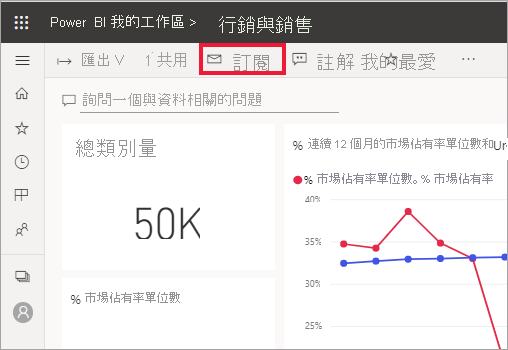
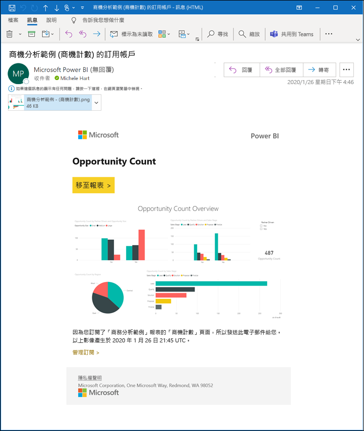
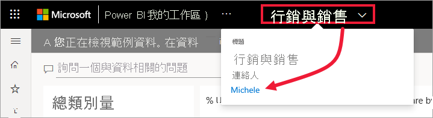

# 訂閱 Power BI 服務中的報表或儀表板 

[!INCLUDE[consumer-appliesto-ynny](../includes/consumer-appliesto-ynny.md)]

[!INCLUDE [power-bi-service-new-look-include](../includes/power-bi-service-new-look-include.md)]

讓您最重要的儀表板和報表維持最新的狀態從沒這麼容易過。 訂閱對您來說最重要的報表頁面和儀表板，Power BI 就會以電子郵件寄送快照集到您的收件匣。 您要告訴 Power BI 需要收到電子郵件的頻率︰每天、每週，或在資料重新整理後。 您甚至可以設定特定的時間，讓 Power BI 傳送電子郵件或立即執行。  針對每個報表或儀表板，您總計可以設定最多 24 個不同的訂用帳戶。

電子郵件和快照集將使用 Power BI 設定中設定的語言 (請參閱 [Power BI 支援的語言與國家/地區](../fundamentals/supported-languages-countries-regions.md))。 如果未定義任何語言，Power BI 會使用您目前瀏覽器中地區設定的語言。 若要查看或設定語言喜好設定，請選取齒輪圖示  > [設定] > [一般] > [語言]。 

![[語言] 下拉式清單](./media/end-user-subscribe/power-bi-language.png)

當您收到電子郵件時，其中會包含「前往報表或儀表板」的連結。 在安裝 Power BI 應用程式的行動裝置上，選取此連結會啟動應用程式 (而不是在 Power BI 網站上開啟報表或儀表板的預設動作)。

## 需求
為您自己**建立**訂用帳戶需要特定類型的[授權](end-user-license.md)。 如果您無法建立訂用帳戶，請連絡您的 Power BI 系統管理員。 只有儀表板擁有者或報表擁有者可以**訂閱其他內容**。 訂閱編頁報表則略有不同。 如需詳細資訊，請參閱[為您自己和其他人訂閱 Power BI 服務中的編頁報表](paginated-reports-subscriptions.md)。 

## 訂閱儀表板或報表頁面
不論您是要訂閱儀表板或報表，程序都很相似。 同樣的按鈕可讓您訂閱 Power BI 服務的儀表板與報表。
 
.

1. 開啟儀表板或報表。
2. 從頂端功能表列，選取 [訂閱] 或選取信封圖示 。
   

   
    
    當您在儀表板上並選取 [訂閱] 時，左側畫面隨即出現。 當您在報表頁面上並選取 [訂閱] 時，右側畫面隨即出現。 
    
    a. 若要訂閱報表中的多個頁面，請選取 [新增另一個訂閱] 並從頂端附近的下拉式清單中選取其他頁面。

    b. 使用黃色的滑桿開啟和關閉訂閱。  將滑桿設定為 [關閉] 並不會刪除訂用帳戶。 若要刪除訂閱，請選取垃圾桶圖示。

    c. 您可以選擇新增主旨和電子郵件訊息的詳細資料。 

    d. 為您的訂用帳戶選取 [頻率]。  您可以選擇 [每天]、[每週]，或 [在資料重新整理後 (每天)]。  若只要在特定日子收到訂用帳戶電子郵件，請選取 [每週]，然後選擇您想要在哪幾天接收電子郵件。  例如，如果您只想要在工作日收到訂閱電子郵件，請為頻率選取 [每週]，並取消核取 [週六] 和 [週日] 的方塊。 如果您選取 [每月]，請輸入您想要接收訂閱電子郵件的月份天數。   

    e。 如果您選擇 [每天]、[每小時]、[每月] 或 [每週]，則可以一併為訂閱選擇 [排程的時間]。 您將於每小時整點，或在 15、30 或 45 分時加以執行。 請選取上午 (AM) 或下午/晚上 (PM)。 您也可以指定時區。 如果您選擇 [每小時]，請選取想要開始訂閱的 [排程的時間]，系統即會在該時間之後每小時執行。  

    f. 在日期欄位中輸入日期，以針對開始和結束日期進行排程。 根據預設，訂用帳戶開始時間會是建立訂用帳戶的日期，而結束日期則是一年後。 您可以在訂用帳戶結束之前，隨時將它變更為未來的任何日期 (最多至 9999 年)。 當訂用帳戶達到結束日期時，即會停止直到您重新啟用為止。  在排程結束日期之前，您會收到通知，詢問您是否要加以延長。     

    如 若要檢閱您的訂用帳戶並測試它，請選取 [立即執行]。  這會立即將電子郵件傳送給您。 

3. 如果一切看起來都沒有問題，請選取 [儲存並關閉] 來儲存訂用帳戶。 您會按照所設定的排程，收到儀表板或報表的電子郵件和快照集。 所有已將頻率設定為 [在資料重新整理後] 的訂用帳戶，只會在那一天第一次排程重新整理之後傳送一封電子郵件。
   
   
   
    重新整理報表頁面不會重新整理資料集。 只有資料集擁有者可以手動重新整理資料集。 若要查看底層資料集的擁有者名稱，請從功能表列選取下拉式清單，或查看原始訂閱電子郵件。
   
    

## 管理您的訂閱
只有您可以管理您建立的訂閱。 再次選取 [訂閱]，然後選擇左下角的 [管理所有訂用帳戶] (請參閱上方的螢幕擷取畫面)。 顯示的特定訂用帳戶會取決於哪一個工作區目前為使用中。 若要一次查看所有工作區的所有訂閱，請務必讓 [我的工作區] 為使用中。 如需了解工作區，請參閱 [Power BI 中的工作區](end-user-workspaces.md)。 

![查看 [我的工作區] 中的所有訂閱](./media/end-user-subscribe/power-bi-manage-subscriptions.png)

如果 Pro 授權過期、擁有者刪除儀表板或報表，或是用來建立訂閱的使用者帳戶遭到刪除，則訂閱將會終止。

## 考量與疑難排解
* 若要避免訂閱電子郵件傳送到垃圾郵件資料夾，請將 Power BI 電子郵件別名 (no-reply-powerbi@microsoft.com) 新增至連絡人。 如果您使用的是 Microsoft Outlook，請在別名上按一下滑鼠右鍵，然後選取 [新增至 Outlook 連絡人]。 
* 傳送給使用者的訂閱電子郵件中，釘選磚超過 25 個，或是有四個以上釘選即時報表頁面的儀表板可能不會完整呈現。 我們建議您連絡儀表板設計人員，並請他們將釘選磚減少到 25 個以下，以及將釘選的即時報表減少到四個以下，以確保電子郵件會正確呈現。  
* 針對儀表板電子郵件訂用帳戶，如果有任何圖格套用資料列層級安全性 (RLS)，則不會顯示這些圖格。  
* 如果您電子郵件中的 (內容) 連結停止運作，可能是內容已遭刪除。 在電子郵件的螢幕擷取畫面下方，您可以查看是否自我訂閱，或否有其他人訂閱您。 如果有其他人訂閱您，請要求同事取消電子郵件或重新訂閱您。
* 針對儀表板訂閱，尚不支援某些磚類型。 其中包括：資料流磚、影片磚、自訂 Web 內容磚。 
* 報表頁面訂閱會繫結至報表頁面的名稱。 如果您訂閱報表頁面，而該頁面已重新命名，您就必須重新建立訂閱。
* 如果您無法使用訂用帳戶功能，請連絡您的系統管理員。 您的組織可能已停用這項功能。  
* 電子郵件訂閱不支援大部分[自訂視覺效果](../developer/visuals/power-bi-custom-visuals.md)。  其中例外狀況是[經認證](../developer/visuals/power-bi-custom-visuals-certified.md)的 Power BI 自訂視覺效果。    
* 電子郵件訂閱傳送時會使用報表的預設篩選器和交叉分析篩選器狀態。 在訂閱之後對預設值所做的所有變更，均不會顯示在電子郵件中。 編頁報表支援此功能，且可讓您針對每個訂閱設定特定參數值。  
* 電子郵件訂閱目前不支援使用 R 的 Power BI 視覺效果。  
* 尤其是儀表板訂閱，尚不支援某些類型的磚。  其中包括：資料流磚、影片磚、自訂 Web 內容磚。     
* 由於電子郵件大小限制，儀表板或報表若含有非常大的影像，訂閱可能會失敗。    
* 如果超過兩個月未瀏覽某些儀表板和報表，Power BI 會自動暫停重新整理與這些儀表板和報表建立關聯的資料集。  不過，如果您新增儀表板或報表的訂閱，即使有段時間未瀏覽也不會暫停。
* 請記住，如同其他 BI 產品，您為訂閱所設定時間就是訂閱開始處理的時間。  報表處理完成之後，訂閱會排入佇列並傳送給電子郵件收件者。  雖然我們致力於儘快處理和提供所有訂閱，但有些時候可能會有尖峰需求，可能會因為一次可傳送的訂閱數目而看到較長的延遲。  對大部分的客戶而言，其在處理和傳送其報表時不應該看到超過 15 分鐘時間的延遲，不過在特定時間以及具有大量使用量的租用戶，可能需要最多 30 分鐘的時間。  我們從不預期在排程訂閱之後，於傳遞上的延遲超過 60 分鐘。  萬一有任何客戶看到該長度的延遲，其應該先確定位址 no-reply-powerbi@microsoft.com 由其電子郵件提供者列入允許清單。  若該電子郵件地址已在白名單上，則應連絡 Power BI 支援以取得協助。

## 後續步驟

[搜尋和排序內容](end-user-search-sort.md)
