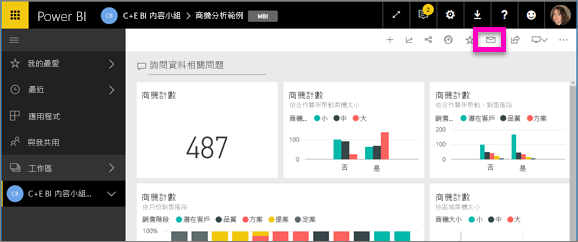
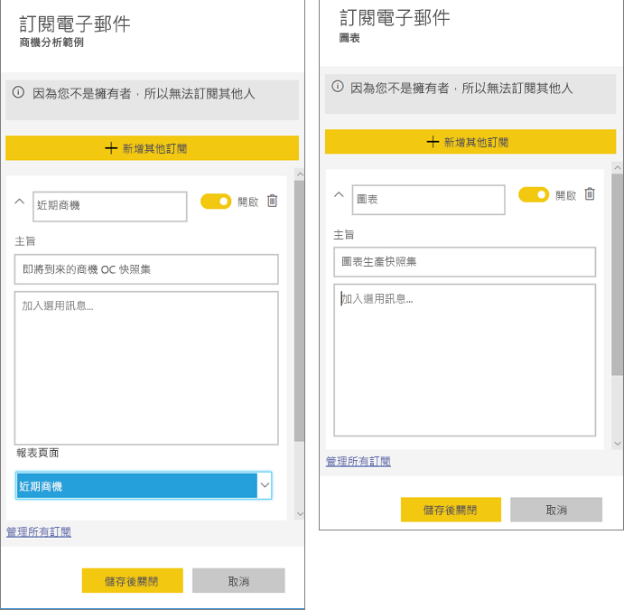
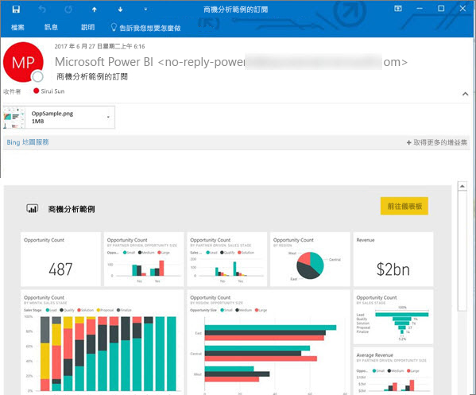
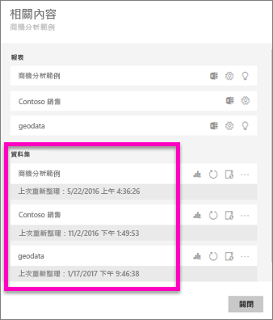

# 訂閱 Power BI 服務中的報表或儀表板 
讓您最重要的儀表板和報表維持最新的狀態從沒這麼容易過。 訂閱對您來說最重要的報表頁面和儀表板，Power BI 就會以電子郵件寄送快照集到您的收件匣。 您要告訴 Power BI 需要收到電子郵件的頻率︰從一天一次到每週一次。 

電子郵件和快照集將使用 Power BI 設定中設定的語言 (請參閱 [Power BI 支援的語言與國家/地區](../supported-languages-countries-regions.md))。 如果未定義任何語言，Power BI 會使用您目前瀏覽器中地區設定的語言。 若要查看或設定語言喜好設定，請選取齒輪圖示  > [設定] > [一般] > [語言]。 

![[語言] 下拉式清單](./media/end-user-subscribe/power-bi-language.png)

當您收到電子郵件時，其中會包含「前往報表或儀表板」的連結。 在安裝 Power BI 應用程式的行動裝置上，選取此連結會啟動應用程式 (而不是在 Power BI 網站上開啟報表或儀表板的預設動作)。

## 需求
- **建立**訂閱是 Power BI Pro 的功能。 
- 因為訂閱電子郵件只會在基礎資料集更新或重新整理時送出，所以訂閱不適用於不會更新或重新整理的資料集。

## 訂閱儀表板或報表頁面
不論您是要訂閱儀表板還是報表，程序都非常相似。 同樣的按鈕可讓您訂閱 Power BI 服務的儀表板與報表。
 
.

1. 開啟儀表板或報表。
2. 從頂端功能表列，選取 [訂閱] 或選取信封圖示。
   
   

3. 使用黃色的滑桿開啟和關閉訂閱。  將滑桿設定為關閉並不會刪除訂閱。 若要刪除訂閱，請選取垃圾桶圖示。

4. 您可以選擇新增電子郵件訊息的詳細資料。 

    在下方的螢幕擷取畫面中，您可以注意到當您在訂閱報表時，實際上是在訂閱報表「頁面」。  若要訂閱報表中的多個頁面，請選取 [新增另一個訂閱] 再選取其他頁面。 
      
   

5. 選取 [儲存並關閉] 來儲存訂閱。 每當任何一個基礎資料集變更時，您就會收到儀表板或報表頁面的電子郵件與快照。 若儀表板或報表在一天內會重新整理多次，則只會在第一次重新整理後傳送電子郵件。  
   
   
   
重新整理報表頁面不會重新整理資料集。 只有資料集擁有者可以手動重新整理資料集。 若要查看基礎資料集的名稱，請從頂端功能表列選取 [檢視相關項目]。
   

## 如何決定電子郵件排程
下表描述您將會收到電子郵件的頻率。 它完全取決於儀表板或報表所根據的資料集連線方式 (DirectQuery、即時連線、匯入到 Power BI 或 OneDrive 或 SharePoint Online 中的 Excel 檔案)，以及可用和已選取的訂閱選項 ([每日]、[每週]，或 [無])。

|  | **DirectQuery** | **Live Connect** | **排定的重新整理 (匯入)** | **OneDrive/SharePoint Online 中的 Excel 檔案** |
| --- | --- | --- | --- | --- |
| **報表/儀表板重新整理的頻率？** |每隔 15 分鐘 |Power BI 會每隔 15 分鐘檢查一次，並且如果資料集已變更，會重新整理報表。 |使用者選取 [無]、[每天] 或 [每週]。 每日最多可達一天 8 次。 每週實際上是使用者建立並設定的每週排程，重新整理最少為每週一次，最多則為每日。 |每小時一次 |
| **使用者對訂閱電子郵件排程有多大的控制權？** |選項有︰[每日] 或 [每週] |沒有選項︰如果報表重新整理，便會傳送電子郵件給使用者，但每天不會超過一次。 |如果重新整理排程為每日，選項有 [每日] 和 [每週]。  如果重新整理排程為每週，選項只有 [每週]。 |沒有選項︰每當資料集更新，便會傳送電子郵件給使用者，但每天不會超過一次。 |

## 管理您的訂閱
只有您可以管理您的訂閱。 再次選取 [訂閱]，然後選擇 [管理所有訂閱] (請參閱上方步驟 4 下的螢幕擷取畫面)。 

![查看 [我的工作區] 中的所有訂閱](./media/end-user-subscribe/power-bi-subscriptions.png)

如果 Pro 授權過期、擁有者刪除儀表板或報表，或是用來建立訂閱的使用者帳戶遭到刪除，則訂閱將會終止。

## 考量與疑難排解
* 針對儀表板電子郵件訂用帳戶，如果有任何圖格套用資料列層級安全性 (RLS)，則不會顯示這些圖格。  針對報表電子郵件訂用帳戶，如果資料集使用 RLS，則您無法建立訂用帳戶。
* 報表頁面訂閱會繫結至報表頁面的名稱。 如果您訂閱了報表頁面，而該頁面已重新命名，您就必須重新建立訂閱
* 您的組織可能會在 Azure Active Directory 進行某些設定，而這可能會限制在 Power BI 中使用電子郵件訂閱的功能。  這包括但不限於存取資源時的多重要素驗證或 IP 範圍限制。
* 對於即時連線資料集的電子郵件訂閱，您只會在資料變更時收到電子郵件。 因此，如果發生重新整理但沒有任何資料變更，Power BI 將不會傳送電子郵件給您。
* 電子郵件訂閱不支援大部分[自訂視覺效果](../power-bi-custom-visuals.md)。  其中一個例外是[「已認證」](../power-bi-custom-visuals-certified.md)的自訂視覺效果。  
* 電子郵件訂閱目前不支援 R 支援的自訂視覺效果。  
* 如果有任何儀表板圖格套用資料列層級安全性 (RLS)，則不會顯示這些圖格。
* 電子郵件訂閱傳送時會使用報表的預設篩選器和交叉分析篩選器狀態。 在訂閱之後對預設值所做的所有變更，均不會顯示在電子郵件中。    
* 尤其是儀表板訂閱，尚不支援某些類型的磚。  其中包括：資料流磚、影片磚、自訂 Web 內容磚。     
* 由於電子郵件大小限制，儀表板或報表若含有非常大的影像，訂閱可能會失敗。    
* 如果超過 2 個月未瀏覽某些儀表板和報表，Power BI 會自動暫停重新整理與這些儀表板和報表建立關聯的資料集。  不過，如果您新增儀表板或報表的訂閱，即使有段時間未瀏覽也不會暫停。    

## 後續步驟
* 有其他問題嗎？ [嘗試在 Power BI 社群提問](http://community.powerbi.com/)    
* [閱讀部落格文章](https://powerbi.microsoft.com/blog/introducing-dashboard-email-subscriptions-a-360-degree-view-of-your-business-in-your-inbox-every-day/)

