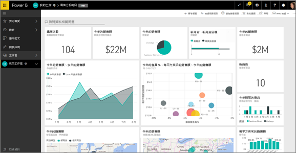
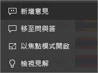
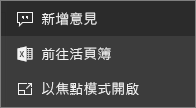
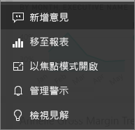

# Power BI 的儀表板圖格
圖格是您的資料快照，由*設計工具*釘選到儀表板。 您可以從報表、資料集、儀表板、問與答問題方塊、Excel 和 SQL Server Reporting Services (SSRS) 等來方建立圖格。  這個螢幕擷取畫面顯示許多釘選到儀表板的不同磚。

除了從報表中釘選的圖格，*設計工具*也可以使用 [新增圖格] 直接在儀表板上新增獨立圖格。 獨立磚包括：文字方塊、影像、視訊、串流資料和 Web 內容。

您想要了解構成 Power BI 的建置組塊嗎？  請參閱 [Power BI - 基本概念](end-user-basic-concepts.md)。

## 與儀表板上的圖格互動

1. 將滑鼠暫留在圖格上以顯示省略符號。
   
    
2. 選取省略符號開啟圖格的 [動作] 功能表。 根據視覺效果類型和用來建立圖格的方法，可用的選項會有所不同。 以下是您可能會看到的一些範例。

    - 使用問與答建立的圖格
   
        

    - 從活頁簿建立圖格
   
        

    - 從報表建立圖格
   
        
   
    從這裡您可以：
   
   * [開啟用於建立此磚的報表](end-user-reports.md)   
   
   * [開啟用於建立圖格的問與答問題](end-user-reports.md)   
   

   * [開啟用於建立此圖格的活頁簿](end-user-reports.md)   
    * [以焦點模式檢視圖格](end-user-focus.md)   
     * [執行深入解析](end-user-insights.md) 
    * [新增註解並開始討論](end-user-comment.md) 

3. 若要關閉動作功能表，選取畫布中的空白區域。

### 選取 (按一下) 圖格
當您選取磚時，接下來的情況取決於該磚的建立方式，以及其是否有[自訂連結](../service-dashboard-edit-tile.md)。 如果有自訂連結，則選取圖格會帶您前往該連結。 否則，選取磚會帶您前往建立此磚所使用的報表、Excel Online 活頁簿、內部部署 SSRS 報表或問與答。

> [!NOTE]
> 使用 [新增磚] 直接在儀表板上建立的影片圖格為例外。 選取影片磚 (以此方式建立) 會直接在儀表板上播放視訊。   
> 
> 

## 考量與疑難排解
* 如未儲存建立視覺效果所用的報表，則選取該圖格不會執行任何動作。
* 如果圖格是在 Excel Online 活頁簿中建立的，而您連該活頁簿基本的讀取權限都沒有，選取圖格不會在 Excel Online 中開啟活頁簿。
* 至於使用 [新增磚] 直接在儀表板上建立的磚，如果您已設定自訂超連結，選取標題、子標題及/或磚即會開啟該 URL。  否則，選取針對影像、Web 程式碼或文字方塊直接在儀表板上建立的其中一個磚，預設不會執行任何動作。
* 如果您無權使用 SSRS 內的報表，則選取從 SSRS 建立的磚時將會產生頁面，指出您沒有存取權 (rsAccessDenied)。
* 如果您無權存取 SSRS 伺服器所在的網路，則選取從 SSRS 建立的磚時將會產生頁面，指出找不到伺服器 (HTTP 404)。 您的裝置需要報表伺服器的網路存取權，才能檢視報表。
* 如果用來建立圖格的原始視覺效果有了變更，也不會改變圖格。  例如，如果「設計工具」已從報表釘選折線圖，然後將折線圖變更為長條圖，則儀表板圖格仍會顯示折線圖。 資料會重新整理，但視覺效果類型不會。

## 後續步驟
[資料重新整理](../refresh-data.md)

[Power BI - 基本概念](end-user-basic-concepts.md)
