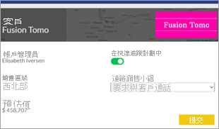
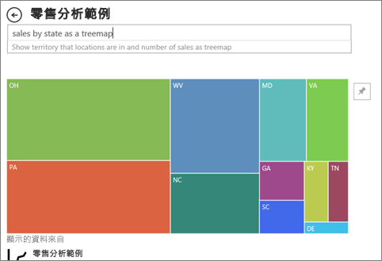

# Power BI 中的視覺效果類型

[!INCLUDE[consumer-appliesto-yynn](../includes/consumer-appliesto-yynn.md)]

您會在報表、儀表板及問與答中看見視覺效果。 其中一些視覺效果類型是隨 Power BI 一同封裝，而某些則是「Power BI 視覺效果」  。 自訂視覺效果是在 Power BI 外部建立，且其建立方式允許報表「設計師」  將它們新增至 Power BI 報表和儀表板。 

此文章概述隨 Power BI 服務一同封裝的視覺效果。  這些是您最常會遇到的視覺效果。 如需這些視覺效果的深入資訊，請參閱[關於視覺效果類型的 Power BI 報表「設計師」  文件](../visuals/power-bi-visualization-types-for-reports-and-q-and-a.md)

> [!NOTE]
> 若要了解自訂視覺效果，請在 [Microsoft AppSource](https://appsource.microsoft.com/marketplace/apps?product=power-bi-visuals) 的 **Power BI 視覺效果**一節中搜尋這些 Power BI 視覺效果。 針對每個視覺效果，您可找到描述、建立者資訊，以及螢幕擷取畫面或影片。 

## Power BI 提供的視覺效果清單
所有這些視覺效果都能在 Power BI 儀表板及報表中找到，並[於問與答中詳述](end-user-q-and-a.md)。 若要了解如何與視覺效果互動，請參閱[在報表、儀表板和應用程式中與視覺效果互動](end-user-visualizations.md)

### 區域圖：基本 (分層) 與堆疊

基本區域圖以折線圖為基礎，會將軸與折線之間的區域填滿。 區域圖強調隨著時間的變化大小，而且可用來強調跨趨勢的總計值。 例如，代表收益隨時間變化的資料，可以在區域圖中繪製，藉此強調總收益。

### 橫條圖和直條圖

 

橫條圖是查看不同類別間特定值的標準作法。

### 卡片：單一數字

單一數字卡片會顯示單一事實 (即單一資料點)。 有時您在 Power BI 儀表板或報告中追蹤的最重要項目是一個單一數字，例如總銷售額、歷年的市佔率，或總商機。  

### 卡片：多列

多列卡片會顯示一或多個資料點，每個資料列各一個。

### 組合圖

組合圖結合了直條圖和折線圖。 將兩種圖結合成一張圖，讓您可以更快速地比較資料。 組合圖可以有一或兩個 Y 軸，因此請務必仔細查看。 

組合圖極適合：
- 當您的折線圖和直條圖具有相同的 X 軸。
- 當您要比較具有不同值範圍的多個量值
- 當您要在一個視覺效果中說明兩個量值間的相互關聯
- 當您要檢查量值是否符合另一個量值所定義的目標
- 當您要節省畫布的空間

### 環圈圖

環圈圖類似於圓形圖。  它們會顯示部分與整體的關聯性。 唯一的差別在於，中央為空白，且保留空間給標籤或圖示。

### 漏斗圖

漏斗圖利於以視覺化方式展現具有階段的程序，而項目會依序從某個階段流向下一個階段。  其中一個範例是銷售程序，其開頭為潛在客戶而結尾為採購履約。

例如，會分階段追蹤客戶的銷售漏斗圖：潛在客戶 (Lead) > 合格的潛在客戶 (Lead) > 潛在客戶 (Prospect) > 合約 > 關閉。 漏斗圖的圖形一看就能表達出您追蹤中程序的健全狀況。
漏斗圖的每個階段代表總數中所佔的百分比。 因此，在大部分情況下，漏斗圖形狀像漏斗 -- 第一階段最大，然後每個後續階段比前一階段小。 梨狀的漏斗圖也很實用，能識別出程序中的問題。 但通常第一階段，也就是「引入」階段佔最大部分。

### 量表圖

星形量測計圖表具有圓弧線段，並且會顯示針對某一目標/KPI 測量進度的單一值。 目標或目標值是由線條 (指針) 表示。 達到該目標的進度是由陰影表示。 代表該進度的值會以粗體顯示在弧線內。所有可能的值會從最小 (最左邊的值) 到最大 (最右邊的值) 平均分散在弧線上。

在上述範例中，我們是汽車零售商，正在追蹤銷售小組每個月的平均銷售量。 我們的目標是 140，以黑色指針代表。 最小的可能平均銷售量是 0，而我們將最大值設為 200。 藍色陰影顯示我們這個月的銷售量目前平均約為 120。 幸好我們還有一週的時間來達成目標。

星形量測計極適合用來：
- 顯示目標的達成進度
- 代表 KPI 等百分位數量值
- 顯示單一量值的健全狀況
- 顯示可快速掃描和了解的資訊

 ### 關鍵影響因素圖表

關鍵影響因素圖表顯示出所選結果或值的主要成因。

關鍵影響因素是協助您了解影響關鍵計量之因素的最佳選擇。 例如，什麼原因讓客戶簽下第二張訂單 **，或者為什麼去年六月的銷售額如此亮眼** 。 

### KPI

關鍵效能指標 (KPI) 是一種視覺提示，指出對於可測量目標已達成的進度。 

KPI 極適合：
- 測量進度 (超前或落後了那些項目？)
- 測量離目標的距離 (超前或落後了多少？)

### 折線圖

折線圖強調完整連續值的整體圖形，通常是一段期間。

### 地圖：基本地圖

使用基本地圖建立類別和數量資訊與空間位置的關聯。

### 地圖：ArcGIS 地圖

ArcGIS 地圖與 Power BI 的結合，把在點之外加上地圖的做法帶到了全新境界。 您可以使用基礎地圖、位置類型、佈景主題、符號樣式及參考圖層等選項，建立具有豐富資訊的絶佳地圖視覺效果。 地圖上的官方資料圖層 (例如人口普查資料) 與空間分析結合之後，能讓人更深入了解視覺效果中的資料。

### 地圖：區域分布圖 (分級著色圖)

區域分布圖使用陰影、濃淡或圖樣，顯示值的比例如何隨著地理位置或地區而有所不同。 可使用範圍介於淺色 (較不常見/較低) 到深色 (較常見/較多) 的陰影，快速顯示這些相對差異。

### 地圖：圖形地圖

圖形地圖會使用色彩來比較地圖上的區域。 圖形地圖無法在地圖上顯示資料點的確切地理位置。 相反地，其主要目的是要藉由不同的著色，在地圖上顯示區域的相對比較。

### Matrix

矩陣圖視覺效果是一種資料表視覺效果 (請參閱下方的＜資料表＞)，可支援分層式配置。 通常，報表設計師會在報表和儀表板中包含矩陣，讓使用者能夠選取矩陣中一或多個項目 (資料列、資料行、資料格)，以交叉醒目提示報表頁面的其他視覺效果。  

### 圓形圖

圓形圖會顯示部分與整體的關聯性。 

### Power Apps 視覺效果

報表設計師可以建立 Power App，並將其內嵌到 Power BI 報表中。 取用者可以在 Power BI 報表內與該視覺效果互動。 

### 問與答視覺效果

>[!TIP]
>問與答視覺效果類似於[儀表板上的問與答體驗](../create-reports/power-bi-tutorial-q-and-a.md)，可讓您使用自然語言來詢問資料的相關問題。 

如需詳細資訊，請參閱 [Power BI 中的問與答視覺效果](../visuals/power-bi-visualization-types-for-reports-and-q-and-a.md)。

### 功能區圖表

功能區圖表會顯示哪些資料類別具有最高的等級 (最大值)。 功能區圖表適合顯示等級變更，最高等級 (值) 一律顯示於每個時段的最上方。

### 散佈圖、泡泡圖與點圖

散佈圖一律會有兩個值座標軸，沿著水平軸顯示一組數字資料，沿著垂直軸顯示另一組數值。 此圖表顯示 x 與 y 數交集處的點，結合這些值可形成單一的資料點。 視資料之不同，這些資料點可能平均散布或不平均地散佈在水平軸。

泡泡圖會將資料點以泡泡取代，而泡泡的大小代表其他維度的資料。

點圖類似於泡泡圖和散佈圖，不同之處在於其可沿 X 軸繪製數值或類別資料。 此範例使用的是正方形而非圓形，並沿著 X 軸繪製銷售額。

### 散佈圖高密度

根據定義，高密度資料是取樣來在合理範圍內快速建立視覺效果以回應互動。 高密度取樣會使用消除重疊點的演算法，並確保視覺效果會呈現資料集中的所有點。 它不只會繪製代表性的資料樣本。  

還可確保提供回應、轉譯和清楚保留整體資料集中重要點的最佳組合。

### 交叉分析篩選器

交叉分析篩選器是一種獨立圖表，可用來篩選頁面上的其他視覺效果。 交叉分析篩選器有許多不同的格式 (類別、範圍、日期等)，可將其格式化以允許只選取一個、選取多個或所有可用的值。 

交叉分析篩選器極適合：
- 在報表畫布上顯示常用或重要篩選，以方便存取
- 不需要開啟下拉式清單，即可輕鬆查看目前篩選的狀態
- 依資料行篩選不必要的資料，並隱藏在資料表中
- 將交叉分析篩選器放在重要的視覺效果旁邊，以建立更多重點報表

### 獨立映像

獨立影像是已新增至報表或儀表板的圖形。 

### 資料表

資料表是一個方格，其中以資料列和資料行的邏輯數列包含相關的資料。 它也可能包含標頭和總計資料列。 資料表適合處理您要在許多值裡尋找單一類別的量化比較。 例如，這個資料表會顯示類別的五個不同量值。

資料表極適合：
- 查看並比較詳細資料和實際值 (而非視覺表示法)
- 以表格格式顯示資料
- 依類別顯示數值資料

### 矩形式樹狀結構圖

矩形式樹狀結構圖是彩色矩形圖，值以矩形大小表示。  它們可以是階層式，各矩形可以巢嵌在主要矩形內。 每個矩形內的空間配置是根據測量中的值。 矩形會依大小從左上角 (最大) 排列到右下角 (最小)。

矩形式樹狀結構圖極適合：
- 顯示大量的階層式資料
- 橫條圖無法有效處理大量值的時候
- 顯示各部分與整體之間的比例
- 顯示量值在階層中每個類別層級的分佈模式
- 使用大小和色彩編碼顯示屬性
- 找出模式、極端值、最重要的參與者和例外狀況

### 瀑布圖

瀑布圖會顯示總額的增減變動。 它適用於了解起始值 (例如淨收益) 如何受到一系列正面和負面變更的影響。

資料行會標示色彩，讓您快速地分辨增加和減少。 起始值和最終值資料行通常在水平軸上開始，而中間值則是浮動的資料行。 由於其「外觀」，瀑布圖也稱為橋樑圖 (bridge chart)。

瀑布圖極適合：
- 您擁有跨越時間或不同類別目錄的量值變更時
- 稽核對總值造成的重大變更
- 藉由顯示營收的各種來源來標示貴公司的年度收益，並達到總收益 (或虧損)
- 呈現貴公司一年的開始和結束人數
- 以視覺化方式顯示您的每月收入與支出，以及帳戶的日常餘額

## 告訴問與答要使用的視覺效果
使用 Power BI 問與答輸入自然語言查詢時，您可以在查詢中指定視覺效果類型。  例如：

***依州以矩形式樹狀結構圖顯示銷售額***.

## 後續步驟
[在報表、儀表板和應用程式中與視覺效果互動](end-user-visualizations.md)    
[來自 sqlbi.com 的正確視覺效果參考](https://www.sqlbi.com/wp-content/uploads/videotrainings/dashboarddesign/visuals-reference-may2017-A3.pdf)

