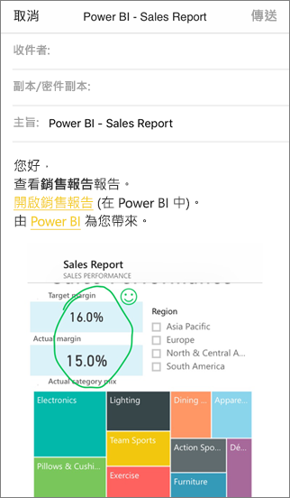

# 在 Power BI 行動裝置應用程式中標註並共用磚、報表或視覺效果。
適用於︰

|  |  |  |  |
|:--- |:--- |:--- |:--- |
| iPhone |iPad |Android 手機 |Android 平板電腦 |

您可以從 Power BI for iOS 和 Android 裝置的行動裝置應用程式標註並共用圖格、報告或視覺效果的快照集。 收件者看到的外觀與送出郵件加上連結時完全相同。 您可以將磚的快照集傳送給任何人，不只是在相同電子郵件網域的同事而已。 您可以新增註解 (線條、文字或戳記) 然後共用它。

包含註解的報表 

具有圖格、報告或視覺效果快照集的郵件也包括 Power BI 服務 ([https://powerbi.com](https://powerbi.com)) 上實際物件的連結。 如果您和您的收件者都具有 Power BI Pro 授權或內容位於[進階容量](../../service-premium-what-is.md)中，且您已經與收件者共用項目，收件者只需按一下連結就能直接前往磚、報表或視覺效果。 

您也可以[從 Power BI for Windows 10 裝置的行動裝置應用程式共用圖格](mobile-windows-10-phone-app-get-started.md)，但不能標註磚。

## 開啟磚以便標註
1. 點選磚，藉此在焦點模式中開啟。
2. 點選標註圖示  位於磚的右上角。
3. 即可[標註和共用磚](mobile-annotate-and-share-a-tile-from-the-mobile-apps.md#annotate-and-share-the-tile-report-or-visual)。

## 開啟報表以便標註
1. 開啟報表。 
2. 點選標註圖示  位於報表的右上角。
3. 您可以[標註和共用報表](mobile-annotate-and-share-a-tile-from-the-mobile-apps.md#annotate-and-share-the-tile-report-or-visual)。

## 開啟視覺效果以進行標註
1. 在報告中點選視覺效果，然後點選展開圖示，以焦點模式開啟。 
   
    
2. 點選標註圖示  位於視覺效果的右上角。
3. 您可以開始[標註和共用視覺效果](mobile-annotate-and-share-a-tile-from-the-mobile-apps.md#annotate-and-share-the-tile-report-or-visual)。

## 標註並共用圖格、報告或視覺效果
1. 以下是您標註的方法︰  
   
   
   
   *iPhone 和 iPad 中的註解列*
   
   
   
   *Android 裝置中的註解列*
   
   * 若要繪製不同色彩和粗細的線條，請點選波浪狀線條圖示、選擇寬度和色彩，然後繪製。  
   * 若要輸入註解，請點選 [AA]  、選擇文字大小和色彩，然後輸入。  
   * 若要在磚上貼上戳記 (例如表情符號)，請點選笑臉、選擇色彩，並點選想要的位置。   
2. 在標註之後，請點選右上角的 [共用]  。
3. 開啟郵件應用程式，輸入收件者的名稱，以及視需要修改訊息。  
   
   
   
   郵件包含影像，以及特定圖格、報告或視覺效果的連結。 
4. 點選 [傳送]  。

## 後續步驟
* [從 Power BI 行動裝置應用程式共用儀表板](mobile-share-dashboard-from-the-mobile-apps.md)
* 有問題嗎？ [嘗試在 Power BI 社群提問](http://community.powerbi.com/)

