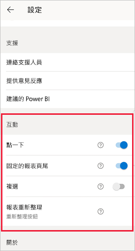
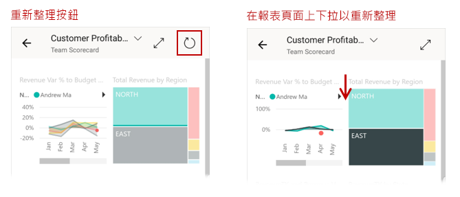
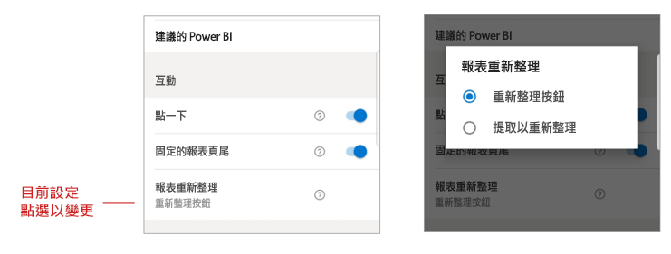

# 設定報表互動設定

## 概觀

Power BI 行動應用程式有數個可設定的「互動」設定，可讓您控制與資料互動的方式，並定義 Power BI 行動應用程式中的某些項目如何運作。 目前的設定可進行下列項目
* [對報表視覺效果的點一下與點兩下互動](#single-tap)
* [停駐與動態報表頁尾](#docked-report-footer-android-phones) (Android)
* [按鈕起始的報表重新整理與拖動以重新整理](#report-refresh-android-phones) (Android)

若要前往互動設定，請點選您的個人資料圖片以開啟 [側面板](./mobile-apps-home-page.md#header)，選擇 [設定]  ，然後尋找 [互動]  區段。

>[!NOTE]
>重新整理按鈕和停駐報表頁尾的互動設定，目前不會影響報表伺服器報表。 這會在 2020 年 1 月的報表伺服器版本中變更。

## 互動設定

### 點一下
當您下載 Power BI 行動應用程式時，應用程式會設定為點一下互動。 這表示當點選視覺效果以執行某些動作 (例如選取交叉分析篩選器項目、交叉醒目提示、按一下連結或按鈕等) 時，點選就會選取視覺效果並執行您想要的動作。

如果您想要的話，您可以關閉點一下互動。 您即可使用點兩下互動。 藉由點兩下互動，您可以先點選視覺效果以將其選取，然後再次點選視覺效果以執行您想要的動作。

### 停駐的報表頁尾 (Android 手機)

停駐的報表頁尾設定決定報表頁尾是否在報表底部維持停駐 (意即固定且一律顯示)，或根據您在報表中的動作 (例如捲動) 來隱藏及重新顯示。

在 Android 手機上，停駐的報表頁尾設定預設為 [開啟]  ，表示報表頁尾會停駐，且一律顯示於報表的底部。 如果您較喜歡會顯示並消失的動態報表頁尾 (視您對報表的動作而定)，請將設定切換為 [關閉]  。

### 報表重新整理 (Android 手機)

報表重新整理設定定義您起始報表重新整理的方式。 您可以選擇在所有報表首新增重新整理按鈕，或在報表頁面上使用「拖動以重新整理」動作 (稍微從上往下拉) 來重新整理報表。 下圖說明這兩種替代方式。 

根據預設，在 Android 手機上會新增重新整理按鈕。

若要變更報表重新整理設定，請前往互動設定中的報表重新整理項目。 目前的設定隨即顯示。 點選值以開啟快顯視窗，您可以在其中選擇新值。

## 遠端設定

系統管理員也可以使用 MDM 工具搭配應用程式設定檔，以遠端方式來設定互動。 如此一來，您就可以將全組織 (或組織中特定使用者群組) 的報表互動體驗標準化。 如需詳細資料，請參閱[使用行動裝置管理來設定互動](./mobile-app-configuration.md)。

## 後續步驟
* [與報表互動](./mobile-reports-in-the-mobile-apps.md#interact-with-reports)
* [使用行動裝置管理來設定互動](./mobile-app-configuration.md)
