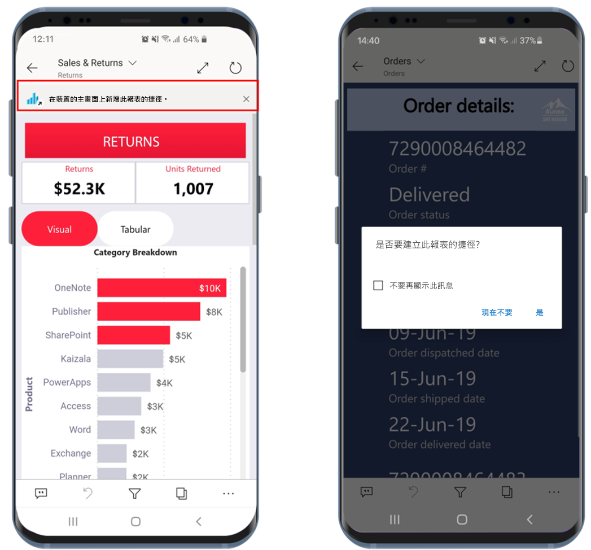
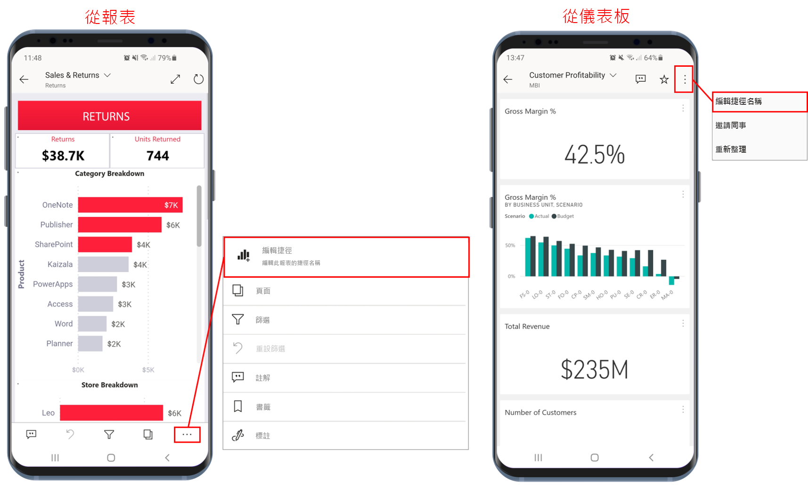
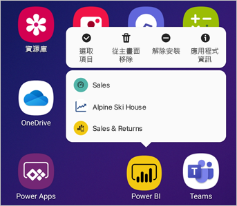

# 在 Power BI Android 應用程式中使用 Android 應用程式捷徑

適用於︰

|  |  |
|:--- |:--- |
| Android 手機 |Android 平板電腦 |

適用於 Android 的 Power BI 行動裝置應用程式提供兩種簡單方式，無需瀏覽應用程式即可直接取得所需的報表或儀表板：**裝置主畫面捷徑**和**應用程式啟動器捷徑**。
 * **裝置主畫面捷徑**：您可建立任何報表或儀表板的捷徑，並將其釘選到裝置的主畫面。 報表或儀表板不一定要位於其中一個工作區中，您也可以建立應用程式內的報表和儀表板捷徑，甚至是位於外部 (B2B) 租用戶的報表或儀表板。
 * **應用程式啟動器捷徑**：您可直接在裝置的主畫面上按一下應用程式啟動器圖示以開啟應用程式啟動器，直接進入經常檢視的報表和儀表板。 快速存取功能表提供三個經常檢視項目的捷徑。 這些項目會隨時變更，Power BI 行動裝置應用程式會持續追蹤經常檢視的內容，並據此變更捷徑。

 >[!NOTE]
 >Android 應用程式捷徑適用於 Android 8 和更新版本。

## 建立任何報表或儀表板的捷徑

您可建立任何報表或儀表板的捷徑。

1. 在 [動作] 功能表上，按一下 [其他選項...]  然後選取 [新增捷徑]  。

   

   此外，如果 Power BI 應用程式發現您經常存取某個項目，也會建議建立該項目的捷徑。 此情況會以兩種方式發生：
   * 在經常檢視的報表和儀表板上，當開啟項目時，[新增捷徑]  選項會在橫幅中顯示。
   * 如果經常使用連結來取得報表 (例如從共用的電子郵件、註釋等)，在使用幾次此連結後，會開啟視窗詢問您是否要建立捷徑。 [是]  會開啟 [新增捷徑]  對話方塊 (如下所示)，[現在不要]  會繼續帶您到嘗試存取的項目。
   
   這兩種體驗如下所示。

   

 1. [新增捷徑]  對話方塊會以項目名稱開啟。 您可自行編輯該名稱。 完成時，點選 [新增]  。

    

1. 系統會要求您確認是否要新增捷徑。 點選 [新增]  將捷徑新增至裝置的主畫面。

   

   捷徑儀表板或報表圖示會以所輸入的名稱新增至裝置主畫面。

   

## 編輯捷徑名稱

若要編輯捷徑的名稱，請在 [動作] 功能表上選取 [其他選項...]  ，然後選擇 [編輯捷徑名稱] 

 

## 使用 Power BI 行動裝置應用程式啟動器來存取經常檢視的內容

您可使用 Power BI 行動裝置應用程式啟動器，以直接前往經常存取的項目。

長按應用程式啟動器以顯示經常檢視項目的快速存取功能表。 然後，點選捷徑來開啟所需的項目。

您只要將所需的捷徑圖示拖曳至裝置主畫面，就可以為任何列出的項目建立永久捷徑。

## 後續步驟
* [使用 Google 搜尋來尋找及存取內容](mobile-app-find-access-google-search.md)
* 如果使用 iOS 並想要尋找 Siri 捷徑，請參閱[在 Power BI 行動版 iOS 應用程式中使用 Siri 捷徑](mobile-apps-ios-siri-shortcuts.md)。
* [Power BI 行動裝置應用程式中我的最愛項目](mobile-apps-favorites.md)
