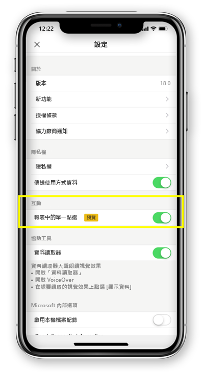

# 設定點一下或點兩下的報表互動
適用於︰

|  |  | 
|:--- |:--- |
| iPhone |Android 手機 |

Power BI 報表是資料的互動式檢視，以視覺效果顯示資料的各種發現與洞見及需要深入了解的事項。

您可以設定與資料互動的方式。 您可以決定要點一下互動或點兩下互動。

* 使用點兩下互動，在視覺效果上點第一下時會選取它，只有在視覺效果上點第二下時才會執行動作本身，例如交叉分析篩選器項目選取、交叉醒目提示或按一下連結、按鈕等。

* 使用點一下互動，點選一次即完成兩項作業 - 選取視覺效果並執行動作。

從 iOS 版 Power BI 應用程式 18.0 版和 Android 112540 版開始，所有新安裝都會設定點一下的預設行為。
手機上已安裝 Power BI 以及要升級為這些新版本的使用者，可切換為點一下。

## 變更互動行為

若要變更互動行為，您可以移至應用程式設定，並開啟/關閉點一下互動。

本文適用於橫向和手機報表。

## 後續步驟
* [檢視為您的手機最佳化的 Power BI 報表，並與其互動](mobile-apps-view-phone-report.md)
* 有問題嗎？ [嘗試在 Power BI 社群提問](https://community.powerbi.com/)

