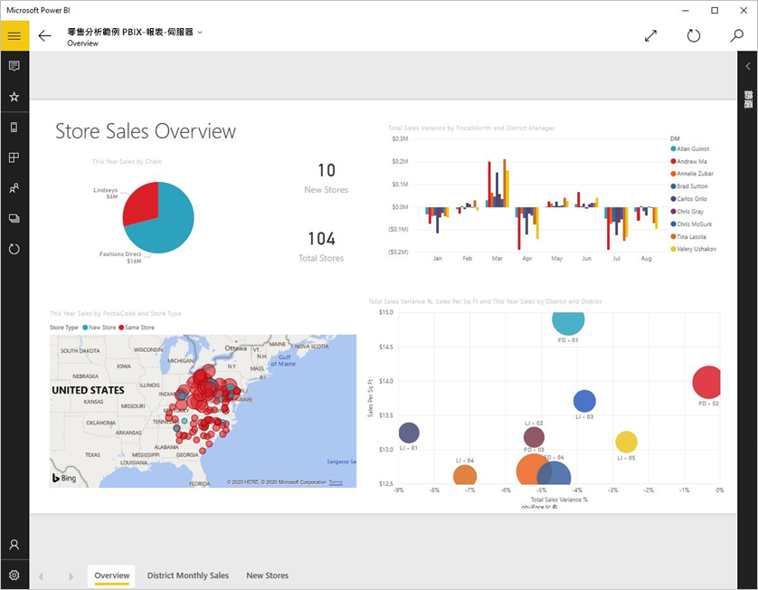
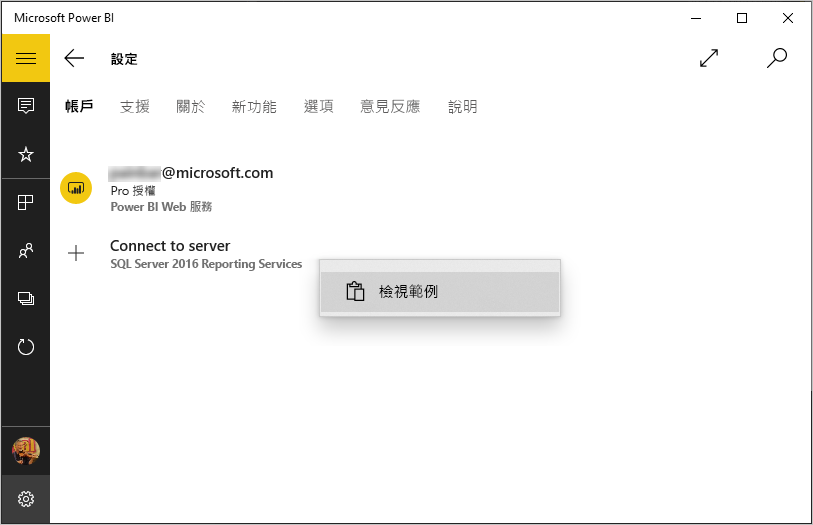
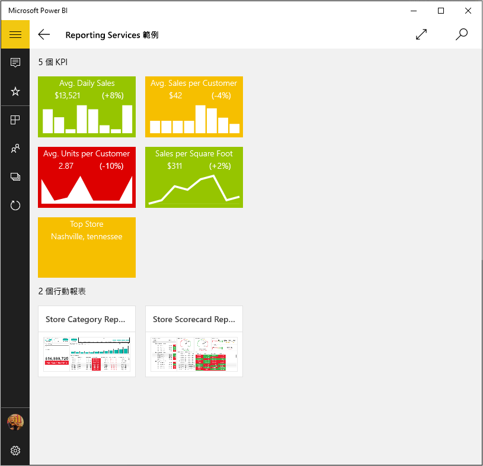
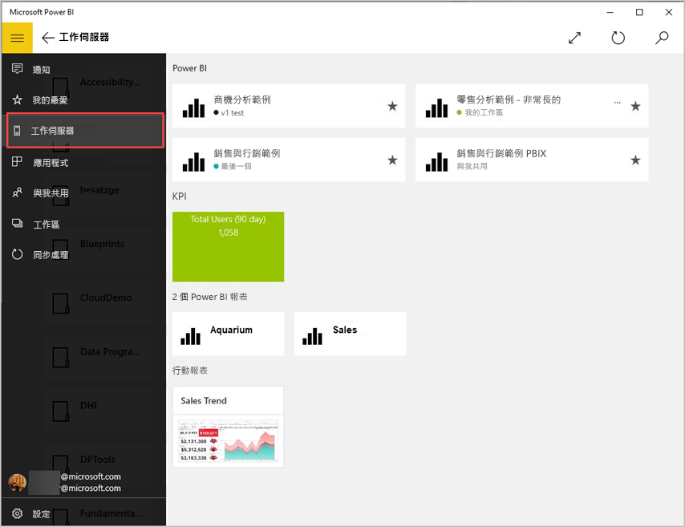
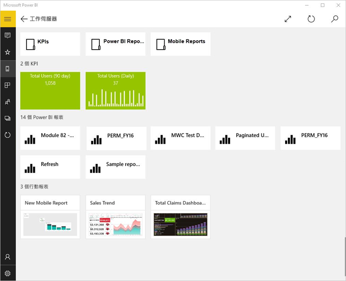
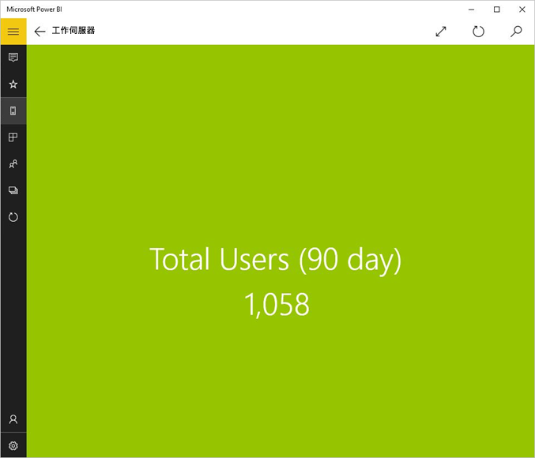
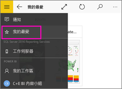
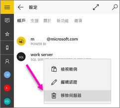

# 在 Power BI Windows 應用程式中檢視內部部署報表與 KPI
適用於 Windows 10 的 Power BI 應用程式提供 SQL Server 2016 Reporting Services 中重要內部部署商務資訊的即時觸控式行動存取。 

## 最重要的第一件事
使用 SQL Server 2016 Enterprise Edition 行動報表發行工具[建立 Reporting Services 行動報表](/sql/reporting-services/mobile-reports/create-mobile-reports-with-sql-server-mobile-report-publisher)，並將其發行至 [Reporting Services 入口網站](/sql/reporting-services/web-portal-ssrs-native-mode)。 在入口網站中建立 KPI 權限。 在資料夾中整理並標示我的最愛，讓您可以輕鬆地找到它們。 

然後在適用於 Windows 10 的 Power BI 應用程式中，檢視資料夾中整理或收集於我的最愛的 KPS、行動報表與 Power BI 報表。 

> [!NOTE]
> 您的裝置必須執行 Windows 10。 應用程式最適合與具有至少 1 GB RAM 與 8 GB 內部儲存空間的裝置搭配使用。

>[!NOTE]
>**使用 Windows 10 行動裝置版手機**的 Power BI 行動裝置應用程式支援，將於 2021 年 3 月 16 日停止。 [深入了解](https://go.microsoft.com/fwlink/?linkid=2121400)

## 不使用 SQL Server 2016 Reporting Services 伺服器的瀏覽範例
即使您沒有 Reporting Services 入口網站的存取權，您仍然可以瀏覽 Reporting Services 行動報表的功能。

1. 在您的 Windows 10 裝置上開啟 Power BI 應用程式。
2. 點選左上角的  全域導覽按鈕。
3. 點選**設定**圖示，以滑鼠右鍵按一下或點選並按住 [連線至伺服器]，然後點選 [檢視範例]。
   
   
4. 開啟 [Retail Reports]\(零售報表) 或 [Sales Reports]\(銷售報表) 資料夾，探索其 KPI 和行動報表。
   
   

瀏覽與 KPI 和行動報表互動的範例。

## 連線到 Reporting Services 報表伺服器
1. 在導覽窗格的底部，點選 [設定] 
2. 點選 [連線到伺服器]。
3. 請填入伺服器位址以及使用者名稱和密碼。 請使用此格式的伺服器位址︰
   
     `https://<servername>/reports` 或   `https://<servername>/reports`
   
   > [!NOTE]
   > 請勿在連接字串開頭包含 **http** 或 **https**。
   > 
   > 
   
    如有需要，請點選 [進階選項] 以給予伺服器名稱。
4. 點選核取記號以連線。 
   
   現在您會在導覽窗格中看到伺服器。
   
   
   
   >[!TIP]
   >您可以隨時點選 [全域導覽] 按鈕，切換 Reporting Services 行動報表與在 Power BI 服務中的儀表板。 
   > 

   >[!NOTE]
   >不支援設定自訂連接埠的報表伺服器，且無法從 Power BI Windows 應用程式進行存取。 

## 在 Power BI 應用程式中檢視 Reporting Services 的 KPI 和行動報表
Reporting Service、行動報表與 Power BI 報表 (預覽) 皆顯示在 Reporting Services 入口網站的同一個資料夾中。

* 點選 KPI，以焦點模式查看。
  
    
* 點選行動報表加以開啟，並在 Power BI 中與之互動。
  
    

## 檢視您最愛的 KPI 和報表
您可以在 Reporting Services 入口網站中，將 KPI、行動報表與 Power BI 報表標示為 [我的最愛]，然後將其與您 Power BI 最愛的儀表板和報表放置在 Windows 10 裝置方便存取的資料夾中，加以檢視。

* 點選 [我的最愛]。
  
   
  
   入口網站上的我的最愛皆在此頁面。
  
閱讀更多以了解 [Power BI 行動裝置應用程式中的我的最愛](mobile-apps-favorites.md)。

## 移除報表伺服器的連接
您只能一次性從 Power BI 行動裝置應用程式連接到一部報表伺服器。 如果您要連接到其他伺服器，則必須先從目前伺服器中斷連接。

1. 在導覽窗格的底部，點選 [設定] 。
2. 點選並按住您不要連接的伺服器名稱。
3. 點選 [移除伺服器]。
   
    

## 建立 Reporting Services 行動報表和 KPI
您無法在 Power BI 行動裝置應用程式中建立 Reporting Services KPI 和行動報表。 請在 SQL Server 行動報表發行工具和 SQL Server 2016 Reporting Services 入口網站加以建立。

* [建立您自己的 Reporting Services 行動報表](/sql/reporting-services/mobile-reports/create-mobile-reports-with-sql-server-mobile-report-publisher)，並將其發行至 Reporting Services 入口網站。
* [在 Reporting Services 入口網站上建立 KPI](/sql/reporting-services/working-with-kpis-in-reporting-services)

## 後續步驟
* [開始使用 Power BI for Windows 10 行動裝置 App](mobile-windows-10-phone-app-get-started.md)  
* [Power BI 是什麼？](../../fundamentals/power-bi-overview.md)  
* 有問題嗎？ [嘗試在 Power BI 社群提問](https://community.powerbi.com/)
