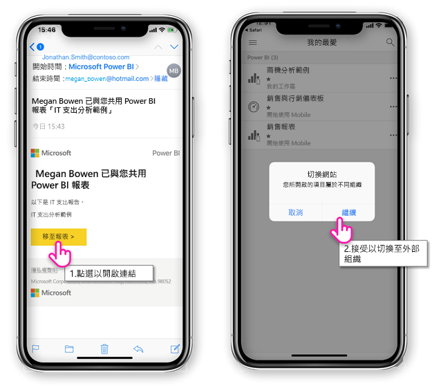
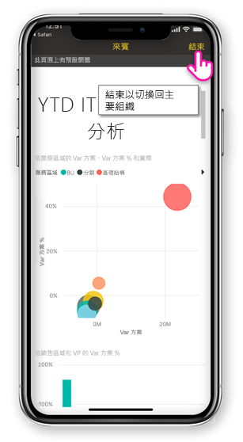
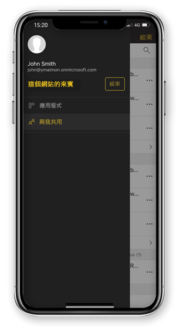

# 檢視與您共用的外部組織的 Power BI 內容

Power BI 與 Azure Active Directory 企業對企業 (Azure AD B2B) 若要能夠安全地散發給組織外部的來賓使用者的 Power BI 內容整合。 與外部來賓使用者可以使用 Power BI 行動裝置應用程式，來存取與他們共用的 Power BI 內容。 

適用於︰

|  |  |  |  |
|:--- |:--- |:--- |:--- |
| iPhone |iPad |Android 手機 |Android 平板電腦 |

## 存取共用的內容

**首先，您必須從外部共用項目與您組織的其他人。** 當有人[與您共用的項目](../../service-share-dashboards.md)，從相同的組織或外部組織，您會收到電子郵件，內含項目共用的連結。 遵循您的行動裝置中的連結會開啟 Power BI 行動裝置應用程式。 如果應用程式可辨識的項目共用的外部組織，應用程式重新連接到您的身分識別與該組織中。 應用程式，然後載入來自該組織與您共用的所有項目。

> [!NOTE]
> 如果這是外部來賓使用者身分，與您共用的第一個項目時，您必須宣告在瀏覽器中的邀請。 您可以無法宣告中的 Power BI 應用程式的邀請。

只要您連接到外部組織，黑色的標頭會出現在應用程式中。 此標頭表示您未連接到您的主要組織。 若要連線到您的主要組織，結束來賓模式。

即使您需要有 Power BI 成品連結連接到外部組織，您的應用程式會切換之後，您可以存取與您 （不只的項目中開啟電子郵件） 共用的所有項目。 若要檢視之外部組織可以存取的所有項目，請移至 [應用程式] 功能表，然後選取**與我共用**。 底下**應用程式**您找到您也可以使用的應用程式。

## 限制

- 條件式存取和其他 Intune 原則不支援在 Azure AD B2B 和 Power BI 行動裝置。 這表示，應用程式會強制執行只有主要組織的原則，如果有的話。
- 從主要組織站台只能接收推播通知 （即使當使用者連接到外部組織以來賓身分）。 開啟通知重新連接至使用者的主要組織站台的應用程式。
- 如果使用者關閉應用程式時重新開啟應用程式會自動連接到使用者的主要組織。
- 當連接到外部組織，有些動作會停用： 我的最愛項目，資料警示註解和共用。
- 無法連線到外部組織時使用離線資料。
- 如果您有安裝在裝置上的公司入口網站應用程式時，必須註冊您的裝置。
